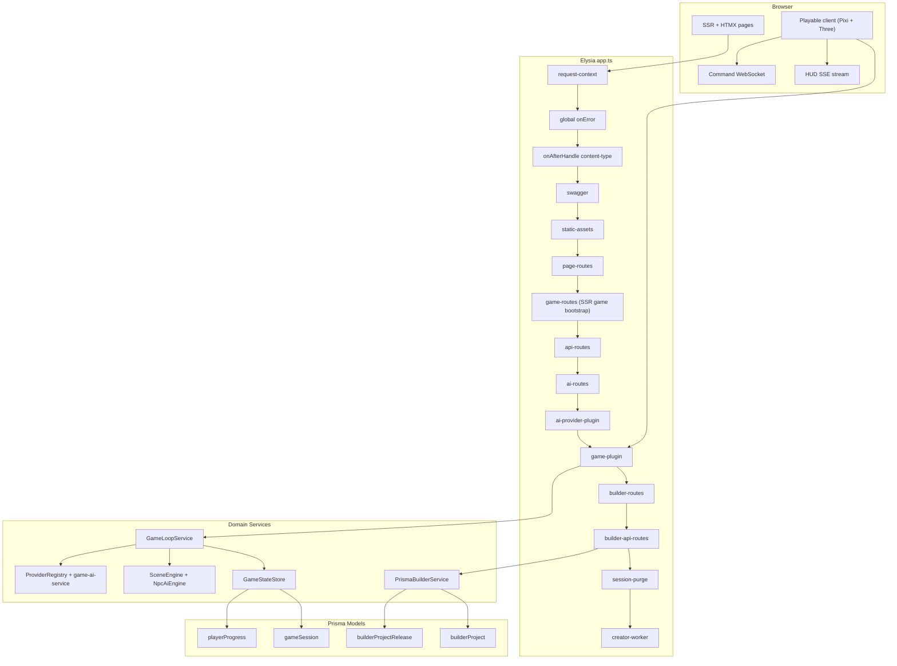
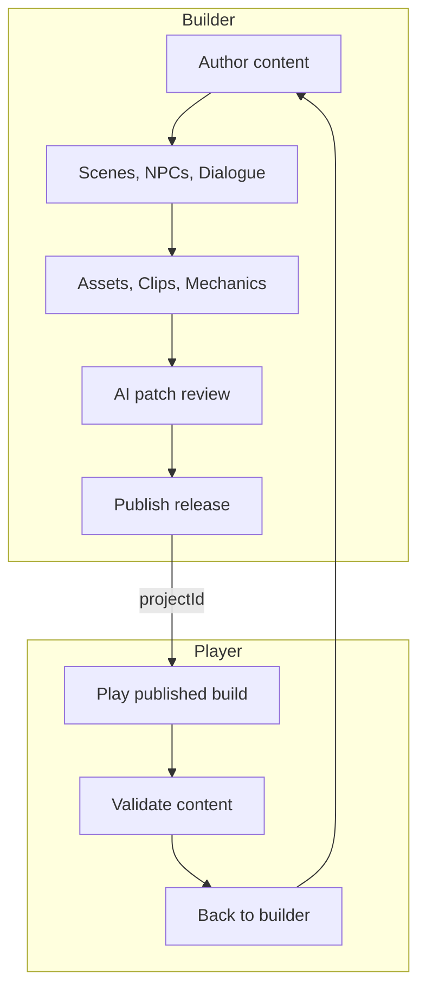
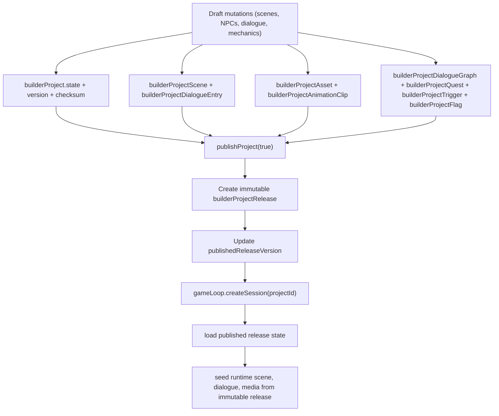

# System Architecture Trace

## Runtime Topology



## Ownership Boundaries

- `request-context` owns correlation-id creation and per-request completion logs.
- `builder-request-context` owns canonical builder locale, project id, and current-path resolution from request URL, query/body overrides, and route params.
- `layout.ts` owns the shared SSR `LayoutContext` and document renderer, so page, builder, and game shells consume one route-derived layout contract instead of rebuilding nav/path state independently.
- `auth-session` owns anonymous cookie identity, and that cookie identity is now the ownership boundary for game sessions.
- `game-plugin` owns game transport contracts:
  - REST lifecycle routes (`create`, `state`, `restore`, `save`, `close`, `delete`)
  - command enqueue route
  - canonical HUD SSE stream
  - command/state websocket endpoint
  - websocket tick registration/cleanup and session-scoped transport teardown
- `game-loop` owns authoritative simulation, canonical session resolution, dashboard/session metrics, expired-session purging, HUD state projection, token verification, tick scheduling, throttled persistence, and chat rate limiting.
- `playerProgressStore` owns XP, level, and one-time interaction persistence consumed by the game loop and HUD projection.
- `shared/contracts/game.ts` owns boundary validation for persisted scene state, trigger definitions, and realtime websocket frames before they reach runtime or client renderers.
- `GameStateStore` stays the persistence boundary behind `game-loop`.
- `builder-project-state-store` owns builder project JSON decode/normalize, optimistic versioned saves, snapshot projection, and published-release reads.
- `builder-service` owns builder domain mutations, canonical create-form defaults for mechanics/generation/automation, publish/unpublish orchestration, and AI patch preview/apply flows.
- `ai-provider-plugin` owns provider-registry boot, periodic capability refresh, and shutdown disposal.
- `creator-worker-plugin` owns lifecycle-managed generation-job and automation-run draining.

## Session Security Contract

```mermaid
sequenceDiagram
  participant Client as Client
  participant Cookie as auth-session cookie
  participant Plugin as game-plugin
  participant Loop as game-loop
  participant Store as game-state-store
  participant DB as Prisma

  Client->>Plugin: POST /api/game/session
  Plugin->>Cookie: resolveAuthSession()
  Plugin->>Loop: createSession(..., ownerSessionId)
  Loop->>Store: createSession(ownerSessionId)
  Store->>DB: INSERT gameSession
  DB-->>Store: session row
  Loop-->>Plugin: snapshot + resume token
  Plugin-->>Client: 200 + token + expiresAt

  Client->>Plugin: WS /api/game/session/:id/ws?resumeToken=...
  Plugin->>Cookie: resolve owner session id
  Plugin->>Loop: restoreSession(sessionId, resumeToken, ownerSessionId)
  Loop-->>Plugin: accept/reject
  Plugin-->>Client: state stream or close(4408/4404)
```

Enforced rules:

- Resume token payload includes `sessionId`, `ownerSessionId`, `expiresAtMs`, `tokenVersion`, and a signature.
- Restore is POST-only with JSON body: `{ "resumeToken": "..." }`.
- Token possession is insufficient; owner cookie must match persisted `ownerSessionId`.
- Token version rotates on successful restore, invalidating stale tokens.

## Game Transport Contract

| Surface | Endpoint | Contract |
|---|---|---|
| SSR bootstrap | `GET /game` | Emits session meta + resume token meta + client runtime config meta tags |
| Create | `POST /api/game/session` | Creates authoritative session and returns lifecycle state |
| State | `GET /api/game/session/:id/state` | Owner-scoped state read |
| Restore | `POST /api/game/session/:id` | Body token verification + owner check |
| Command | `POST /api/game/session/:id/command` | Schema validated command enqueue |
| HUD | `GET /api/game/session/:id/hud` | Canonical SSE HTML stream (`scene-title`, `xp`, `dialogue`, `close`) |
| WS | `/api/game/session/:id/ws` | Token-gated command/state realtime lane |

Removed legacy transport:

- `/api/game/session/:id/partials/dialogue` is removed.
- HUD rendering now has one source of truth: the SSE stream.
- Session close/delete now actively tear down websocket tick owners for that session instead of
  waiting for the socket to disappear later.

## Tick and Persistence Model

- Tick ownership is not coupled to websocket presence.
- `startTick()` registers optional callbacks; ticks continue when queue/dialogue state requires it.
- Async overlap is prevented with `tickInFlight` and per-session timeout scheduling.
- Persistence is throttled by `sessionPersistIntervalMs`.
- Manual save uses `saveSessionNow()` plus cooldown gate from `saveCooldownMs`.
- Optimistic versioning is maintained with `stateVersion` and guarded writes in persistence stores.

## Builder/Player Loop



## Builder Publishing and Runtime Seeding



Current behavior:

- Draft edits mutate `builderProject.state` only for residual draft metadata, while scenes, dialogue catalogs, assets, animation clips, dialogue graphs, quests, triggers, flags, generation jobs, artifacts, and automation runs live in relational draft tables.
- Asset upload via `POST /api/builder/assets/upload`; mechanics CRUD via quest/trigger/dialogue-graph routes.
- Generation review streams via `GET /api/builder/generation-jobs/:jobId/stream`; automation evidence review via builder automation routes.
- Publish creates a new immutable release snapshot that materializes residual draft JSON plus relational content, media, mechanics, and worker state.
- Runtime session seeding consumes the published snapshot, not mutable draft state.
- Unpublish clears `publishedReleaseVersion` without deleting historical releases.

## Client Runtime Config Contract

The SSR game page emits these required runtime meta tags consumed by `game-client.ts`:

- `game-client-command-send-interval-ms`
- `game-client-command-ttl-ms`
- `game-client-socket-reconnect-delay-ms`
- `game-client-restore-request-timeout-ms`
- `game-client-restore-max-attempts`

If these are missing/invalid, the playable client aborts initialization instead of silently using hidden hardcoded values.

## Configuration Sources of Truth

| Concern | Source |
|---|---|
| Environment parsing and defaults | `src/config/environment.ts` |
| i18n message catalogs (en-US, zh-CN) | `src/shared/i18n/messages.ts` |
| Locale resolution (Accept-Language, ?lang=) | `src/shared/i18n/translator.ts` |
| Builder request locale/project/path resolution | `src/plugins/builder-request-context.ts` |
| Shared SSR layout context + document rendering | `src/views/layout.ts` |
| Runtime game contract | `src/shared/config/game-config.ts` |
| Public route constants | `src/shared/constants/routes.ts` |
| Game type contracts | `src/shared/contracts/game.ts` |
| Session persistence + repair | `src/domain/game/services/GameStateStore.ts` |
| Authoritative simulation loop | `src/domain/game/game-loop.ts` |
| Builder draft/release domain mutations | `src/domain/builder/builder-service.ts` |
| Builder project state codec + snapshot persistence | `src/domain/builder/builder-project-state-store.ts` |
| Builder project/release persistence primitives | `src/shared/services/db.ts` |

## Verification Gates

- `bun run build:assets`
- `bun run lint`
- `bun run typecheck`
- `bun test`
