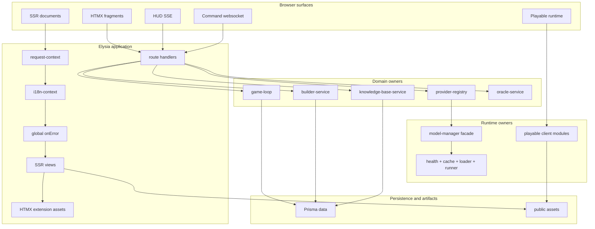
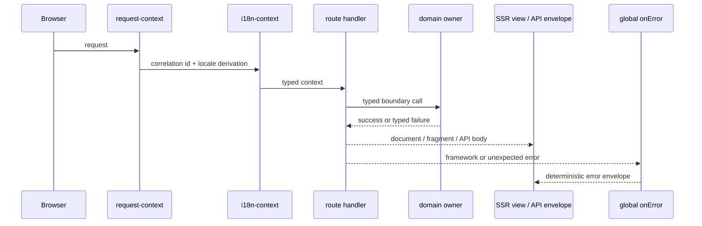
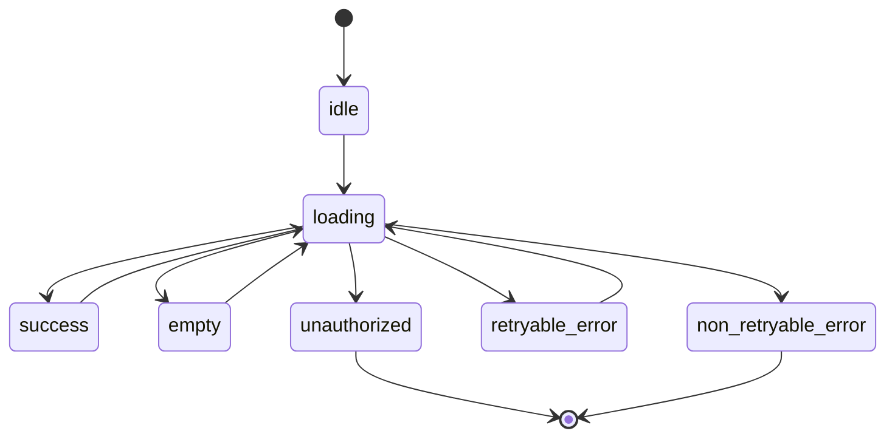
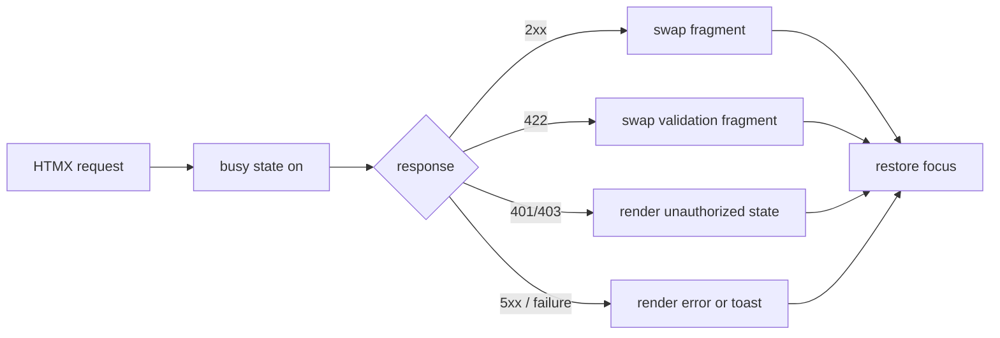
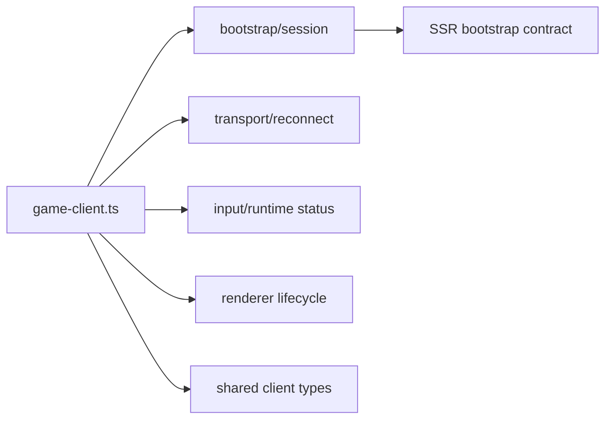
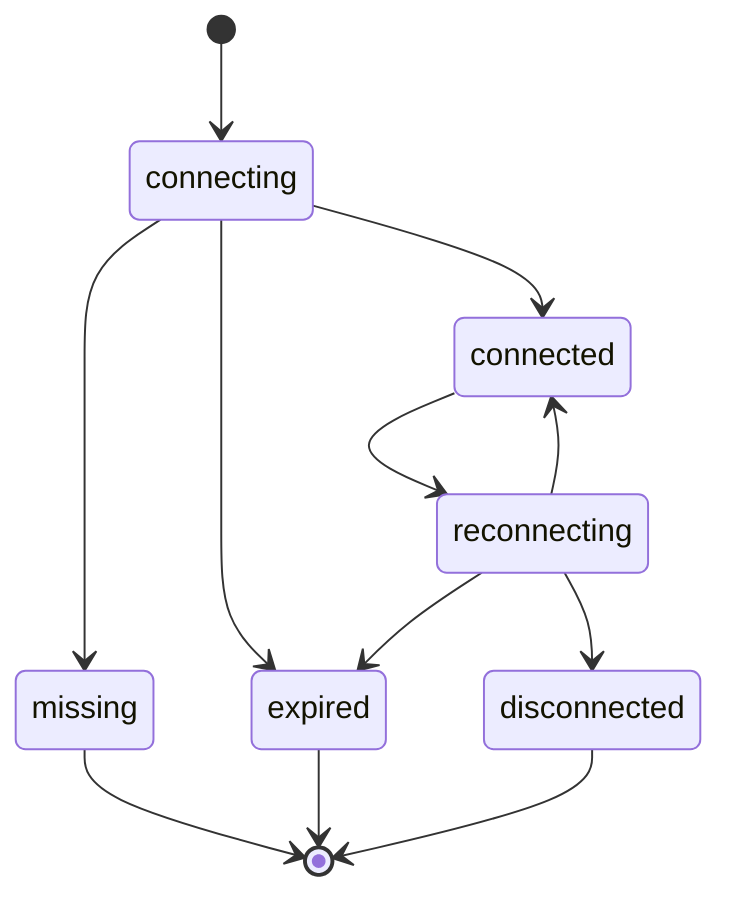
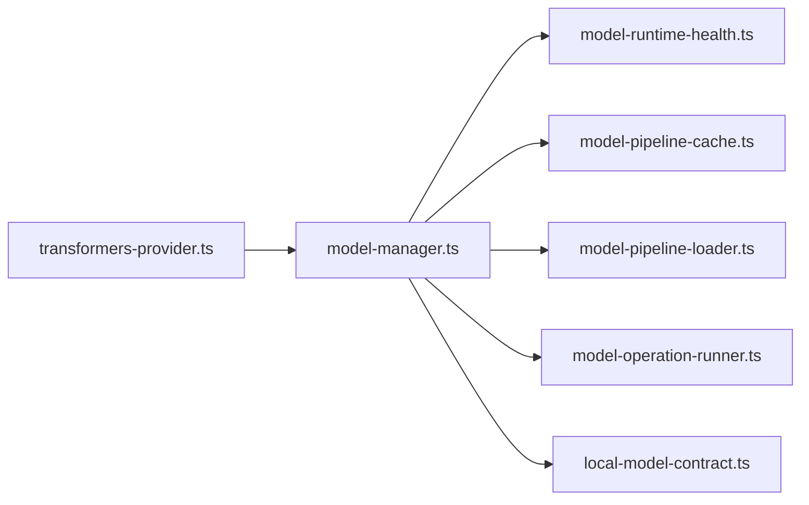
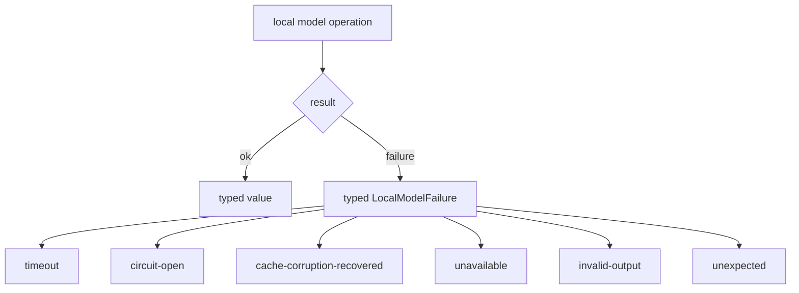
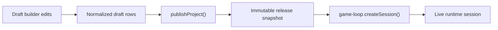
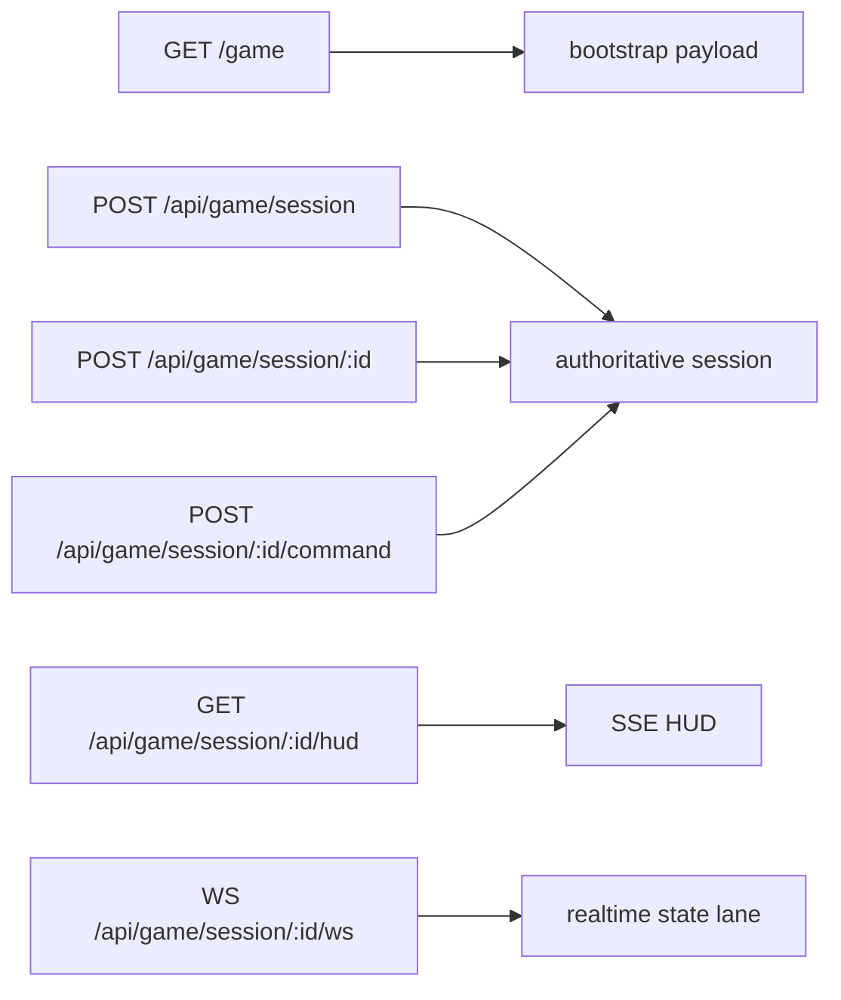

# TEA architecture

This document is the source-of-truth overview for TEA’s current runtime boundaries.

## System topology

## Request lifecycle

## Ownership boundaries

| Concern | Owner | Notes |
| --- | --- | --- |
| Correlation ids and request completion logs | `request-context` | One request-scoped logging boundary |
| Locale negotiation and translator selection | `i18n-context`, `translator.ts` | Tracks explicit override, query, header, and default fallback |
| Shared shell and theme wiring | `src/views/layout.ts` | One layout owner for the SSR shell |
| HTMX lifecycle behavior | `src/htmx-extensions/layout-controls.ts` | Busy state, validation swaps, focus return |
| Game page bootstrap contract | `src/shared/contracts/game-client-bootstrap.ts` | Single SSR-to-browser contract |
| Playable runtime entry | `src/playable-game/game-client.ts` | Orchestration only |
| Authoritative simulation | `src/domain/game/game-loop.ts` | Session restore, queue advancement, persistence coordination |
| Builder mutations and release flow | `src/domain/builder/builder-service.ts` | Draft mutation and publish orchestration |
| AI capability routing | `src/domain/ai/providers/provider-registry.ts` | One provider switchboard |
| Local model execution | `src/domain/ai/model-manager.ts` | Facade over health/cache/loader/runner modules |
| Prisma failure mapping | `src/shared/services/prisma-failure.ts` | Explicit DB failure translation |

## UI state model

All SSR fragments and runtime fallback surfaces map to one state vocabulary.

## Shared shell and HTMX ownership

The shell is DaisyUI-first and HTMX-first.

- Shared primitives: `navbar`, `drawer`, `card`, `alert`, `loading`, `table`, `toast`
- Request behavior is driven by HTMX lifecycle events instead of page-local scripts
- Validation responses can intentionally swap on `422`
- Post-swap focus returns to `[data-focus-panel="true"]` first, then `#main-content`

## Playable runtime decomposition

The playable client is decomposed into focused modules under one entrypoint.

### Playable connection state machine

Rules:

- Restore-first logic is limited to token-expiry and recoverable-close paths.
- Session persistence is owned by the bootstrap/session module.
- Websocket lifecycle, queue depth sync, and retry budget are transport-owned.
- Renderer lifecycle is isolated from connection logic.

## Local AI runtime decomposition

The local model runtime uses one public facade and typed internal boundaries.

### Local runtime result model

## Builder publish and runtime seeding

Runtime sessions seed from immutable published releases, not mutable draft state.

## Transport surfaces

## Contract-first boundaries

| Boundary | Contract owner |
| --- | --- |
| SSR game bootstrap | `src/shared/contracts/game-client-bootstrap.ts` |
| Game transport frames and scene state | `src/shared/contracts/game.ts` |
| UI fragment state | `src/shared/contracts/ui-state.ts` |
| External provider/network/DB failures | `src/shared/contracts/external-boundary.ts` |
| Local model runtime failures | `src/domain/ai/local-model-contract.ts` |
| Locale ids and messages | `src/shared/i18n/messages.ts`, `translator.ts` |

## Documentation index

- [Docs index](/Users/brandondonnelly/Downloads/tea/docs/index.md)
- [README](/Users/brandondonnelly/Downloads/tea/README.md)
- [API and transport contracts](/Users/brandondonnelly/Downloads/tea/docs/api-contracts.md)
- [Builder domain](/Users/brandondonnelly/Downloads/tea/docs/builder-domain.md)
- [HTMX extensions](/Users/brandondonnelly/Downloads/tea/docs/htmx-extensions.md)
- [Playable runtime](/Users/brandondonnelly/Downloads/tea/docs/playable-runtime.md)
- [Local AI runtime](/Users/brandondonnelly/Downloads/tea/docs/local-ai-runtime.md)
- [Operator runbook](/Users/brandondonnelly/Downloads/tea/docs/operator-runbook.md)
- [RMMZ companion pack](/Users/brandondonnelly/Downloads/tea/docs/rmmz-pack.md)
