<div align="center">

```
        (  )   (   )  )
         ) (   )  (  (
         ( )  (    ) )
         _____________
        <_____________> ___
        |             |/ _ \
        |               | | |
        |               |_| |
   _____|             |\___/
  /    \___________/    \
  \_____________________/

   _____  _____     _
  |_   _|| ____|   / \
    | |  |  _|    / _ \
    | |  | |___  / ___ \
    |_|  |_____|/_/   \_\

  Templated  Event-driven  Agentic
```

# 🍵 TEA Game Engine

**T**emplated · **E**vent-driven · **A**gentic

A server-driven game engine and worldbuilding platform.<br/>
服务端驱动的游戏引擎与世界构建平台。

[](https://bun.sh)
[](https://www.typescriptlang.org)
[](https://elysiajs.com)
[](https://htmx.org)
[](https://pixijs.com)
[](https://www.prisma.io)

[English](#overview)&ensp;·&ensp;[中文说明](#中文说明)

</div>

---

## Table of Contents

- [Overview](#overview)
  - [Key Capabilities](#key-capabilities)
- [Tech Stack](#tech-stack)
- [Quick Start](#quick-start)
- [Architecture](#architecture)
  - [System Overview](#system-overview)
  - [Request Lifecycle](#request-lifecycle)
  - [Plugin Pipeline](#plugin-pipeline)
  - [Domain Model](#domain-model)
  - [Session Transport Contract](#session-transport-contract)
  - [Builder/Player Flow](#builderplayer-flow)
  - [Builder Publish Contract](#builder-publish-contract)
- [Project Structure](#project-structure)
- [Commands](#commands)
- [Environment](#environment)
- [API Reference](#api-reference)
- [Accessibility](#accessibility)
- [Acknowledgements](#acknowledgements)
- [中文说明](#%E4%B8%AD%E6%96%87%E8%AF%B4%E6%98%8E)

---

## Overview

TEA Game Engine is an SSR-first game development platform that unifies server-rendered pages, real-time AI narrative generation, and a browser-native playable game client into a single runtime. Built for **Leaves of the Fallen Kingdom (LOTFK)** — a strategy worldbuilding experience.

The product centers on a **builder/player loop**: author content in the builder, publish an immutable release, play the published build, and iterate. Primary navigation routes to Home, Game, and Builder.

### Key Capabilities

- **Builder/Player Loop** — project-scoped authoring, publish/unpublish, immutable releases, and playable validation
- **Shared-Session Multiplayer** — owners can issue invite tokens for controller and spectator roles, and controller participants now drive their own in-scene avatars inside the same published runtime session
- **Server-Side Rendering** — all pages render on the server via Elysia; HTMX provides progressive enhancement with `hx-indicator` and `hx-disabled-elt` for loading feedback
- **AI Narrative Engine** — on-device inference via 🤗 Transformers with ONNX/WebGPU acceleration; patch preview/apply for reviewable co-author flow
- **AI Knowledge + RAG** — persisted project-scoped/app-scoped knowledge documents, embeddings-backed semantic search, retrieval-augmented implementation assist, and structured tool planning for agentic workflows
- **Playable Game Client** — PixiJS 8 canvas with Three.js 3D layer, bundled and hot-reloaded during development
- **OpenUSD-Aware Asset Ingestion** — builder uploads accept `.usd`, `.usda`, `.usdc`, and `.usdz`, and the published Three.js runtime can load `usdz` assets directly
- **Type-Safe Stack** — end-to-end types from Prisma schema through Elysia route contracts and SSR views
- **Internationalization** — `Accept-Language` q-weight parsing with deterministic locale persistence
- **Structured Observability** — correlation ID propagation, levelled JSON logging, typed error envelopes
- **Canonical Runtime Ownership** — `game-loop` orchestrates simulation, session resolution, and runtime metrics while `playerProgressStore` owns XP/level/interaction persistence
- **Domain-Owned Builder Factories** — scene, asset, animation clip, mechanics, generation, and automation create flows now originate in `builder-service`, so routes no longer invent authored defaults

### Platform Readiness

The builder exposes a capability matrix that reflects current implementation state:

| Capability | Status | Notes |
|---|---|---|
| Release flow | Implemented | Publish/unpublish, immutable releases |
| 2D runtime | Partial | PixiJS; scene from authored data |
| 3D runtime | Partial | Three.js runtime supports authored model assets, but builder viewport authoring is still limited |
| Sprite pipeline | Partial | Manifest-based; asset upload implemented |
| Animation pipeline | Partial | Clip definitions; no frame editor |
| Mechanics | Partial | Quests, triggers, dialogue graphs; quest edit/delete implemented |
| AI authoring | Partial | Patch preview/apply; dialogue generate; structured tool planning |
| RAG / knowledge retrieval | Partial | Persisted documents, lexical term index plus semantic rerank, retrieval assist; vector storage is JSON-backed in Prisma rows rather than a dedicated vector database |
| Automation / RPA | Partial | Lifecycle-managed worker, auditable steps, Playwright-backed evidence capture |
| Multiplayer | Partial | Shared-session owner/controller/spectator flow with independent owner/controller avatars; spectator mode remains observe-only |
| OpenUSD | Partial | `.usd/.usda/.usdc/.usdz` ingest supported; `usdz` playable in Three.js runtime |

---

## Tech Stack

| Layer | Technology | Version |
|---|---|---|
| Runtime | Bun | 1.3 |
| Language | TypeScript (strict) | 5.9 |
| Server Framework | Elysia | 1.4 |
| SSR Enhancement | HTMX | 2.0 |
| CSS Framework | Tailwind CSS | 4.x |
| UI Components | DaisyUI | 5.x |
| ORM | Prisma + libSQL | 7.x |
| 2D Render | PixiJS | 8.x |
| 3D Render | Three.js | 0.183 |
| AI Inference | 🤗 Transformers (ONNX) | 3.8 |
| Image Ops | Sharp | 0.34 |

---

## Quick Start

```bash
# Clone
git clone https://github.com/d4551/tea.git && cd tea

# Bootstrap on a Bun-ready machine
bun run setup

# Or bootstrap from an OS installer entrypoint
./scripts/install-macos.sh
./scripts/install-linux.sh
powershell -ExecutionPolicy Bypass -File .\scripts\install-windows.ps1

# Verify runtime readiness
bun run doctor

# Start development (launches all watchers)
bun run dev
```

Setup performs:

- `bun install`
- `.env` creation only when missing
- `bun run prisma:generate`
- `bunx --bun prisma db push`
- `bun run build:assets`
- typed readiness verification for DB reachability, required assets, writable directories, and AI routing

---

## Architecture

### System Overview

Browser runtime (SSR + HTMX, Playable Client with Pixi + Three, HUD via SSE, Command stream via WebSocket) connects to the Elysia server. Plugins run in strict order. Domain services stay thin, while Prisma client extensions own session, progress, and builder project persistence primitives.

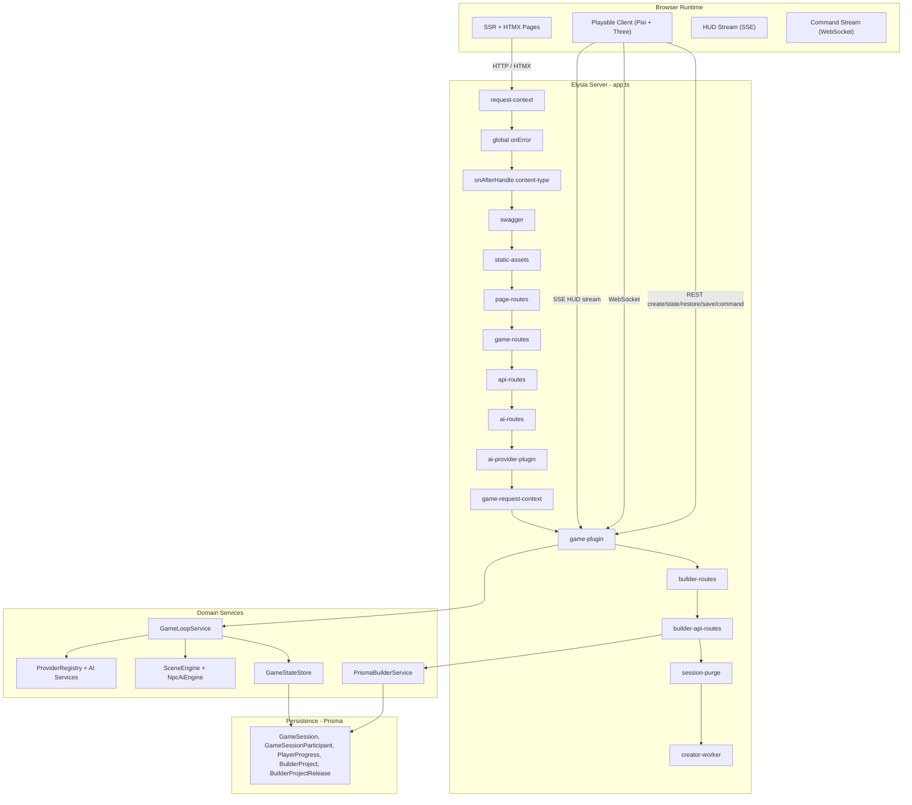

### Request Lifecycle

Example flow for server-authoritative game session creation:

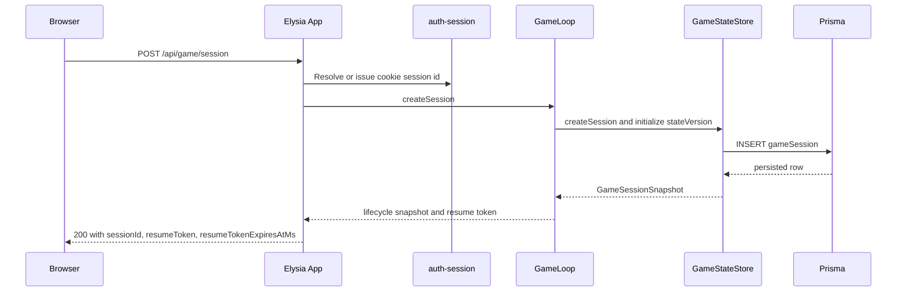

### Plugin Pipeline

Plugins are composed in strict order. Each plugin decorates the request context for downstream consumers. Infrastructure plugins (request-context, onError, content-type, swagger, static-assets) run first; then page, game, API, and AI routes; then the AI provider lifecycle plugin; then the scoped `game-request-context` derive plugin; then `game-plugin`; then builder routes; finally session-purge and creator-worker for lifecycle-owned background execution. Builder locale, project id, current path, and scoped body/query/param merges are attached once through `src/plugins/builder-request-context.ts`, page/oracle auth-session state is attached once through `src/plugins/auth-session.ts`, game HTTP participant identity/locale plus playable-page `sessionId` / `projectId` / `invite` query resolution and websocket participant/resume-token resolution are attached once through `src/plugins/game-request-context.ts`, full-page SSR shells consume a shared `LayoutContext` from `src/views/layout.ts`, builder JSON draft-state decode/versioned-save/snapshot projection now live behind `src/domain/builder/builder-project-state-store.ts`, `src/shared/contracts/game.ts` owns persisted scene-state / realtime-frame validation, `GameStateStore` owns normalized session persistence for scalar project/release binding plus relational scene, actor, runtime, NPC, trigger, quest, and flag rows, `game-plugin` owns session-scoped websocket tick cleanup plus transport teardown when a session closes or is deleted, and `game-loop` owns canonical session resolution, dashboard/session metrics, expired-session purging, and the HUD state read path consumed by SSE transport rendering.

```mermaid
flowchart LR
  A["request-context"] --> B["global onError"]
  B --> C["onAfterHandle content-type"]
  C --> D["swagger"]
  D --> E["static-assets"]
  E --> F["page-routes"]
  F --> G["game-routes"]
  G --> H["api-routes"]
  H --> I["ai-routes"]
  I --> J["ai-provider-plugin"]
  J --> K["game-request-context"]
  K --> L["game-plugin"]
  L --> M["builder-routes"]
  M --> N["builder-api-routes"]
  N --> O["session-purge"]
  O --> P["creator-worker"]
```

### Domain Model

Core entities: GameSession (authoritative shared runtime session row with scalar project/release binding), GameSessionSceneState / GameSessionSceneCollision / GameSessionSceneNode / GameSessionSceneAsset / GameSessionSceneAssetTag / GameSessionSceneAssetVariant (normalized runtime scene playback state), GameSessionParticipant (shared-session multiplayer membership), GameSessionActor (authoritative per-participant runtime actor state), GameSessionRuntimeState / GameSessionNpc / GameSessionNpcDialogueKey / GameSessionNpcDialogueEntry (normalized runtime camera, dialogue, and NPC state), GameSessionTrigger / GameSessionTriggerRequiredFlag / GameSessionTriggerSetFlag (normalized runtime trigger state), GameSessionQuest / GameSessionQuestStep / GameSessionFlag (normalized runtime quest and flag state), PlayerProgress / PlayerProgressVisitedScene / PlayerProgressInteraction (normalized runtime progression state), BuilderProject (draft state/versioning), BuilderProjectScene / BuilderProjectSceneCollision / BuilderProjectSceneNpc / BuilderProjectSceneNpcDialogueKey / BuilderProjectSceneNode / BuilderProjectDialogueEntry (relational draft world-content registries), BuilderProjectAsset / BuilderProjectAssetTag / BuilderProjectAssetVariant / BuilderProjectAnimationClip (relational draft media registries), BuilderProjectDialogueGraph / BuilderProjectDialogueGraphNode / BuilderProjectDialogueGraphEdge / BuilderProjectQuest / BuilderProjectQuestStep / BuilderProjectTrigger / BuilderProjectTriggerRequiredFlag / BuilderProjectTriggerSetFlag / BuilderProjectFlag (relational draft mechanics registries), BuilderProjectGenerationJob / BuilderProjectGenerationJobArtifact / BuilderProjectArtifact / BuilderProjectAutomationRun / BuilderProjectAutomationRunStep / BuilderProjectAutomationRunArtifact (relational draft worker state), AiKnowledgeDocument / AiKnowledgeChunk (persisted RAG corpus), and BuilderProjectRelease (immutable published snapshots).

```mermaid
erDiagram
  GAME_SESSION {
    string id PK
    string ownerSessionId
    int stateVersion
    datetime expiresAt
    json scene
    string projectId
  }
  GAME_SESSION_PARTICIPANT {
    string sessionId PK
    string participantSessionId PK
    string role
  }
  PLAYER_PROGRESS {
    string sessionId PK
    int xp
    int level
  }
  BUILDER_PROJECT {
    string id PK
    int version
    string checksum
    int latestReleaseVersion
    int publishedReleaseVersion
    json state
  }
  BUILDER_PROJECT_SCENE {
    string projectId PK
    string id PK
    string titleKey
  }
  BUILDER_PROJECT_DIALOGUE_ENTRY {
    string projectId PK
    string locale PK
    string key PK
  }
  BUILDER_PROJECT_ASSET {
    string projectId PK
    string id PK
    string kind
    string sceneMode
  }
  BUILDER_PROJECT_ANIMATION_CLIP {
    string projectId PK
    string id PK
    string assetId
    string sceneMode
  }
  BUILDER_PROJECT_DIALOGUE_GRAPH {
    string projectId PK
    string id PK
    string rootNodeId
  }
  BUILDER_PROJECT_QUEST {
    string projectId PK
    string id PK
    string title
  }
  BUILDER_PROJECT_TRIGGER {
    string projectId PK
    string id PK
    string event
  }
  BUILDER_PROJECT_FLAG {
    string projectId PK
    string key PK
    string label
  }
  BUILDER_PROJECT_GENERATION_JOB {
    string projectId PK
    string id PK
    string kind
    string status
  }
  BUILDER_PROJECT_ARTIFACT {
    string projectId PK
    string id PK
    string jobId
    string kind
  }
  BUILDER_PROJECT_AUTOMATION_RUN {
    string projectId PK
    string id PK
    string status
  }
  BUILDER_PROJECT_RELEASE {
    string projectId FK
    int releaseVersion
    string checksum
    json state
  }
  GAME_SESSION ||--o{ GAME_SESSION_PARTICIPANT : admits
  GAME_SESSION ||--|| PLAYER_PROGRESS : has
  BUILDER_PROJECT ||--o{ BUILDER_PROJECT_SCENE : owns
  BUILDER_PROJECT ||--o{ BUILDER_PROJECT_DIALOGUE_ENTRY : owns
  BUILDER_PROJECT ||--o{ BUILDER_PROJECT_ASSET : owns
  BUILDER_PROJECT ||--o{ BUILDER_PROJECT_ANIMATION_CLIP : owns
  BUILDER_PROJECT ||--o{ BUILDER_PROJECT_DIALOGUE_GRAPH : owns
  BUILDER_PROJECT ||--o{ BUILDER_PROJECT_QUEST : owns
  BUILDER_PROJECT ||--o{ BUILDER_PROJECT_TRIGGER : owns
  BUILDER_PROJECT ||--o{ BUILDER_PROJECT_FLAG : owns
  BUILDER_PROJECT ||--o{ BUILDER_PROJECT_GENERATION_JOB : owns
  BUILDER_PROJECT ||--o{ BUILDER_PROJECT_ARTIFACT : owns
  BUILDER_PROJECT ||--o{ BUILDER_PROJECT_AUTOMATION_RUN : owns
  BUILDER_PROJECT_ASSET ||--o{ BUILDER_PROJECT_ANIMATION_CLIP : drives
  BUILDER_PROJECT ||--o{ BUILDER_PROJECT_RELEASE : publishes
  BUILDER_PROJECT ||..o{ GAME_SESSION : seeds
```

### Session Transport Contract

Client creates or joins a session via REST, connects WebSocket with a participant-scoped resume token, sends commands via REST when the role permits control, and subscribes to HUD events via SSE. On token expiry, client calls POST restore with the resume token in the request body.

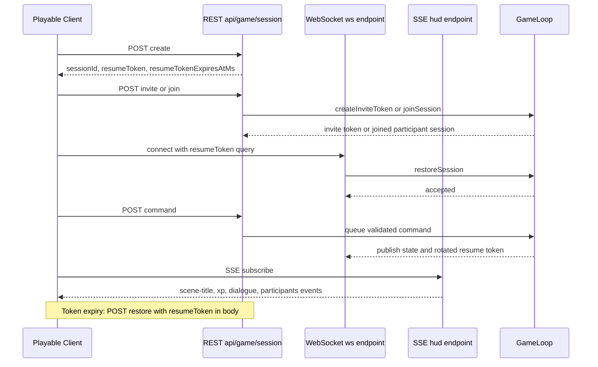

Session roles:

- `owner`: full lifecycle control, save/close/delete/invite
- `controller`: can restore, observe, and issue gameplay commands
- `spectator`: can restore and observe, but command enqueue is rejected server-side

### Builder/Player Flow

Authors create content in the builder, publish immutable releases, and players validate the published build. The loop continues with iteration back in the builder.

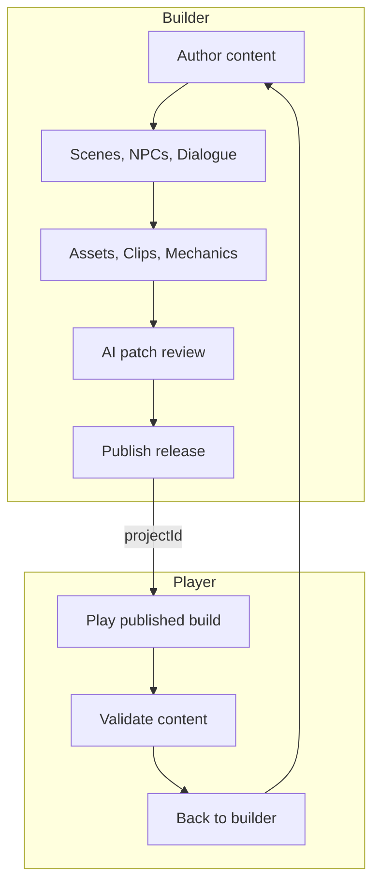

### Builder Publish Contract

Draft mutations update `builderProject.state` only for residual draft metadata, while scenes, localized dialogue catalogs, media, mechanics, and worker state live in relational draft tables. Publish creates an immutable release snapshot with the full materialized project. Runtime sessions load only published release data.

OpenUSD asset policy:

- Builder ingestion accepts `.usd`, `.usda`, `.usdc`, and `.usdz`.
- Published runtime currently treats `usdz` as the directly loadable OpenUSD variant in Three.js.
- `.usd`, `.usda`, and `.usdc` remain authoritative source variants for later import or conversion workflows rather than being silently rewritten.

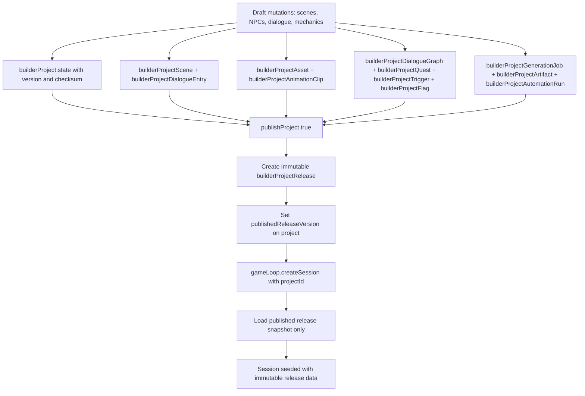

---

## Project Structure

```text
tea/
├── packages/             # Bun workspaces
├── prisma/               # Schema and local libSQL database
│   ├── schema.prisma     # Single source of truth
│   └── dev.db            # Local development database
├── assets/               # Canonical media assets mounted at runtime
├── public/               # Static web assets
├── scripts/              # Bun-native build/dev orchestration
│   └── asset-pipeline.ts # Canonical asset graph used by build + watch flows
├── src/                  # Server / Backend
│   ├── config/           # Envs and constants
│   ├── shared/services/  # Prisma client and shared infrastructure
│   ├── domain/           # Core game logic (Game, AI, Oracle)
│   ├── plugins/          # Elysia plugins (i18n, HTMX, Error)
│   └── app.ts            # Elysia entry point
├── tests/                # bun:test suites
└── README.md             # Developer-facing architecture and workflow guide
```

---

## Commands

| Command | Description |
|---|---|
| `bun run dev` | Start development server with all watchers |
| `bun run setup` | Bun-native bootstrap: install deps, preserve/create `.env`, generate Prisma, push schema, build assets, run readiness checks |
| `bun run doctor` | Non-mutating readiness report for DB reachability, required assets, writable directories, and AI routing |
| `bun run build:assets` | One-off asset compilation |
| `bun run start` | Production: build and start |
| `bun run lint` | Biome linting |
| `bun run typecheck` | Strict TypeScript checking |
| `bun test` | Run test suite |
| `bun run verify` | Full pipeline: build:assets → lint → typecheck → test |

---

## Environment

Core `.env` variables (see `.env.example` for full defaults):

| Variable | Purpose |
|---|---|
| `DATABASE_URL` | libSQL connection string (e.g., `file:./prisma/dev.db`) |
| `APP_ORIGIN` | Absolute browser-reachable app origin used for local callbacks and automation evidence |
| `NODE_ENV` | `development` or `production` |
| `PORT` | Server port (default: 3000) |
| `SESSION_COOKIE_NAME` | Cookie name for anonymous auth-session identity |
| `SESSION_MAX_AGE_SECONDS` | Anonymous session cookie lifetime in seconds |
| `SESSION_RESUME_TOKEN_SECRET` | Required secret used to sign session resume tokens |
| `BUN_SUPPORTED_RANGE` | Supported Bun major/minor line enforced by setup and doctor |
| `BUN_INSTALL_VERSION` | Exact Bun version used by the OS bootstrap scripts |
| `BUILDER_LOCAL_AUTOMATION_ORIGIN` | Optional absolute override for builder-local automation/browser evidence capture |
| `BUILDER_UPLOADS_DIRECTORY` | Writable builder upload root for source assets and generated artifacts |
| `AI_WARMUP_ON_BOOT` | Optional boolean to enable eager local model warmup at boot (default: `false`) |
| `AI_CACHE_DIRECTORY` | Writable cache directory checked by setup, doctor, and startup preflight |
| `AI_LOCAL_MODEL_DIRECTORY` | Writable local model directory checked by setup, doctor, and startup preflight |
| `AI_ONNX_DEVICE` | ONNX execution device (`cpu`, `webgpu`, or `wasm`); use `cpu` for Bun server runtime stability |
| `AI_LOCAL_API_COMPATIBLE_ENABLED` | Enables a local OpenAI-compatible inference lane (recommended for Ramalama-class local servers) |
| `AI_LOCAL_API_COMPATIBLE_BASE_URL` | Base URL for the local OpenAI-compatible API (for example `http://127.0.0.1:8080/v1`) |
| `AI_LOCAL_API_COMPATIBLE_TRANSCRIPTION_MODEL` | Optional speech-to-text model exposed by the local OpenAI-compatible lane |
| `AI_LOCAL_API_COMPATIBLE_SPEECH_MODEL` | Optional text-to-speech model exposed by the local OpenAI-compatible lane |
| `AI_LOCAL_API_COMPATIBLE_MODERATION_MODEL` | Optional moderation/classification model exposed by the local OpenAI-compatible lane |
| `AI_LOCAL_API_COMPATIBLE_SPEECH_VOICE` | Optional default speech voice used by the local OpenAI-compatible lane |
| `AI_CLOUD_API_COMPATIBLE_ENABLED` | Enables the hosted OpenAI-compatible fallback lane |
| `AI_CLOUD_API_COMPATIBLE_BASE_URL` | Base URL for the hosted OpenAI-compatible API |
| `AI_CLOUD_API_COMPATIBLE_TRANSCRIPTION_MODEL` | Speech-to-text model used by the hosted OpenAI-compatible lane |
| `AI_CLOUD_API_COMPATIBLE_SPEECH_MODEL` | Text-to-speech model used by the hosted OpenAI-compatible lane |
| `AI_CLOUD_API_COMPATIBLE_MODERATION_MODEL` | Moderation/classification model used by the hosted OpenAI-compatible lane |
| `AI_CLOUD_API_COMPATIBLE_SPEECH_VOICE` | Default speech voice used by the hosted OpenAI-compatible lane |
| `AI_CLOUD_FALLBACK_ENABLED` | Allows hosted OpenAI-compatible providers when no local-capable provider can satisfy the request |
| `AI_RAG_CHUNK_SIZE` | Plain-text chunk size used when ingesting persisted knowledge documents |
| `AI_RAG_CHUNK_OVERLAP` | Overlap between adjacent RAG chunks |
| `AI_RAG_SEARCH_LIMIT` | Default retrieval limit for semantic search and retrieval assist |
| `AI_RAG_CANDIDATE_LIMIT` | Lexical term-index shortlist size used before semantic reranking |
| `AI_RAG_HASH_DIMENSION` | Deterministic fallback embedding dimension used when local/cloud embeddings are unavailable or degraded |

Game runtime controls:

| Variable | Purpose |
|---|---|
| `GAME_SESSION_TTL_MS` | Session expiration TTL |
| `GAME_TICK_MS` | Server-authoritative tick cadence |
| `GAME_SESSION_PERSIST_INTERVAL_MS` | Minimum interval between automatic DB persists |
| `GAME_SAVE_COOLDOWN_MS` | Manual save cooldown for `/save` endpoint |
| `GAME_MAX_COMMANDS_PER_TICK` | Command queue upper bound per processing window |
| `GAME_MAX_INTERACTIONS_PER_TICK` | Per-tick interaction cap |
| `GAME_MAX_CHAT_COMMANDS_PER_WINDOW` | Chat anti-spam max actions per window |
| `GAME_CHAT_RATE_LIMIT_WINDOW_MS` | Chat anti-spam window length |
| `GAME_SESSION_RESUME_WINDOW_MS` | Max resume token validity horizon |
| `GAME_COMMAND_SEND_INTERVAL_MS` | Client movement command send cadence |
| `GAME_COMMAND_TTL_MS` | Client command TTL used in WS envelopes |
| `GAME_SOCKET_RECONNECT_DELAY_MS` | Client reconnect backoff delay |
| `GAME_RESTORE_REQUEST_TIMEOUT_MS` | Restore POST timeout budget |
| `GAME_RESTORE_MAX_ATTEMPTS` | Max restore retries before expired UX state |

AI routing defaults:

- Routing policy is `local-first` through [src/domain/ai/providers/provider-registry.ts](/Users/brandondonnelly/Downloads/tea/src/domain/ai/providers/provider-registry.ts).
- Local AI can run through Ollama, Transformers.js, or an OpenAI-compatible local server such as Ramalama exposed on a `/v1` endpoint.
- Hosted AI support uses the same OpenAI-compatible provider contract instead of vendor-specific route bindings.
- Cloud-capable providers remain available through the same registry only when enabled and a local-capable provider cannot satisfy the capability.
- RAG persistence is Prisma-backed through [src/domain/ai/knowledge-base-service.ts](/Users/brandondonnelly/Downloads/tea/src/domain/ai/knowledge-base-service.ts); there is no separate vector database in this pass.

Repo audit checklist:

- Auth request context owner: [src/plugins/auth-session.ts](/Users/brandondonnelly/Downloads/tea/src/plugins/auth-session.ts)
- Builder request context owner: [src/plugins/builder-request-context.ts](/Users/brandondonnelly/Downloads/tea/src/plugins/builder-request-context.ts)
- Game request context owner: [src/plugins/game-request-context.ts](/Users/brandondonnelly/Downloads/tea/src/plugins/game-request-context.ts)
- AI provider routing owner: [src/domain/ai/providers/provider-registry.ts](/Users/brandondonnelly/Downloads/tea/src/domain/ai/providers/provider-registry.ts)
- Knowledge/RAG retrieval owner: [src/domain/ai/knowledge-base-service.ts](/Users/brandondonnelly/Downloads/tea/src/domain/ai/knowledge-base-service.ts)
- Builder draft/release persistence owner: [src/domain/builder/builder-project-state-store.ts](/Users/brandondonnelly/Downloads/tea/src/domain/builder/builder-project-state-store.ts)
- Multiplayer session/runtime owner: [src/domain/game/game-loop.ts](/Users/brandondonnelly/Downloads/tea/src/domain/game/game-loop.ts)
- Setup/doctor/preflight owner: [src/bootstrap/runtime-readiness.ts](/Users/brandondonnelly/Downloads/tea/src/bootstrap/runtime-readiness.ts)
- No route-local defaulting: request context is owned by scoped request-context plugins
- No direct provider binding outside `ProviderRegistry`
- No direct persistence access outside owning domain stores/services
- No raw user-facing strings outside message catalogs
- No active authored/runtime state trapped in opaque JSON except immutable release snapshots and opaque machine payloads such as persisted embeddings

---

## API Reference

Core game/session endpoints:

| Endpoint | Method | Purpose |
|---|---|---|
| `/game` | GET | SSR game page bootstrap (`sessionId`, owner-bound `resumeToken`) |
| `/api/game/session` | POST | Create a new server-authoritative session |
| `/api/game/session/:id/state` | GET | Read owner-scoped session state + queue metadata |
| `/api/game/session/:id` | POST | Restore session using resume token in JSON body |
| `/api/game/session/:id/command` | POST | Validate and enqueue command |
| `/api/game/session/:id/dialogue` | GET | Fetch current active dialogue |
| `/api/game/session/:id/save` | POST | Force persist subject to save cooldown |
| `/api/game/session/:id/close` | POST | Close + delete session |
| `/api/game/session/:id` | DELETE | Delete session directly |
| `/api/game/session/:id/hud` | GET (SSE) | Canonical HUD stream (`scene-title`, `xp`, `dialogue`, `close`) |
| `/api/game/session/:id/ws` | WS | Command/state realtime channel (requires valid resume token) |

Other primary endpoints:

| Endpoint | Method | Purpose |
|---|---|---|
| `/` | GET | SSR home page |
| `/api/health` | GET | System health envelope |
| `/api/oracle` | POST | Oracle interaction |
| `/api/ai/knowledge/documents` | GET / POST | List or ingest persisted knowledge documents for app/project-scoped RAG |
| `/api/ai/knowledge/search` | POST | Semantic search across persisted knowledge chunks |
| `/api/ai/assist/retrieval` | POST | Retrieval-augmented assist using the best available chat-capable provider |
| `/api/ai/plan/tools` | POST | Structured tool planning for agentic implementation flows |
| `/builder/*` | GET | Builder SSR views |
| `/api/builder/*` | REST | Builder data + AI compose/test/assist |

Builder API highlights:

| Endpoint | Method | Purpose |
|---|---|---|
| `/api/builder/assets/upload` | POST | Multipart asset upload (file input) |
| `/api/builder/generation-jobs/:jobId/stream` | GET (SSE) | Stream generation job review state |
| `/api/builder/quests/:questId` | GET | Quest edit form |
| `/api/builder/quests/:questId/form` | POST | Save quest |
| `/api/builder/quests/:questId` | DELETE | Delete quest |
| `/api/builder/automation-runs/:runId/approve` | POST | Approve or reject automation evidence |

Deprecated/removed surface:

- `/api/game/session/:id/partials/dialogue` was removed. HUD rendering is now single-path via SSE.

AI retrieval behavior:

- Knowledge ingestion chunks plain text, embeds each chunk, and persists the corpus in Prisma.
- Embeddings route through the shared provider registry, so local Transformers and cloud/back-end providers share one routing boundary.
- Retrieval first narrows to a Prisma-backed lexical term index and then reranks semantically in application memory, which avoids full-corpus scans while keeping Prisma as the canonical persisted corpus.
- When the active embedding backend is cold, degraded, or unavailable, the knowledge service falls back to deterministic hashed embeddings so retrieval endpoints remain responsive instead of timing out.

---

## Accessibility

- WCAG AA minimum
- Skip-to-content link for keyboard navigation
- `aria-current="page"` on active nav items
- Focus management on all interactive elements
- All user-facing text via i18n message catalogs

---

## Acknowledgements

<div align="center">

```text
    ·  ˚ . ·  ✦  ˚
  ˚  · Thank you ·  ˚
  ✦  ·  谢谢你们  ·  ✦
    ˚  ·    🍵   ·  ˚
    ·  ˚ . ·  ✦  ˚
```

*Dedicated to **Estrella** and **Ioanin** — the heart and inspiration behind this engine.*

</div>

---

<details>
<summary><h2 id="中文说明">中文说明</h2></summary>

### 目录

- [概述](#概述)
  - [核心能力](#核心能力)
- [技术栈](#技术栈-1)
- [快速开始](#快速开始-1)
- [系统架构](#系统架构)
  - [系统概览](#系统概览)
  - [请求生命周期](#请求生命周期-1)
  - [插件流水线](#插件流水线-1)
  - [领域模型](#领域模型-1)
  - [会话传输契约](#会话传输契约)
  - [构建器发布契约](#构建器发布契约)
- [项目结构](#项目结构-1)
- [命令](#命令-1)
- [环境变量](#环境变量)
- [API 参考](#api-参考)
- [无障碍](#无障碍)
- [致谢](#致谢)

### 概述

TEA 游戏引擎是一个以服务端渲染 (SSR) 为核心的游戏开发平台，将服务端页面交付、实时 AI 叙事生成和浏览器原生可玩游戏客户端统一在单一运行时中。专为 **落叶王国 (LOTFK)** 策略世界构建体验而打造。

#### 核心能力

- **服务端渲染** — 所有页面由 Elysia 在服务端渲染，HTMX 提供渐进增强
- **AI 叙事引擎** — 通过 🤗 Transformers 进行设备端推理，支持 ONNX/WebGPU 加速
- **可玩游戏客户端** — PixiJS 8 画布 + Three.js 3D 层，开发期间支持热重载
- **全链路类型安全** — 从 Prisma 模式到 Elysia 路由契约与 SSR 视图的端到端类型
- **国际化** — `Accept-Language` q 权重解析与确定性区域设置持久化
- **结构化可观察性** — 关联 ID 传播、分级 JSON 日志、类型化错误信封

### 技术栈

| 层级 | 技术 | 版本 |
|---|---|---|
| 运行时 | Bun | 1.3 |
| 语言 | TypeScript (strict) | 5.9 |
| 服务端框架 | Elysia | 1.4 |
| SSR 增强 | HTMX | 2.0 |
| CSS 框架 | Tailwind CSS | 4.x |
| UI 组件库 | DaisyUI | 5.x |
| ORM | Prisma + libSQL | 7.x |
| 2D 渲染 | PixiJS | 8.x |
| 3D 渲染 | Three.js | 0.183 |
| AI 推理 | 🤗 Transformers (ONNX) | 3.8 |
| 图像处理 | Sharp | 0.34 |

### 快速开始

```bash
# 克隆仓库
git clone https://github.com/d4551/tea.git && cd tea

# 安装依赖
bun install

# 配置环境变量
cp .env.example .env

# 生成 Prisma 客户端
bun run prisma:generate

# 启动开发服务器
bun run dev
```

### 系统架构

#### 系统概览

浏览器运行时（SSR + HTMX、可玩客户端 Pixi + Three、HUD 通过 SSE、命令流通过 WebSocket）连接 Elysia 服务器。插件按严格顺序执行。领域服务保持轻量，Prisma Client 扩展负责会话、进度与构建器项目持久化原语。

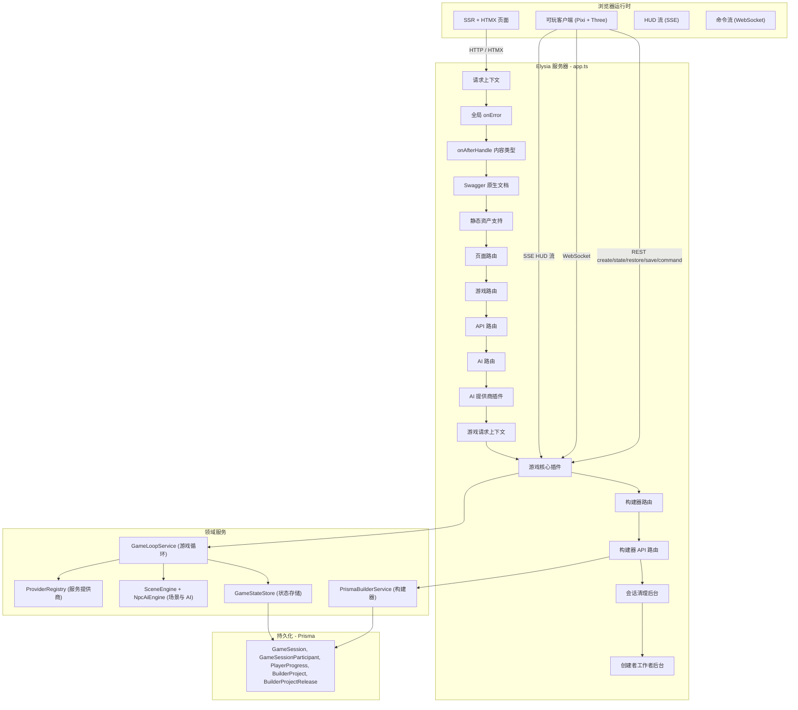

#### 请求生命周期

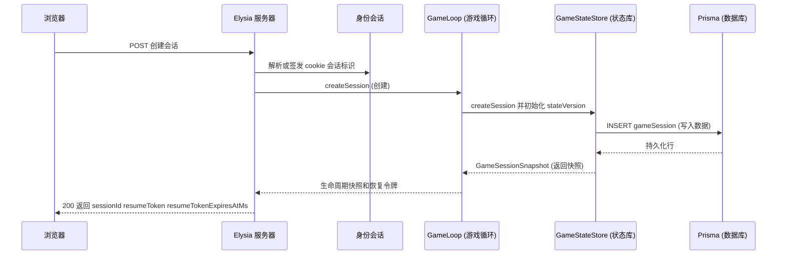

#### 插件流水线

插件按严格顺序组合，每个插件为下游消费者装饰请求上下文。基础设施插件先执行，然后是页面、游戏、API 与 AI 路由，接着是 AI provider 生命周期插件、作用域化的 `game-request-context` derive 插件、`game-plugin`，再到 builder 路由，最后由 session-purge 与 creator-worker 生命周期插件托管后台轮询任务。Builder 的 locale、project id、current-path 以及 body/query/param 的作用域合并统一收敛到 `src/plugins/builder-request-context.ts`，页面与 oracle API 的 auth-session 状态统一收敛到 `src/plugins/auth-session.ts`，游戏 HTTP 的 participant identity / locale、可玩页面 `sessionId` / `projectId` / `invite` 查询参数，以及 websocket 的 participant / resume-token 解析统一收敛到 `src/plugins/game-request-context.ts`，完整页面 SSR 壳层统一消费 `src/views/layout.ts` 中的 `LayoutContext`，builder JSON 草稿状态的 decode / versioned-save / snapshot projection 统一收敛到 `src/domain/builder/builder-project-state-store.ts`，`src/shared/contracts/game.ts` 统一负责持久化 scene state、trigger definitions 与 realtime websocket frame 的边界校验，`game-plugin` 统一负责 session 级别的 websocket tick 清理，以及 session close/delete 时的 transport teardown，而 `game-loop` 统一负责会话解析、仪表盘/会话指标以及 HUD 状态读取。

```mermaid
flowchart LR
  A["请求上下文"] --> B["全局 onError"]
  B --> C["onAfterHandle 内容类型"]
  C --> D["Swagger"]
  D --> E["静态资产"]
  E --> F["页面路由"]
  F --> G["游戏路由"]
  G --> H["API 路由"]
  H --> I["AI 路由"]
  I --> J["AI 提供商插件"]
  J --> K["游戏请求上下文"]
  K --> L["游戏插件"]
  L --> M["构建器路由"]
  M --> N["构建器 API 路由"]
  N --> O["会话清理"]
  O --> P["创建者工作者"]
```

#### 领域模型

核心实体：GameSession（带项目/发布版本标量绑定的服务端权威运行时会话行）、GameSessionParticipant（共享会话多人参与关系）、GameSessionActor（按参与者划分的权威运行时角色状态）、GameSessionRuntimeState / GameSessionNpc / GameSessionNpcDialogueKey / GameSessionNpcDialogueEntry（关系型运行时镜头、对话与 NPC 状态）、GameSessionTrigger / GameSessionTriggerRequiredFlag / GameSessionTriggerSetFlag（关系型运行时触发器状态）、GameSessionQuest / GameSessionQuestStep / GameSessionFlag（关系型运行时任务与旗标状态）、PlayerProgress / PlayerProgressVisitedScene / PlayerProgressInteraction（关系型运行时进度状态）、BuilderProject（草稿状态/版本控制）、BuilderProjectScene / BuilderProjectSceneCollision / BuilderProjectSceneNpc / BuilderProjectSceneNpcDialogueKey / BuilderProjectSceneNode / BuilderProjectDialogueEntry（关系型草稿世界内容注册表）、BuilderProjectAsset / BuilderProjectAssetTag / BuilderProjectAssetVariant / BuilderProjectAnimationClip（关系型草稿媒体注册表）、BuilderProjectDialogueGraph / BuilderProjectDialogueGraphNode / BuilderProjectDialogueGraphEdge / BuilderProjectQuest / BuilderProjectQuestStep / BuilderProjectTrigger / BuilderProjectTriggerRequiredFlag / BuilderProjectTriggerSetFlag / BuilderProjectFlag（关系型草稿机制注册表）、BuilderProjectGenerationJob / BuilderProjectGenerationJobArtifact / BuilderProjectArtifact / BuilderProjectAutomationRun / BuilderProjectAutomationRunStep / BuilderProjectAutomationRunArtifact（关系型草稿工作进程状态），以及 BuilderProjectRelease（不可变的发布快照）。

```mermaid
erDiagram
  GAME_SESSION {
    string id PK
    string ownerSessionId
    int stateVersion
    datetime expiresAt
    json scene
    string projectId
  }
  GAME_SESSION_PARTICIPANT {
    string sessionId PK
    string participantSessionId PK
    string role
  }
  PLAYER_PROGRESS {
    string sessionId PK
    int xp
    int level
  }
  BUILDER_PROJECT {
    string id PK
    int version
    string checksum
    int latestReleaseVersion
    int publishedReleaseVersion
    json state
  }
  BUILDER_PROJECT_SCENE {
    string projectId PK
    string id PK
    string titleKey
  }
  BUILDER_PROJECT_DIALOGUE_ENTRY {
    string projectId PK
    string locale PK
    string key PK
  }
  BUILDER_PROJECT_ASSET {
    string projectId PK
    string id PK
    string kind
    string sceneMode
  }
  BUILDER_PROJECT_ANIMATION_CLIP {
    string projectId PK
    string id PK
    string assetId
    string sceneMode
  }
  BUILDER_PROJECT_DIALOGUE_GRAPH {
    string projectId PK
    string id PK
    string rootNodeId
  }
  BUILDER_PROJECT_QUEST {
    string projectId PK
    string id PK
    string title
  }
  BUILDER_PROJECT_TRIGGER {
    string projectId PK
    string id PK
    string event
  }
  BUILDER_PROJECT_FLAG {
    string projectId PK
    string key PK
    string label
  }
  BUILDER_PROJECT_GENERATION_JOB {
    string projectId PK
    string id PK
    string kind
    string status
  }
  BUILDER_PROJECT_ARTIFACT {
    string projectId PK
    string id PK
    string jobId
    string kind
  }
  BUILDER_PROJECT_AUTOMATION_RUN {
    string projectId PK
    string id PK
    string status
  }
  BUILDER_PROJECT_RELEASE {
    string projectId FK
    int releaseVersion
    string checksum
    json state
  }
  GAME_SESSION ||--o{ GAME_SESSION_PARTICIPANT : 准入
  GAME_SESSION ||--|| PLAYER_PROGRESS : 包含
  BUILDER_PROJECT ||--o{ BUILDER_PROJECT_SCENE : 拥有
  BUILDER_PROJECT ||--o{ BUILDER_PROJECT_DIALOGUE_ENTRY : 拥有
  BUILDER_PROJECT ||--o{ BUILDER_PROJECT_ASSET : 拥有
  BUILDER_PROJECT ||--o{ BUILDER_PROJECT_ANIMATION_CLIP : 拥有
  BUILDER_PROJECT ||--o{ BUILDER_PROJECT_DIALOGUE_GRAPH : 拥有
  BUILDER_PROJECT ||--o{ BUILDER_PROJECT_QUEST : 拥有
  BUILDER_PROJECT ||--o{ BUILDER_PROJECT_TRIGGER : 拥有
  BUILDER_PROJECT ||--o{ BUILDER_PROJECT_FLAG : 拥有
  BUILDER_PROJECT ||--o{ BUILDER_PROJECT_GENERATION_JOB : 拥有
  BUILDER_PROJECT ||--o{ BUILDER_PROJECT_ARTIFACT : 拥有
  BUILDER_PROJECT ||--o{ BUILDER_PROJECT_AUTOMATION_RUN : 拥有
  BUILDER_PROJECT_ASSET ||--o{ BUILDER_PROJECT_ANIMATION_CLIP : 驱动
  BUILDER_PROJECT ||--o{ BUILDER_PROJECT_RELEASE : 发布
  BUILDER_PROJECT ||..o{ GAME_SESSION : 初始化
```

#### 会话传输契约

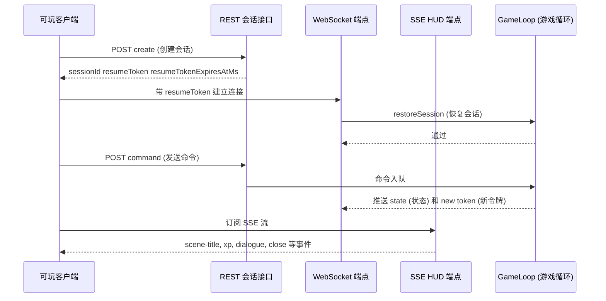

#### 构建器发布契约

草稿变更仅更新 `builderProject.state` 中残留的草稿元数据，而场景、本地化对话目录、媒体、机制以及工作进程状态则保存在关系型的草稿表中。发布操作会创建包含完整序列化项目的不可变发布快照。运行时会话仅加载已发布的版本数据。


### 项目结构

```text
tea/
├── packages/             # Bun 工作区
├── prisma/               # 数据库模式与迁移
│   └── schema.prisma     # 唯一事实来源
├── assets/               # 运行时挂载的媒体资产
├── public/               # 静态 Web 资产
├── scripts/              # Bun 原生构建 / 开发编排
│   └── asset-pipeline.ts # build 与 watch 共用的规范资产图
├── src/                  # 服务器 / 后端
│   ├── config/           # 环境变量与常量
│   ├── shared/services/  # Prisma 客户端与共享基础设施
│   ├── domain/           # 核心游戏逻辑 (游戏, AI, 神谕)
│   ├── plugins/          # Elysia 插件 (国际化, HTMX, 错误处理)
│   └── app.ts            # Elysia 入口点
├── tests/                # bun:test 测试套件
└── README.md             # 面向开发者的架构与工作流文档
```

### 命令

| 命令 | 说明 |
|---|---|
| `bun run dev` | 启动开发服务器 |
| `bun run build:assets` | 一次性资产编译 |
| `bun run start` | 生产环境：构建并启动 |
| `bun run lint` | Biome 代码检查 |
| `bun run typecheck` | TypeScript 严格类型检查 |
| `bun test` | 运行测试套件 |
| `bun run verify` | 完整流水线：检查 → 类型检查 → 测试 |

### 环境变量

核心 `.env` 变量（完整默认值见 `.env.example`）：

| 变量 | 用途 |
|---|---|
| `DATABASE_URL` | libSQL 连接字符串 (例如: `file:./prisma/dev.db`) |
| `APP_ORIGIN` | 供本地回调与自动化证据抓取使用的绝对应用访问地址 |
| `NODE_ENV` | `development` (开发) 或 `production` (生产) |
| `PORT` | 服务器端口 (默认: 3000) |
| `SESSION_COOKIE_NAME` | 匿名 auth-session 的 Cookie 名称 |
| `SESSION_MAX_AGE_SECONDS` | 匿名会话 Cookie 生命周期（秒） |
| `SESSION_RESUME_TOKEN_SECRET` | 用于签名会话恢复令牌的必填密钥 |
| `BUILDER_LOCAL_AUTOMATION_ORIGIN` | 用于构建器本地自动化 / 浏览器证据抓取的可选绝对覆盖地址 |
| `AI_ONNX_DEVICE` | ONNX 执行设备（`cpu`、`webgpu` 或 `wasm`）；Bun 服务端建议使用 `cpu` |

游戏运行时关键参数：

| 变量 | 用途 |
|---|---|
| `GAME_SESSION_TTL_MS` | 会话过期 TTL |
| `GAME_TICK_MS` | 服务端权威 tick 周期 |
| `GAME_SESSION_PERSIST_INTERVAL_MS` | 自动持久化最小间隔 |
| `GAME_SAVE_COOLDOWN_MS` | `/save` 接口手动保存冷却 |
| `GAME_MAX_COMMANDS_PER_TICK` | 每处理窗口命令队列上限 |
| `GAME_MAX_INTERACTIONS_PER_TICK` | 单 tick 交互上限 |
| `GAME_MAX_CHAT_COMMANDS_PER_WINDOW` | 聊天防刷窗口内最大命令数 |
| `GAME_CHAT_RATE_LIMIT_WINDOW_MS` | 聊天防刷窗口长度 |
| `GAME_SESSION_RESUME_WINDOW_MS` | 恢复令牌有效时间上限 |
| `GAME_COMMAND_SEND_INTERVAL_MS` | 客户端移动命令发送频率 |
| `GAME_COMMAND_TTL_MS` | 客户端命令 TTL |
| `GAME_SOCKET_RECONNECT_DELAY_MS` | 客户端重连退避延迟 |
| `GAME_RESTORE_REQUEST_TIMEOUT_MS` | 恢复请求超时预算 |
| `GAME_RESTORE_MAX_ATTEMPTS` | 恢复失败前最大重试次数 |

### API 参考

| 端点 | 方法 | 用途 |
|---|---|---|
| `/game` | GET | SSR 游戏页引导（`sessionId` + owner 绑定 `resumeToken`） |
| `/api/game/session` | POST | 创建新的服务端权威会话 |
| `/api/game/session/:id/state` | GET | 查询 owner 范围内会话状态与队列元数据 |
| `/api/game/session/:id` | POST | 使用 JSON body 中的恢复令牌恢复会话 |
| `/api/game/session/:id/command` | POST | 校验并入队命令 |
| `/api/game/session/:id/dialogue` | GET | 获取当前活动对话 |
| `/api/game/session/:id/save` | POST | 在冷却约束下强制持久化 |
| `/api/game/session/:id/close` | POST | 关闭并删除会话 |
| `/api/game/session/:id` | DELETE | 直接删除会话 |
| `/api/game/session/:id/hud` | GET (SSE) | 规范 HUD 推送流（`scene-title` / `xp` / `dialogue` / `close`） |
| `/api/game/session/:id/ws` | WS | 实时命令/状态通道（需要有效恢复令牌） |

已移除的旧接口：

- `/api/game/session/:id/partials/dialogue` 已删除。HUD 渲染统一经由 SSE 单路径输出。

### 无障碍

- 最低 WCAG AA 合规
- 键盘用户跳转至内容链接
- 活动导航项 `aria-current="page"`
- 交互元素焦点管理
- 所有面向用户文本通过国际化目录管理

### 致谢

*本引擎献给 **Estrella** 和 **Ioanin** — 你们是这一切背后的灵感与灵魂。* 🍵

</details>

---

## License

Private · All rights reserved.
