# TEA


**SSR-first game runtime, builder workspace, and AI-assisted tooling on Bun + TypeScript.**
**基于 Bun + TypeScript 的 SSR 优先游戏运行时、构建器和 AI 辅助工具平台。**

**Runtime stack at a glance / 一览技术栈**
**Bun 1.3+ · TypeScript Strict · Prisma 7+ · Tailwind 4 / DaisyUI 5**

## Quick reference / 快速索引

- Architecture / 架构一览
- Request lifecycle / 请求生命周期
- Builder publish flow / 构建器发布链路
- AI routing / AI 路由
- Quality gates / 质量门禁

## Documentation
## 文档

- Documentation is intentionally bilingual and mirror-driven: documentation source of record now lives in text archive entries.
- 文档采用双语和归档驱动设计：文档源由文本归档条目统一承载。

- English at top, Chinese below line-by-line.
- 英文在上、中文紧随其后逐行对照。
- Architecture archive: [notes/doc-archive/ARCHITECTURE.txt](./notes/doc-archive/ARCHITECTURE.txt)
- 架构归档：[notes/doc-archive/ARCHITECTURE.txt](./notes/doc-archive/ARCHITECTURE.txt)
- Docs index archive: [notes/doc-archive/docs__index.txt](./notes/doc-archive/docs__index.txt)
- 文档索引归档：[notes/doc-archive/docs__index.txt](./notes/doc-archive/docs__index.txt)
- API contracts archive: [notes/doc-archive/docs__api-contracts.txt](./notes/doc-archive/docs__api-contracts.txt)
- API 契约归档：[notes/doc-archive/docs__api-contracts.txt](./notes/doc-archive/docs__api-contracts.txt)
- Builder domain archive: [notes/doc-archive/docs__builder-domain.txt](./notes/doc-archive/docs__builder-domain.txt)
- 构建器域归档：[notes/doc-archive/docs__builder-domain.txt](./notes/doc-archive/docs__builder-domain.txt)
- HTMX extensions archive: [notes/doc-archive/docs__htmx-extensions.txt](./notes/doc-archive/docs__htmx-extensions.txt)
- HTMX 扩展归档：[notes/doc-archive/docs__htmx-extensions.txt](./notes/doc-archive/docs__htmx-extensions.txt)
- Playable runtime archive: [notes/doc-archive/docs__playable-runtime.txt](./notes/doc-archive/docs__playable-runtime.txt)
- 可游玩运行时归档：[notes/doc-archive/docs__playable-runtime.txt](./notes/doc-archive/docs__playable-runtime.txt)
- Local AI runtime archive: [notes/doc-archive/docs__local-ai-runtime.txt](./notes/doc-archive/docs__local-ai-runtime.txt)
- 本地 AI 运行时归档：[notes/doc-archive/docs__local-ai-runtime.txt](./notes/doc-archive/docs__local-ai-runtime.txt)
- Operator runbook archive: [notes/doc-archive/docs__operator-runbook.txt](./notes/doc-archive/docs__operator-runbook.txt)
- 运维手册归档：[notes/doc-archive/docs__operator-runbook.txt](./notes/doc-archive/docs__operator-runbook.txt)
- RMMZ pack archive: [notes/doc-archive/docs__rmmz-pack.txt](./notes/doc-archive/docs__rmmz-pack.txt)
- RMMZ 包归档：[notes/doc-archive/docs__rmmz-pack.txt](./notes/doc-archive/docs__rmmz-pack.txt)
- Companion pack status archive: [notes/doc-archive/LOTFK_RMMZ_Agentic_Pack__STATUS.txt](./notes/doc-archive/LOTFK_RMMZ_Agentic_Pack__STATUS.txt)
- 陪伴包状态归档：[notes/doc-archive/LOTFK_RMMZ_Agentic_Pack__STATUS.txt](./notes/doc-archive/LOTFK_RMMZ_Agentic_Pack__STATUS.txt)

---

## Executive summary
## 执行摘要

TEA is a production-oriented platform that combines SSR pages, a web builder, a server-authoritative game loop, and AI tooling in one Bun stack.
TEA 是一个面向生产环境的统一平台，将 SSR 页面、网页构建器、服务端权威游戏循环与 AI 工具链整合在同一套 Bun 栈中。

The platform is optimized for predictable behavior and deterministic outputs across pages, fragments, APIs, and runtime transport.
平台按多表面使用方式（页面、片段、API 和运行时通信）设计，优先保证可预测性与确定性输出。

Current core value:
当前核心价值如下：
- **High reliability**: explicit boundaries and strict fallback behavior.
- **高可靠性**：明确的边界和严格的回退行为。
- **Composable runtime**: build releases that can be seeded into sessions.
- **可组合运行时**：可将发布产物稳定注入会话。
- **Archive-based docs**: every markdown-style source is mirrored to text artifacts.
- **归档化文档**：所有文档类内容均镜像到文本归档。

Current platform capabilities:
当前平台能力如下：
- Home and oracle pages rendered on SSR with minimal client hydration.
- 首页和 Oracle 页面以 SSR 渲染为主，仅在必要时进行最小化客户端 hydration。
- Game sessions with join/rejoin, combat/cutscene progress, and resumable state.
- 支持加入/重连、战斗与过场推进、可恢复状态的游戏会话。
- Builder drafting, policy checks, and immutable release publishing.
- 构建器草稿编辑、规则校验与不可变发布流程。
- Multi-provider AI orchestration with retrieval and fallback handling.
- 多供应商 AI 编排，包含检索增强与失败回退机制。

## Architecture at a glance / 架构一览

`src/app.ts` wires the complete platform as a single Elysia composition:
`src/app.ts` 将整个平台按单个 Elysia 应用组装：
- request context and locale plugins.
- 请求上下文和语言上下文插件。
- SSR pages and HTMX fragment routes.
- SSR 页面与 HTMX 片段路由。
- Game, builder, oracle, and AI route clusters.
- 游戏、构建器、Oracle 与 AI 路由分组。
- Shared error envelope strategy.
- 统一错误信封策略。

Ownership is intentionally separated so each module has one clear accountability path.
所有权被刻意分离，每个模块都拥有明确的责任边界与归属路径。

<details>
<summary>Architecture data flow (English)</summary>

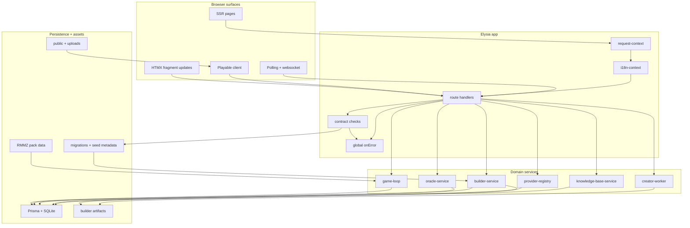

</details>

<details>
<summary>Architecture data flow (Chinese / 中文)</summary>

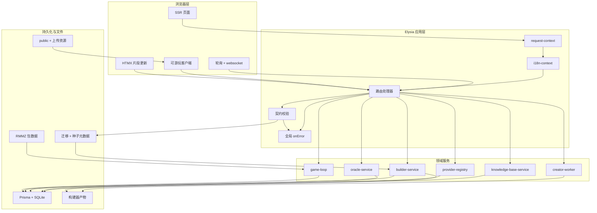

</details>

## Request and error flow / 请求与错误流

Every request follows a deterministic lifecycle:
每个请求都遵循确定性的生命周期：

1. Request context and locale are resolved before route logic.
1. 路由上下文与语言先于路由逻辑完成解析。
2. Route logic calls domain contracts with explicit result models.
2. 路由层以领域结果模型调用边界函数。
3. Route-level errors are converted into predictable envelopes through the global handler.
3. 失败会通过全局 onError 转换为可预测信封。
4. HTML/fragment/JSON responses all honor the same contract surface.
4. HTTP、片段、JSON 响应都共享同一契约形态。

<details>
<summary>Request lifecycle sequence (English)</summary>

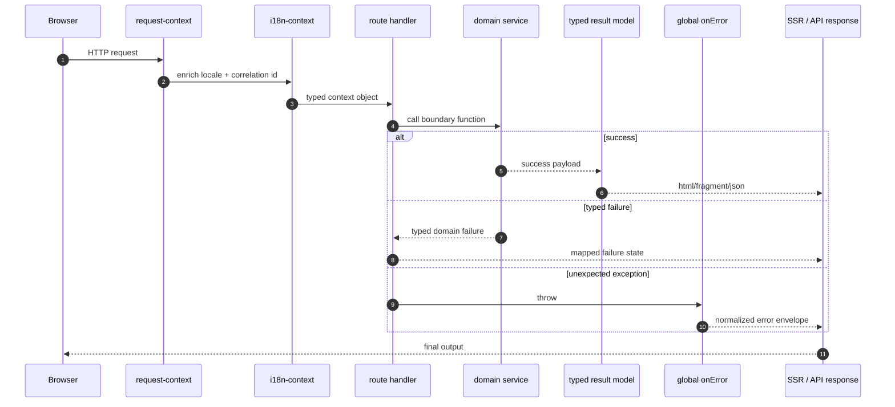

</details>

<details>
<summary>请求生命周期时序（中文）</summary>

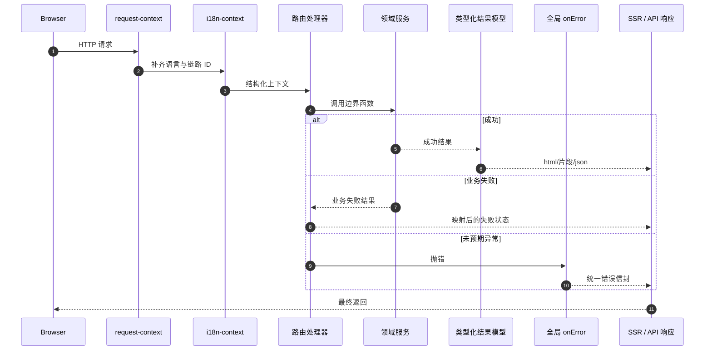

</details>

## Builder to playable runtime pipeline / 构建器到运行时的发布链路

The system only allows runtime sessions from immutable releases.
系统只允许从不可变发布快照创建运行时会话。

Build, validate, publish, then seed: this is the canonical flow.
发布链路固定为：构建 -> 校验 -> 发布 -> 注入会话。

<details>
<summary>Builder publish pipeline (English)</summary>

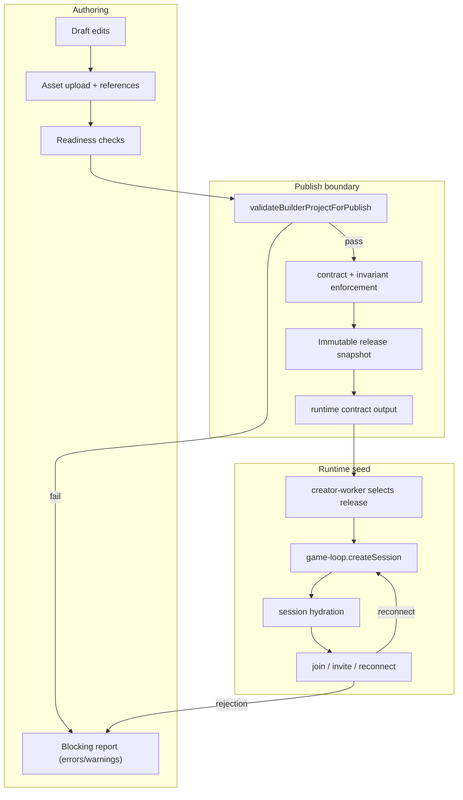

</details>

<details>
<summary>构建器发布链路（中文）</summary>

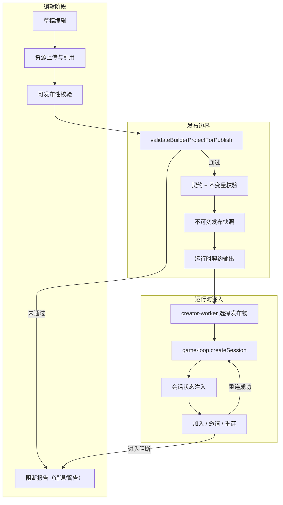

</details>

## Game session lifecycle
## 游戏会话生命周期

Session state is explicit and recoverable.
会话状态是显式可恢复的。

<details>
<summary>Session lifecycle model (English)</summary>

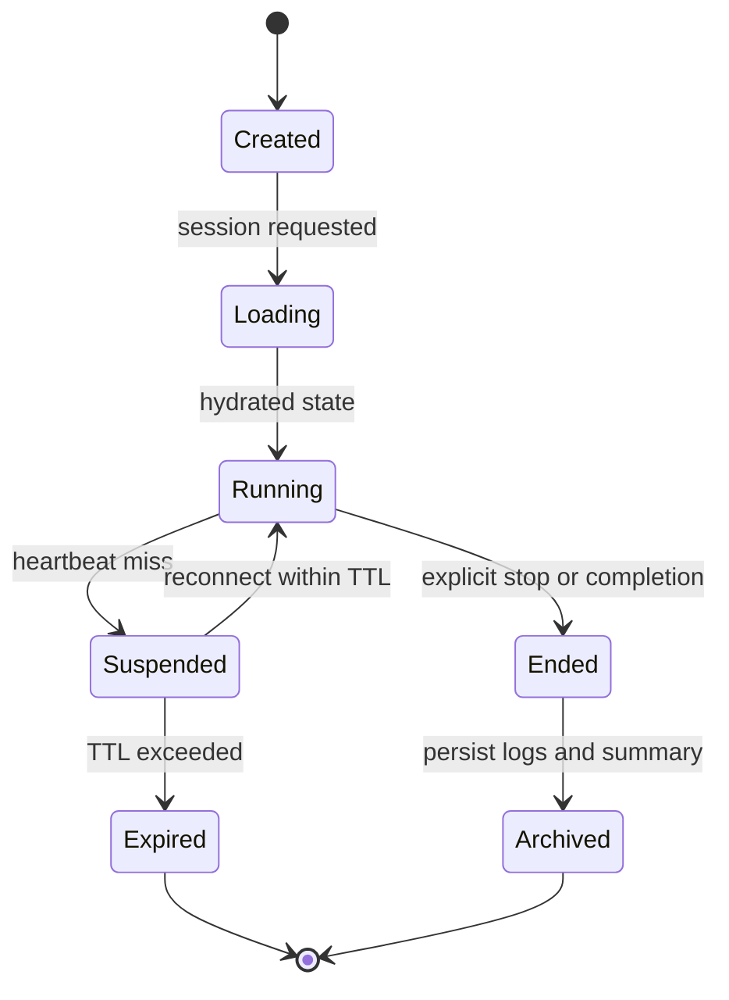

</details>

<details>
<summary>会话生命周期模型（中文）</summary>

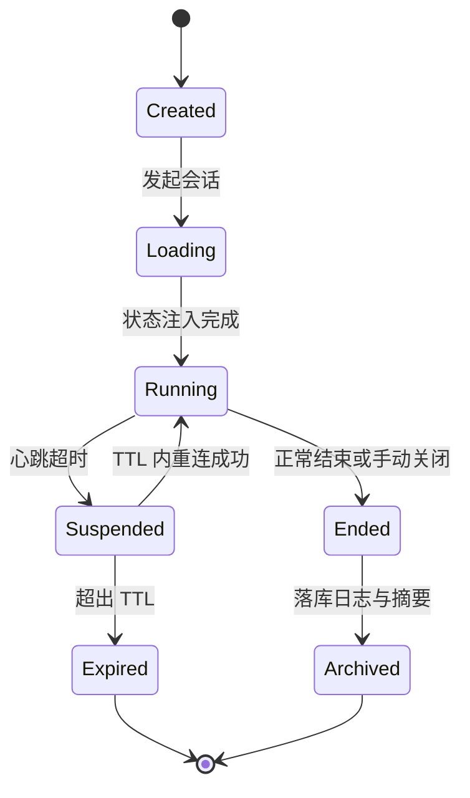

</details>

## Data ownership and state model
## 数据所有权与状态模型

Every major concern has a single owning layer to avoid cross-layer duplication.
每个主要职责都由单一层负责，以防跨层职责重叠。

- Route and response surface owns navigation shape and API envelope shapes.
- 路由与响应表面对导航形态与 API 信封格式负责。
- Game domain owns runtime state, combat, and player progression.
- 游戏领域拥有运行时状态、战斗和玩家进度的所有权。
- Builder domain owns validation, release snapshots, and artifact packaging.
- 构建器领域拥有校验、发布快照和产物打包所有权。
- AI domain owns provider orchestration, fallback, and knowledge retrieval.
- AI 领域负责供应商编排、回退策略和知识检索。
- Shared domain owns contracts, configuration, and cross-cutting utilities.
- Shared 层负责契约、配置与跨域工具。

<details>
<summary>Ownership and core models (English)</summary>

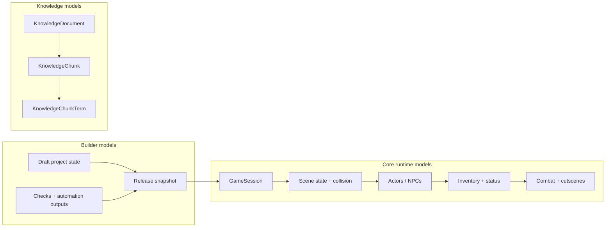

</details>

<details>
<summary>核心模型与所有权（中文）</summary>

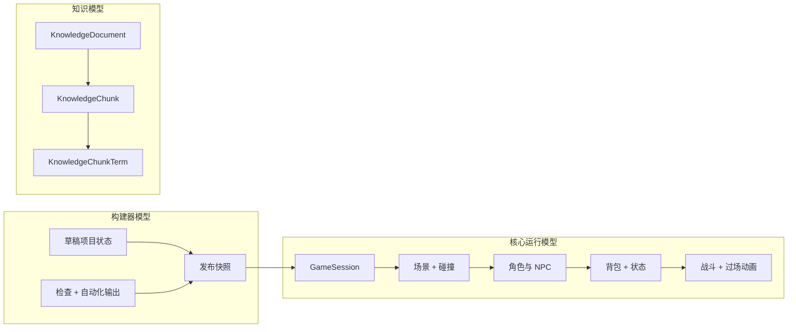

</details>

## AI reliability chain
## AI 可靠性链路

AI behavior is controlled by provider order and timeout/fallback policies.
AI 行为由供应商优先级及超时回退策略统一控制。

- Local provider is preferred for quick local inference when available.
- 本地供应商可用时优先使用以降低延迟。
- Secondary provider is used when local provider fails.
- 本地供应商失败时切换到次级供应商。
- Final provider is used as final fallback with guardrails.
- 最终兜底供应商在必要时使用并带有防护规则。
- Retrieval-enhanced responses are validated and returned with warning metadata.
- 检索增强结果会经过校验并返回告警元数据。

<details>
<summary>AI routing (English)</summary>

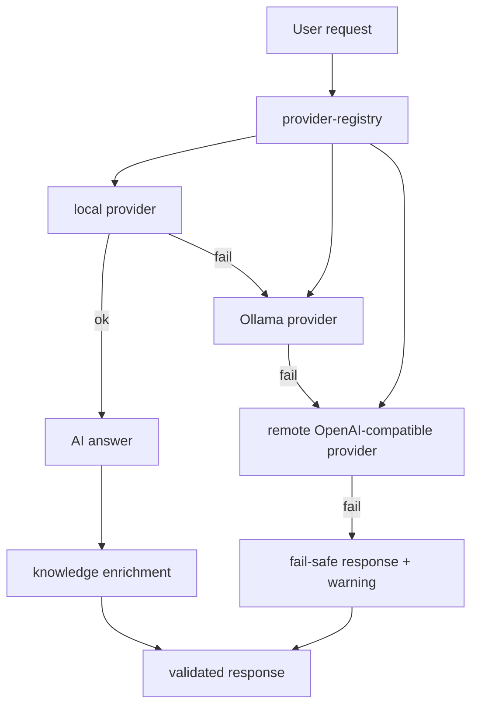

</details>

<details>
<summary>AI 路由（中文）</summary>

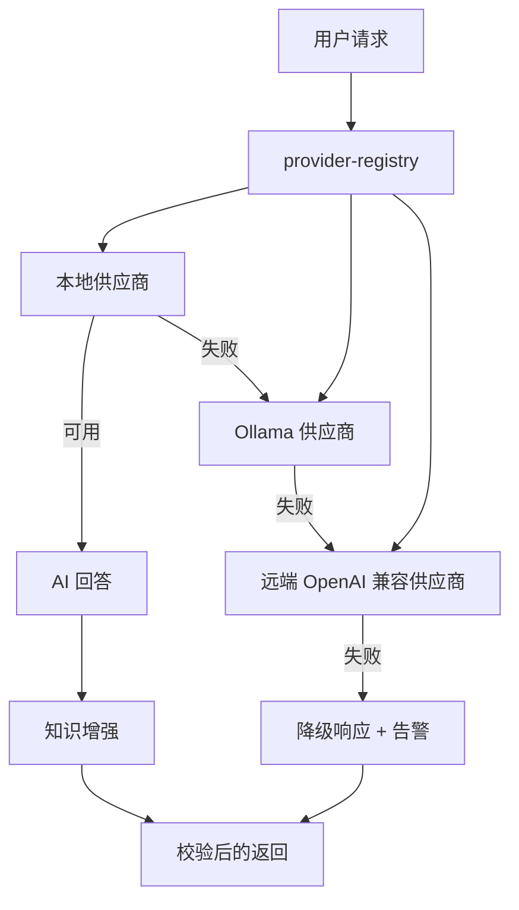

</details>

## Security and hardening
## 安全与加固

Hardening controls are layered:
加固控制分层实施：
- Path normalization before file read.
- 文件读取前进行路径规范化。
- Canonical root checks for static assets.
- 静态资源读取时强制做根目录规范校验。
- Strict payload parsing for builder publish and AI input.
- 构建器发布和 AI 输入进行严格解析。
- Deterministic envelopes for all failures.
- 所有失败返回遵循确定性信封。
- Archive checks in scripts to prevent documentation drift.
- 脚本内置文档归档检查防止文档漂移。

<details>
<summary>Security and hardening pipeline (English)</summary>

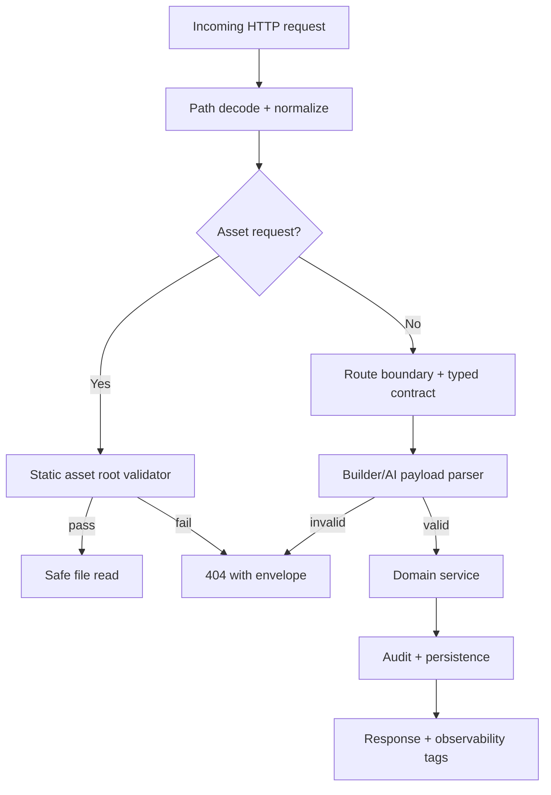

</details>

<details>
<summary>安全与加固链路（中文）</summary>

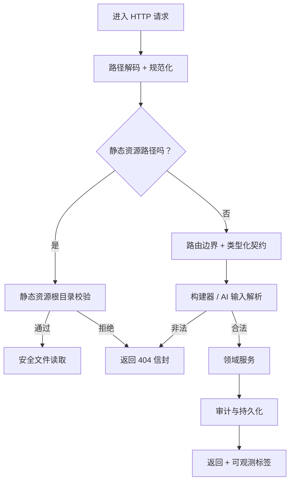

</details>

## Repository map
## 仓库结构

- `src/app.ts` composes request plugins, routes, and shared middleware.
- `src/app.ts` 负责组装请求插件、路由和共享中间件。
- `src/server.ts` handles startup checks and lifecycle hooks.
- `src/server.ts` 处理启动检查和生命周期钩子。
- `src/routes/page-routes.ts` serves SSR and fragments.
- `src/routes/page-routes.ts` 提供 SSR 与片段渲染。
- `src/routes/game-routes.ts` seeds and hydrates game sessions.
- `src/routes/game-routes.ts` 负责会话创建与注水。
- `src/routes/builder-routes.ts` renders builder workspace pages.
- `src/routes/builder-routes.ts` 渲染构建器工作区页面。
- `src/routes/builder-api.ts` handles mutations, publish, and SSE.
- `src/routes/builder-api.ts` 处理变更、发布与 SSE。
- `src/routes/api-routes.ts` hosts typed JSON API envelope endpoints.
- `src/routes/api-routes.ts` 提供类型化 JSON API 信封端点。
- `src/routes/ai-routes.ts` handles AI and retrieval APIs.
- `src/routes/ai-routes.ts` 负责 AI 与检索 API。
- `src/domain/game/` contains authoritative runtime logic.
- `src/domain/game/` 存放服务端权威运行时逻辑。
- `src/domain/builder/` handles draft, publish, and automation flow.
- `src/domain/builder/` 负责草稿、发布与自动化流程。
- `src/domain/ai/` manages providers and provider fallback.
- `src/domain/ai/` 管理供应商与回退策略。
- `src/shared/` stores contracts, configuration, and utilities.
- `src/shared/` 存放契约、配置与通用工具。
- `src/playable-game/` boots browser game transport and canvas.
- `src/playable-game/` 负责浏览器运行时传输与画面启动。
- `prisma/` stores schema and migrations.
- `prisma/` 存放数据库 schema 与迁移。
- `scripts/` includes build, checks, archive, and security tools.
- `scripts/` 包含构建、检查、归档与安全相关脚本。
- `tests/` contains contract and runtime tests.
- `tests/` 包含契约与运行时测试。
- `notes/doc-archive/` stores text archives for retired docs.
- `notes/doc-archive/` 保存已退役文档的文本归档。
- `LOTFK_RMMZ_Agentic_Pack/` stores companion pack artifacts.
- `LOTFK_RMMZ_Agentic_Pack/` 存放伴随包资源。

## Quality gates and operations
## 质量门禁与运维

Run in local order after changes:
修改后按以下顺序执行：
- `bun install`
- `bun run setup`
- `bun run dev`
- `bun run build:assets`
- `bun run docs:check`
- `bun run lint`
- `bun run typecheck`
- `bun test`
- `bun run dependency:drift`
- `bun run verify`

```bash
bun install
bun run setup
bun run dev
bun run verify
```

## State transitions exposed to UI
## UI 暴露的状态流

`idle -> loading -> success | empty | error(retryable|non-retryable) | unauthorized`
`idle -> loading -> success | empty | error(retryable|non-retryable) | unauthorized`

- This vocabulary drives pages, fragments, and APIs.
- 该状态词汇驱动页面、片段与 API 的行为。
- No implicit branches are allowed for failure.
- 不允许失败路径出现隐式未定义分支。
- Every response maps to one explicit state.
- 每个响应都映射到一个明确状态。

## Notes and contribution guidance
## 说明与贡献规范

When features change, update both code and documentation in the same change.
功能变更时必须同步更新代码与文档。

When runtime assumptions change, update archive entries with the next doc migration.
运行时假设变化时，同步更新归档条目。

This README intentionally includes both languages in one file for operational speed.
该 README 有意采用同文件双语，以提升阅读和操作效率。

---

## Change log summary
## 更新摘要

- README is now one file with line-by-line English / Simplified Chinese pairing.
- README 已改为单文件、英中文逐行对应的格式，使用简体中文。
- Mermaid diagrams are now in collapsible `<details>` sections with bilingual variants.
- Mermaid 图表现在改为 `<details>` 折叠区域，并提供中英版本。
