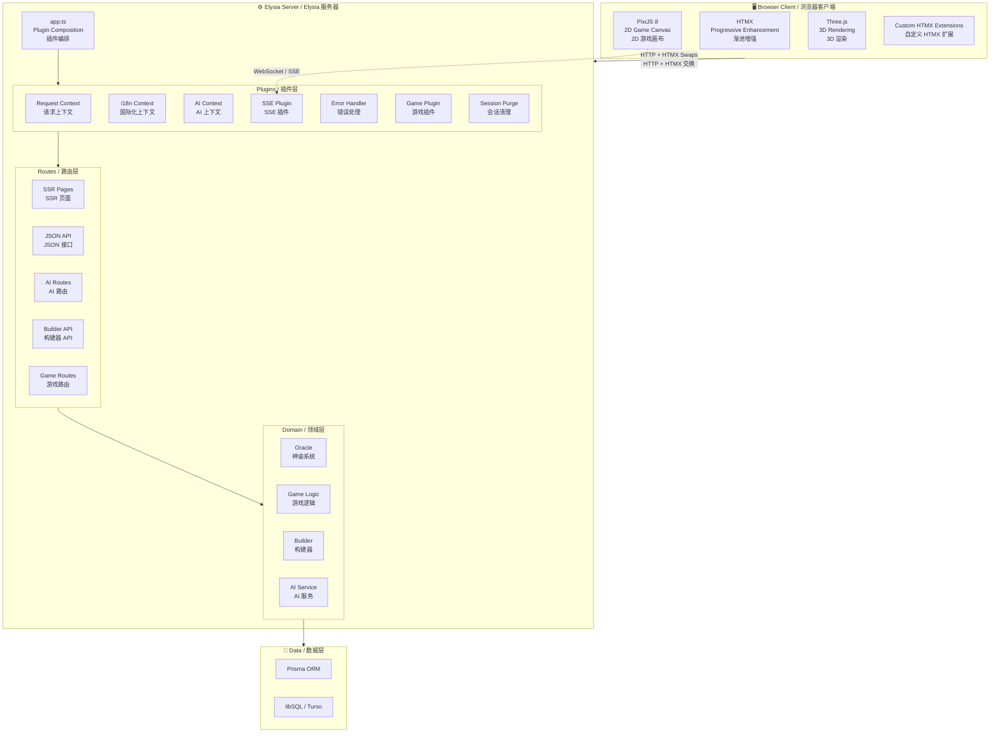
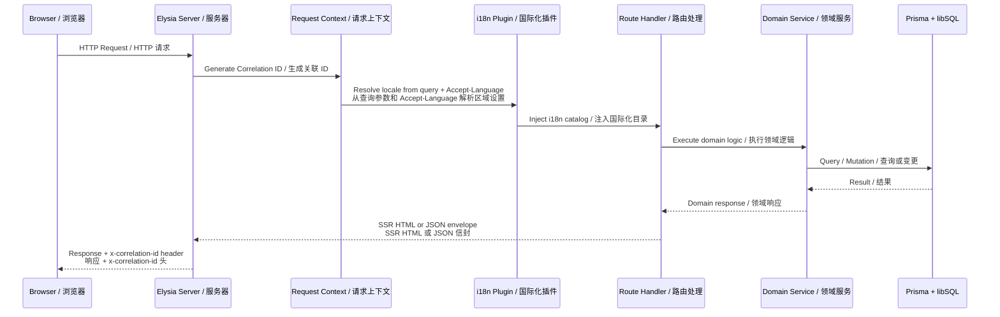
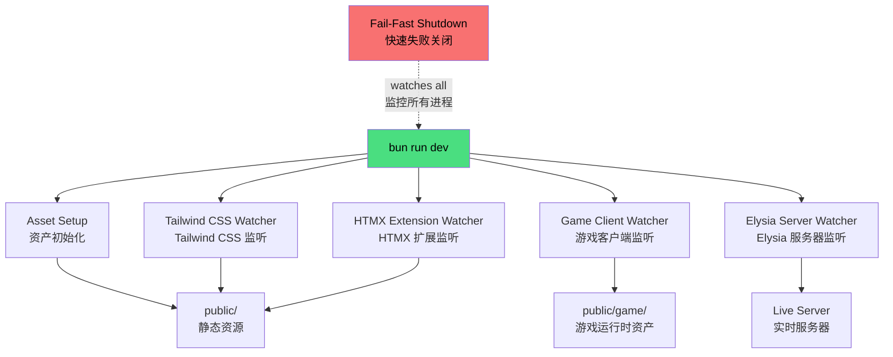
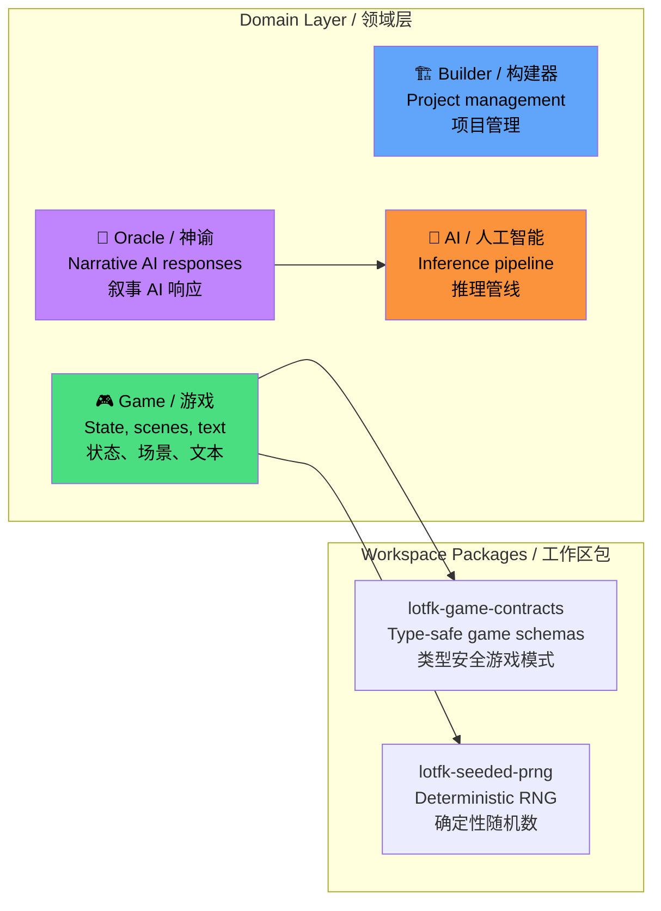
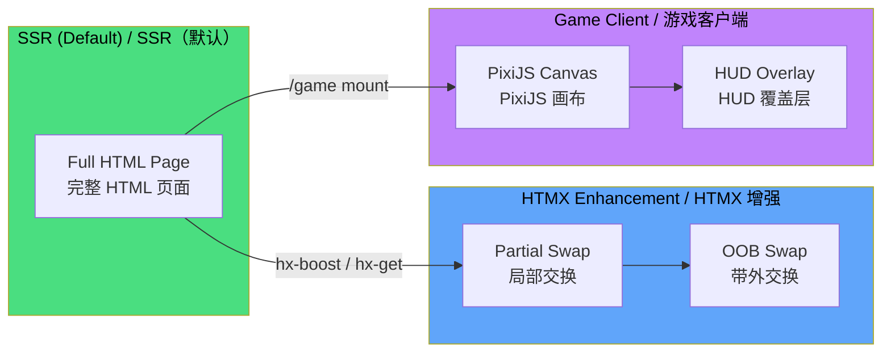
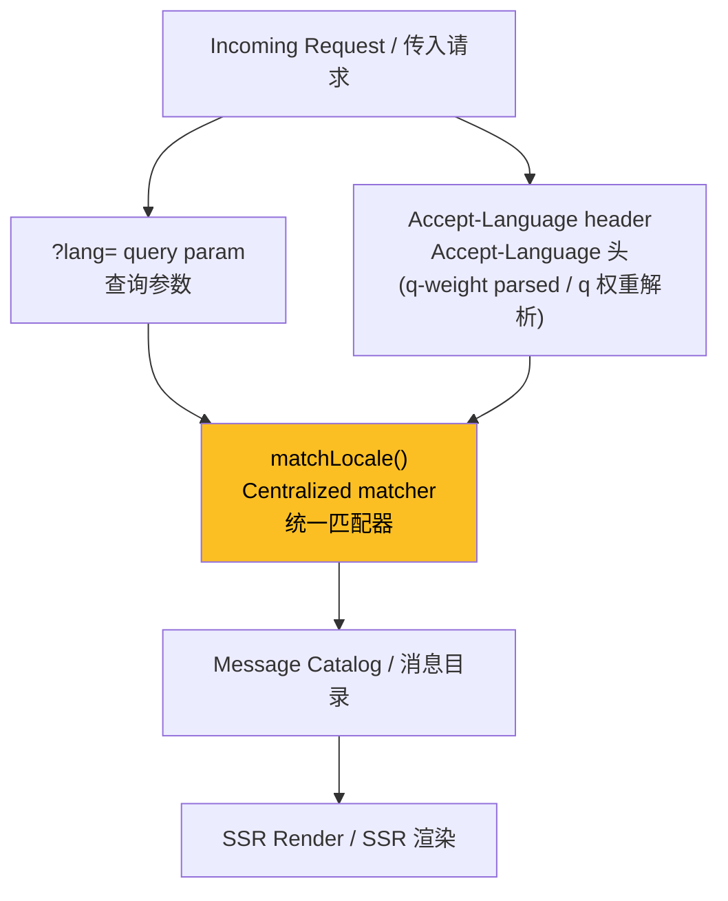
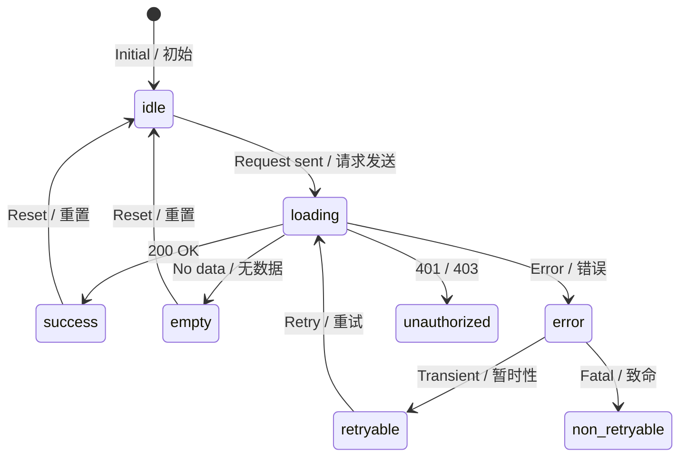
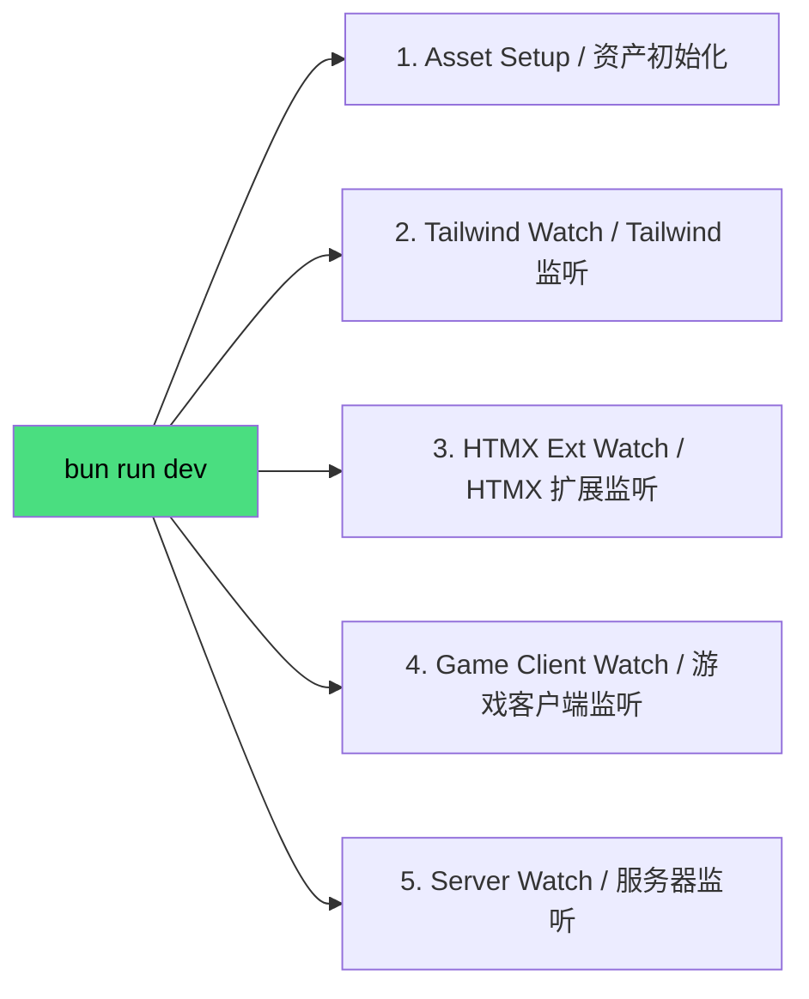

< · [中文](#概述)

</div>

---

## Overview

TEA Game Engine is a server-driven game development platform that fuses SSR page delivery, real-time AI narrative generation, and a browser-native playable game client into a single cohesive runtime. It is purpose-built for **Leaves of the Fallen Kingdom (LOTFK)** — a strategy worldbuilding experience.

## 概述

TEA 游戏引擎是一个服务端驱动的游戏开发平台，将 SSR 页面渲染、实时 AI 叙事生成和浏览器原生可玩游戏客户端融合为一体化运行时。专为**落叶王国 (LOTFK)**——一款策略世界构建体验而打造。

---

## Technology Stack / 技术栈

| Layer / 层级 | Technology / 技术 | Version / 版本 |
|---|---|---|
| Runtime / 运行时 | Bun | `1.3.x` |
| Language / 语言 | TypeScript (strict) | `5.9` |
| Server Framework / 服务端框架 | Elysia | `1.4` |
| Type-safe Client / 类型安全客户端 | Eden Treaty | `1.4` |
| SSR Enhancement / SSR 增强 | HTMX | `2.0` |
| CSS Framework / CSS 框架 | Tailwind CSS | `4.x` |
| UI Components / UI 组件 | DaisyUI | `5.x` |
| ORM | Prisma + libSQL adapter | `7.x` |
| 2D Game Renderer / 2D 游戏渲染 | PixiJS | `8.x` |
| 3D Renderer / 3D 渲染 | Three.js | `0.183` |
| AI / Inference | 🤗 Transformers (ONNX) | `3.8` |
| Image Processing / 图像处理 | Sharp | `0.34` |

---

## Architecture / 系统架构

### High-Level System Diagram / 高层系统图



### Request Lifecycle / 请求生命周期



### Plugin Composition Order / 插件编排顺序

```mermaid
flowchart LR
  A["1. Request Context<br/>请求上下文"] --> B["2. i18n Context<br/>国际化上下文"]
  B --> C["3. AI Context<br/>AI 上下文"]
  C --> D["4. SSE Plugin<br/>SSE 插件"]
  D --> E["5. Error Handler<br/>错误处理"]
  E --> F["6. Static Mounts<br/>静态资源挂载"]
  F --> G["7. Swagger Docs<br/>API 文档"]
  G --> H["8. SSR + API Routes<br/>SSR 与 API 路由"]

  style A fill:#4ade80,color:#000
  style B fill:#60a5fa,color:#000
  style C fill:#c084fc,color:#000
  style D fill:#fb923c,color:#000
  style E fill:#f87171,color:#000
  style F fill:#94a3b8,color:#000
  style G fill:#fbbf24,color:#000
  style H fill:#2dd4bf,color:#000
```



### Build & Dev Pipeline / 构建与开发流水线



### Domain Architecture / 领域架构



---

## Project Structure / 项目结构

```
tea/
├── src/
│   ├── app.ts              # Plugin + route composition / 插件与路由编排
│   ├── server.ts           # Boot entry / 启动入口
│   ├── config/             # Typed environment config / 类型化环境配置
│   ├── domain/             # Domain logic / 领域逻辑
│   │   ├── ai/             # AI inference pipeline / AI 推理管线
│   │   ├── builder/        # Project builder / 项目构建器
│   │   ├── game/           # Game state & scenes / 游戏状态与场景
│   │   └── oracle/         # Oracle narrative engine / 神谕叙事引擎
│   ├── htmx-extensions/    # Custom HTMX extensions / 自定义 HTMX 扩展
│   ├── lib/                # Structured logging & error envelope / 结构化日志与错误信封
│   ├── playable-game/      # Browser game client source / 浏览器游戏客户端源码
│   ├── plugins/            # Elysia plugins / Elysia 插件
│   ├── routes/             # SSR pages + API + partials / SSR 页面 + API + 局部视图
│   ├── shared/             # Constants, i18n, contracts, utils / 常量、国际化、契约、工具
│   ├── styles/             # Tailwind + DaisyUI source / Tailwind + DaisyUI 源码
│   └── views/              # SSR templates / SSR 模板
├── packages/               # Bun workspace packages / Bun 工作区包
│   ├── lotfk-game-contracts/  # Shared game type schemas / 共享游戏类型模式
│   └── lotfk-seeded-prng/     # Deterministic PRNG / 确定性伪随机数生成器
├── prisma/                 # Prisma schema + migrations / Prisma 模式与迁移
├── scripts/                # Build, dev, sprite processing / 构建、开发、精灵图处理
├── public/                 # Compiled static assets / 编译后静态资产
├── tests/                  # API + config tests / API 与配置测试
└── LOTFK_RMMZ_Agentic_Pack/  # RPG Maker MZ plugin pack / RPG Maker MZ 插件包
```

---

## Runtime Model / 运行时模型

### SSR & Progressive Enhancement / SSR 与渐进增强



**Key behaviors / 关键行为:**

- All pages render via SSR by default / 所有页面默认通过 SSR 渲染
- HTMX provides progressive enhancement for interactive elements / HTMX 为交互元素提供渐进增强
- Oracle interactions use HTMX partial swaps within `#oracle-panel` / 神谕交互使用 HTMX 局部交换
- Game client mounts at configurable `PLAYABLE_GAME_MOUNT_PATH` / 游戏客户端挂载在可配置路径
- SSE/WebSocket for real-time game state updates / SSE/WebSocket 用于实时游戏状态更新

### Internationalization / 国际化 (i18n)



- Single locale matcher `matchLocale()` used by both env defaults and request-time resolution / 统一使用 `matchLocale()` 解析区域设置
- Locale persists across navigation via `withLocaleQuery()` / 区域设置通过 `withLocaleQuery()` 在导航间持续保持
- Oracle form includes hidden `lang` input for non-JS fallback / 神谕表单包含隐藏的 `lang` 输入以支持无 JS 回退

### UI State Machine / UI 状态机



---

## API Contracts / API 契约

| Endpoint / 端点 | Method / 方法 | Description / 描述 |
|---|---|---|
| `/api/health` | `GET` | Health check envelope / 健康检查信封 |
| `/api/oracle` | `POST` | Oracle query with typed schemas / 带类型模式的神谕查询 |
| `/docs` | `GET` | Swagger UI / Swagger 接口文档 |
| `/partials/oracle` | `POST` | HTMX partial for oracle panel / 神谕面板 HTMX 局部视图 |
| `/game` | `GET` | Playable game client mount / 可玩游戏客户端挂载 |

- Validation errors → `422 Unprocessable Content` typed error envelope / 验证错误 → `422` 类型化错误信封
- Framework errors are localized via `Accept-Language` / 框架错误通过 `Accept-Language` 本地化
- All responses carry `x-correlation-id` for tracing / 所有响应携带 `x-correlation-id` 用于追踪

---

## Commands / 命令

```bash
# Development / 开发
bun run dev           # Start dev watchers / 启动开发监听

# Build / 构建
bun run build:assets  # Compile Tailwind, HTMX extensions, game client / 编译资产

# Production / 生产
bun run start         # Build + start server / 构建并启动服务器

# Quality / 质量检查
bun run lint          # Biome lint / Biome 代码检查
bun run typecheck     # TypeScript strict check / TypeScript 严格检查
bun test              # Run test suite / 运行测试套件
bun run verify        # Full pipeline: build → lint → typecheck → test / 完整流水线
```

### Dev Orchestration / 开发编排

`bun run dev` orchestrates the following concurrent watchers with signal-aware cleanup and fail-fast shutdown:

`bun run dev` 编排以下并发监听器，支持信号感知清理和快速失败关闭：



---

## Environment / 环境配置

Copy `.env.example` to `.env` and configure per environment.

复制 `.env.example` 为 `.env` 并按环境配置。

| Variable / 变量 | Purpose / 用途 |
|---|---|
| `PUBLIC_ASSET_PREFIX` | Base prefix for static assets / 静态资产基础前缀 |
| `PLAYABLE_GAME_MOUNT_PATH` | Game client URL mount / 游戏客户端 URL 挂载 |
| `PLAYABLE_GAME_SOURCE_DIRECTORY` | Game client build output / 游戏客户端构建输出 |
| `RMMZ_PACK_PREFIX` | RPG Maker plugin pack mount / RPG Maker 插件包挂载 |
| `API_DOCS_PATH` | Swagger docs path / Swagger 文档路径 |
| `STYLESHEET_PATH` | CSS override (optional) / CSS 覆盖（可选） |
| `HTMX_SCRIPT_PATH` | HTMX script override (optional) / HTMX 脚本覆盖（可选） |
| `IMAGES_ASSET_PREFIX` | Shared image asset mount / 共享图片资产挂载 |

Session cookie keys, oracle answer-hash multiplier, and sprite extraction config are also environment-driven.

会话 Cookie 密钥、神谕答案哈希乘数和精灵图提取配置同样由环境变量驱动。

---

## Accessibility / 无障碍

- WCAG AA minimum compliance / 最低 WCAG AA 合规
- Skip-to-content link for keyboard users / 为键盘用户提供跳转至内容链接
- `aria-current="page"` on active navigation items / 活动导航项上的 `aria-current="page"`
- Focus management for interactive elements / 交互元素的焦点管理
- All user-facing strings via i18n catalogs / 所有面向用户的字符串通过国际化目录

---

<div align="center">

## Special Thanks / 特别感谢

*This engine is dedicated to **Estrella** and **Ioanin** — the heart and inspiration behind everything this system became.*

*本引擎献给 **Estrella** 和 **Ioanin**——你们是这个系统背后的灵感与灵魂。*

```
        ·  ˚ . ·  ✦  ˚
    ˚   ·  Thank you  ·  ˚
  ✦  ·   谢谢你们    ·  ✦
    ˚   ·    🍵    ·   ˚
        ·  ˚ . ·  ✦  ˚
```

</div>

---

## License / 许可证

Private · All rights reserved.

私有 · 保留所有权利。
]]>
