# TEA

## Start here / 从这里开始

- [Platform explainer / 平台白话说明 / ELI5](docs/platform-explainer.md)
- [GitHub description, technologies, and keywords / GitHub 描述、技术栈与关键词](docs/github-metadata.md)
- [Documentation index / 文档索引](docs/index.md)

SSR-first game runtime, builder workspace, and AI-enabled game platform built on Bun + TypeScript.

基于 Bun + TypeScript 的 SSR 优先游戏运行时、构建器工作区与 AI 游戏平台。

## Overview / 概览

### English

SSR-first game runtime, builder workspace, and AI-enabled game platform built on Bun + TypeScript.

Runtime stack: Bun 1.3+ · TypeScript Strict · Prisma 7+ · Tailwind 4 / DaisyUI 5 · Pixi.js 8 (2D) · Three.js (3D/WebGPU).

Documentation parity strategy: every concept is mirrored with English first, then Simplified Chinese. Library docs: llms-stack-refresh for core stack; Context7 MCP for Pixi.js, Three.js, Transformers, Playwright, Biome.

### 中文

基于 Bun + TypeScript 的 SSR 优先游戏运行时、构建器工作区与 AI 游戏平台。

技术栈：Bun 1.3+、TypeScript Strict、Prisma 7+、Tailwind 4 / DaisyUI 5、Pixi.js 8（2D）、Three.js（3D/WebGPU）。

文档对照策略：每个概念先写英文，再给出对应的简体中文。库文档：llms-stack-refresh 覆盖核心栈；Context7 MCP 覆盖 Pixi.js、Three.js、Transformers、Playwright、Biome。

---

## Quick reference / 快速索引

### English

- [Platform explainer](docs/platform-explainer.md)
- [Documentation](#documentation--文档)
- [Architecture at a glance](#architecture-at-a-glance--架构一览)
- [Request and error lifecycle](#request-and-error-lifecycle--请求与错误流)
- [Builder publish flow](#builder-to-playable-runtime-pipeline--构建器到运行时发布链路)
- [End-to-end game creation (UI to runtime)](#end-to-end-game-creation-ui-runtime--游戏创建端到端流程)
- [Game session lifecycle](#game-session-lifecycle--游戏会话生命周期)
- [Data ownership and state model](#data-ownership-and-state-model--数据所有权与状态模型)
- [AI routing and reliability](#ai-reliability-chain--ai-可靠性链路)
- [Security and hardening](#security-and-hardening--安全与加固)
- [Repository map](#repository-map--仓库结构)
- [UI/API state model](#state-transitions-exposed-to-ui--ui-暴露的状态流)
- [Quality gates](#quality-gates-and-operations--质量门禁与运维)
- [Notes and contribution guidance](#notes-and-contribution-guidance--说明与贡献规范)

### 中文

- [平台白话说明](docs/platform-explainer.md)
- [文档](#documentation--文档)
- [架构一览](#architecture-at-a-glance--架构一览)
- [请求与错误流](#request-and-error-lifecycle--请求与错误流)
- [构建器发布链路](#builder-to-playable-runtime-pipeline--构建器到运行时发布链路)
- [游戏创建端到端流程](#end-to-end-game-creation-ui-runtime--游戏创建端到端流程)
- [游戏会话生命周期](#game-session-lifecycle--游戏会话生命周期)
- [数据所有权与状态模型](#data-ownership-and-state-model--数据所有权与状态模型)
- [AI 可靠性链路](#ai-reliability-chain--ai-可靠性链路)
- [安全与加固](#security-and-hardening--安全与加固)
- [仓库结构](#repository-map--仓库结构)
- [UI 暴露的状态流](#state-transitions-exposed-to-ui--ui-暴露的状态流)
- [质量门禁与运维](#quality-gates-and-operations--质量门禁与运维)
- [说明与贡献规范](#notes-and-contribution-guidance--说明与贡献规范)

---

## Documentation / 文档

### English

The source of truth is now a plaintext archive namespace in `notes/doc-archive/`.
Markdown is no longer used as the runtime documentation source.

Documentation workflow: project architecture and contracts live in `notes/doc-archive/`; library patterns use llms-stack-refresh (Bun, Elysia, htmx, Prisma, Tailwind, DaisyUI) and Context7 MCP (Pixi.js, Three.js, Transformers, Playwright, Biome). See `docs__context7-audit.txt` for coverage.

Key archives:

- Architecture: `notes/doc-archive/ARCHITECTURE.txt`
- Docs index: `notes/doc-archive/docs__index.txt`
- API contracts: `notes/doc-archive/docs__api-contracts.txt`
- Builder domain: `notes/doc-archive/docs__builder-domain.txt`
- HTMX extensions: `notes/doc-archive/docs__htmx-extensions.txt`
- Playable runtime: `notes/doc-archive/docs__playable-runtime.txt`
- Local AI runtime: `notes/doc-archive/docs__local-ai-runtime.txt`
- Operator runbook: `notes/doc-archive/docs__operator-runbook.txt`
- RMMZ pack: `notes/doc-archive/docs__rmmz-pack.txt`
- Companion pack status: `notes/doc-archive/LOTFK_RMMZ_Agentic_Pack__STATUS.txt`
- Context7 audit: `notes/doc-archive/docs__context7-audit.txt` (doc coverage and Context7 MCP usage)

### 中文

文档源真相已迁移到 `notes/doc-archive/` 的纯文本归档空间。
运行时文档不再使用 Markdown 作为源码。

文档工作流：项目架构与契约在 `notes/doc-archive/`；库模式使用 llms-stack-refresh（Bun、Elysia、htmx、Prisma、Tailwind、DaisyUI）与 Context7 MCP（Pixi.js、Three.js、Transformers、Playwright、Biome）。详见 `docs__context7-audit.txt`。

关键归档：

- 架构：`notes/doc-archive/ARCHITECTURE.txt`
- 文档索引：`notes/doc-archive/docs__index.txt`
- API 契约：`notes/doc-archive/docs__api-contracts.txt`
- 构建器域：`notes/doc-archive/docs__builder-domain.txt`
- HTMX 扩展：`notes/doc-archive/docs__htmx-extensions.txt`
- 可游玩运行时：`notes/doc-archive/docs__playable-runtime.txt`
- 本地 AI 运行时：`notes/doc-archive/docs__local-ai-runtime.txt`
- 运维手册：`notes/doc-archive/docs__operator-runbook.txt`
- RMMZ 包：`notes/doc-archive/docs__rmmz-pack.txt`
- 陪伴包状态：`notes/doc-archive/LOTFK_RMMZ_Agentic_Pack__STATUS.txt`
- Context7 审计：`notes/doc-archive/docs__context7-audit.txt`（文档覆盖与 Context7 MCP 使用）

---

## Executive summary / 执行摘要

### English

TEA combines SSR pages, a game-loop domain, a builder workspace, and AI tooling in one deterministic Bun platform.

The system is designed for predictable behavior across pages, HTMX fragments, JSON APIs, and runtime transport.

Core values:

- High reliability through strict boundaries and explicit fallback behavior.
- Composable releases that seed sessions in a controlled, reproducible way.
- Archive-first documentation for stable source/runtime parity.

Core capabilities:

- Homepage and oracle SSR with minimal client hydration.
- Game sessions with join, rejoin, combat progression, and resumable state.
- Builder drafting, policy checks, immutable releases, and publish gates.
- Multi-provider AI with retrieval and explicit fallback policy.

### 中文

TEA 将 SSR 页面、游戏循环域、构建器工作区与 AI 工具链统一到一套可预测的 Bun 平台。

平台目标是在页面、HTMX 片段、JSON API 与运行时传输上保持确定性行为。

核心价值：

- 通过严格边界和显式回退策略提升可靠性。
- 通过可复现方式将发布物注入会话，支持可组合运行时。
- 文档归档优先，保持源与运行时参考一致。

核心能力：

- 首页与 Oracle 采用 SSR 渲染，并最小化客户端 hydration。
- 会话支持加入、重连、战斗推进与可恢复状态。
- 构建器草稿、策略校验、不可变发布与发布门禁。
- 多供应商 AI，支持检索增强和明确回退链路。

---

## Architecture at a glance / 架构一览

### English

`src/app.ts` composes the platform as one Elysia application.
Composition layers are request context, locale context, route groups, domain services, contracts, and global error handling.
Ownership is separated so each module has one explicit behavioral and failure contract source.

Architecture Charts / 架构图表

English

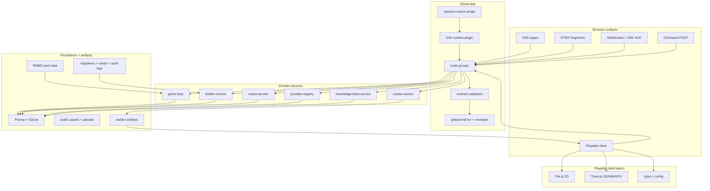

中文

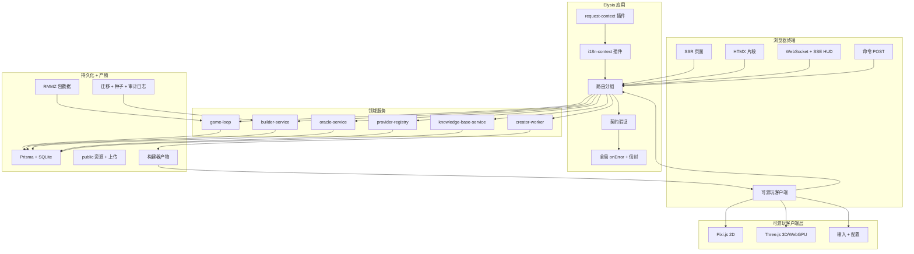

### 中文

`src/app.ts` 将整个平台作为单一 Elysia 应用组装。
组成层包含请求上下文、语言上下文、路由分组、领域服务、契约与全局错误处理。
所有权被分离，确保每个模块仅承担一组行为和失败语义。

---

## Request and error lifecycle / 请求与错误流

### English

All requests flow through a deterministic chain:
context resolution, route boundary, contract validation, domain execution, error normalization, and typed final output.
The same state vocabulary is applied to SSR pages, HTMX fragments, and JSON endpoints.

Request Lifecycle Charts / 请求生命周期图表

English

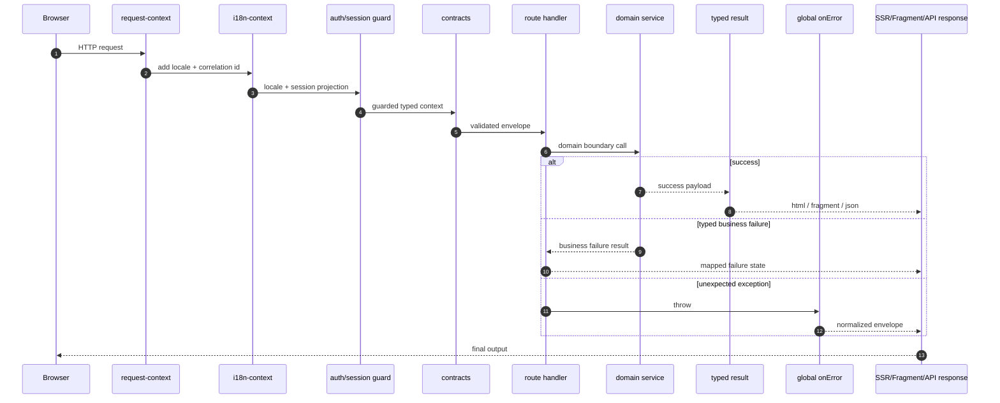

中文

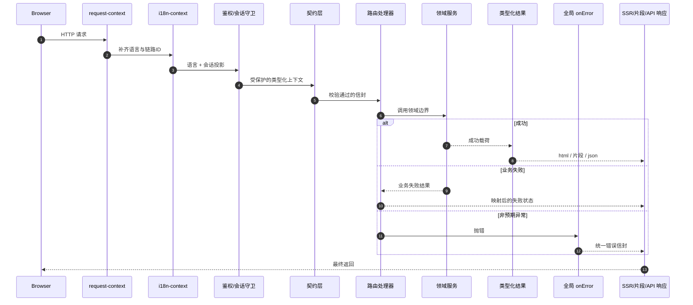

### 中文

每个请求都经过确定性链路：
上下文解析 → 路由边界 → 契约校验 → 领域执行 → 错误标准化 → 类型化最终输出。
页面、HTMX 片段和 JSON 接口共享同一状态词汇。

---

## Builder to playable runtime pipeline / 构建器到运行时发布链路

### English

Runtime sessions are created only from immutable release snapshots.
The workflow keeps authoring and publish boundaries distinct for reproducibility and auditability.

Builder Publish Charts / 构建器发布图表

English

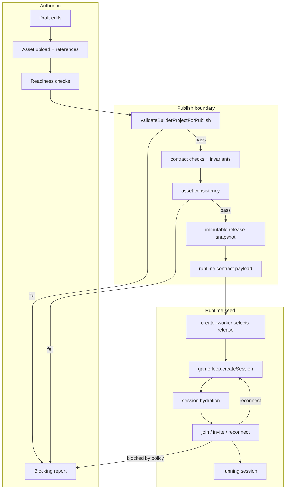

中文

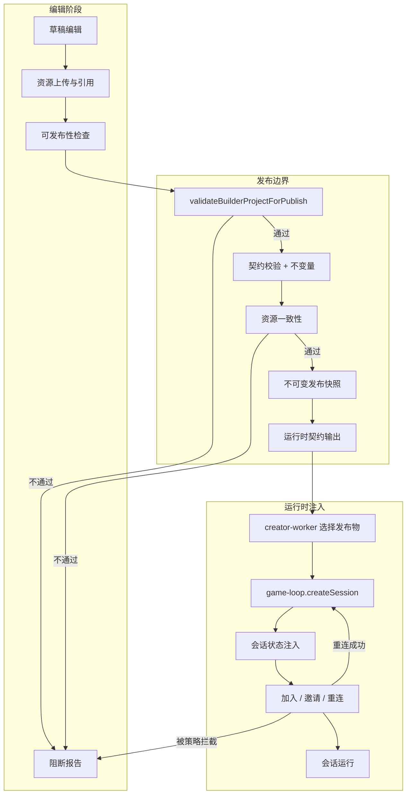

### 中文

运行时会话只允许基于不可变发布快照创建。
工作流将创作与发布边界分离，便于复现和审计。

---

## End-to-end game creation (UI → runtime) / 游戏创建端到端流程

### English

This section maps the full path from Builder UI interactions to a playable, persisted session.

The flow is validation-first: session hydration is the last step and must succeed before gameplay is exposed.

UI To Runtime Charts / UI 到运行时图表

English

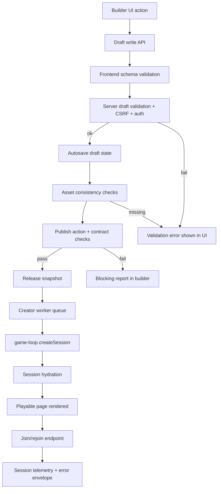

中文

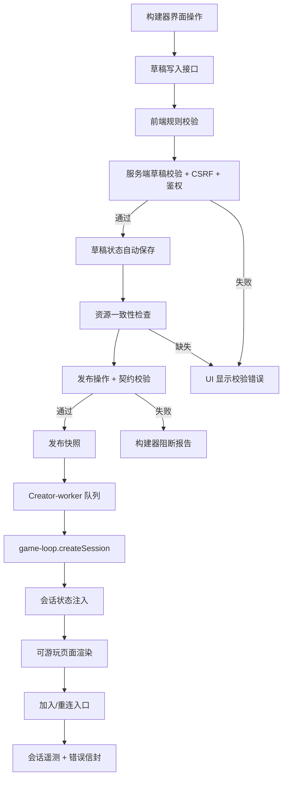

### 中文

本节给出从构建器界面到可游玩的持久会话完整链路。

链路是以校验优先为原则：仅在会话注水成功后才暴露游戏操作。

---

## Game session lifecycle / 游戏会话生命周期

### English

Session state is explicit, persisted, and resumable by design. Created from immutable release snapshots only; heartbeat and TTL govern reconnection.

Session Lifecycle Charts / 会话生命周期图表

English

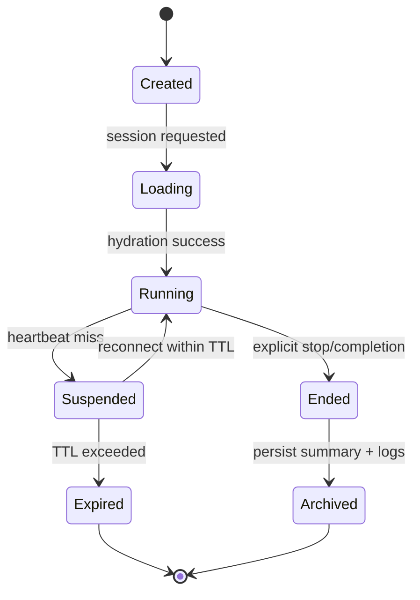

中文

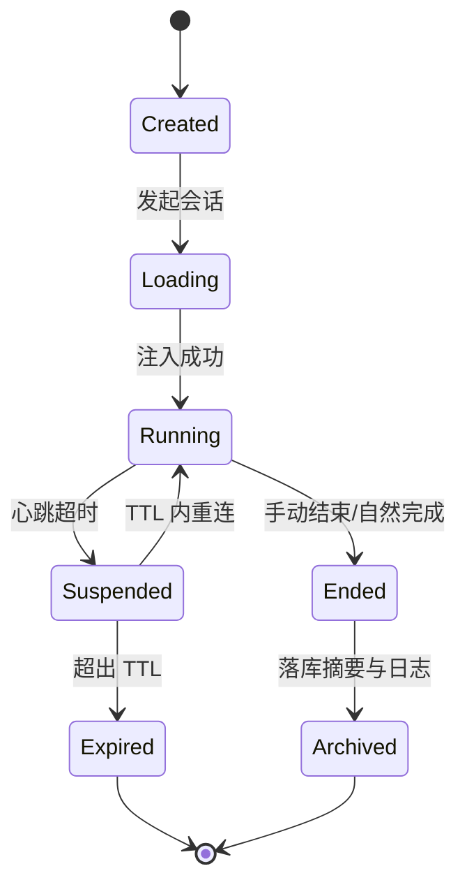

### 中文

会话状态被设计为显式、可落库并可恢复。仅从不可变发布快照创建；心跳与 TTL 控制重连。

---

## Data ownership and state model / 数据所有权与状态模型

### English

Responsibility ownership is single-sourced to avoid mixed concerns:

- Route layer owns transport shape, contract envelope, and fragment/page selection.
- Game domain owns session state, actor transitions, and scene progression.
- Builder domain owns validation, release snapshots, and artifact packaging.
- AI domain owns provider orchestration and fallback policy.
- Shared layer owns configuration, contracts, and cross-cutting utilities.

Ownership Charts / 所有权图表

English

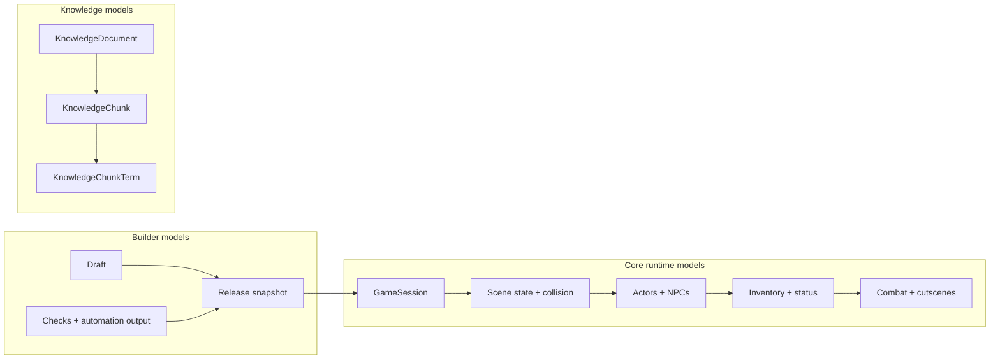

中文

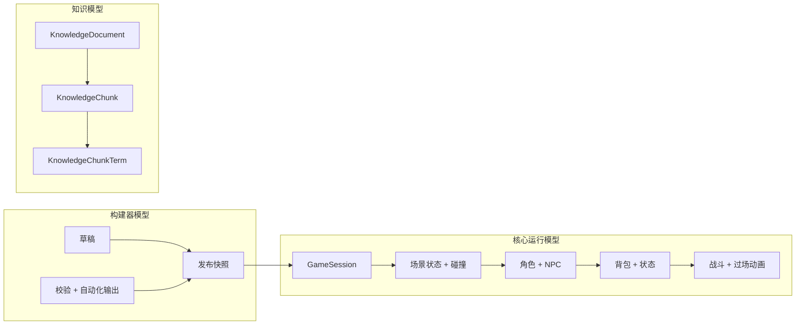

### 中文

为避免职责混杂，采用单一责任归属：

- 路由层负责传输形态、错误信封和页面/片段选择。
- 游戏域负责会话状态、角色状态迁移与场景推进。
- 构建器域负责校验、发布快照和产物打包。
- AI 域负责供应商编排和回退策略。
- 共享层负责配置、契约和跨领域工具。

---

## AI reliability chain / AI 可靠性链路

### English

Provider orchestration is preference-based with explicit failover and validation gating.

AI Routing Charts / AI 路由图表

English

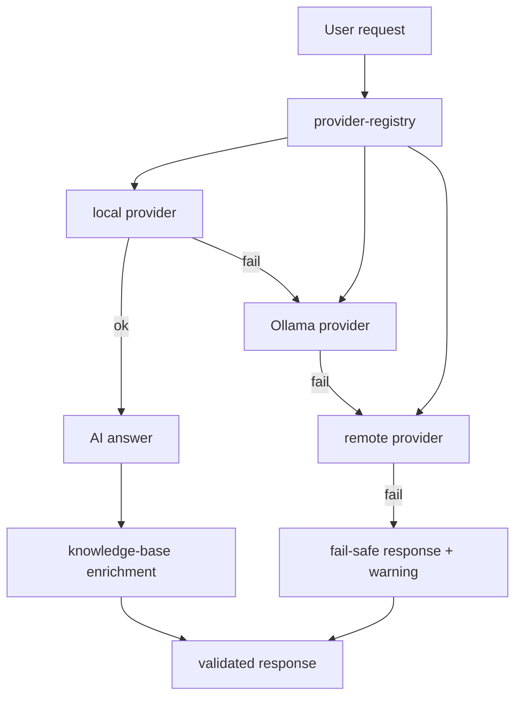

中文

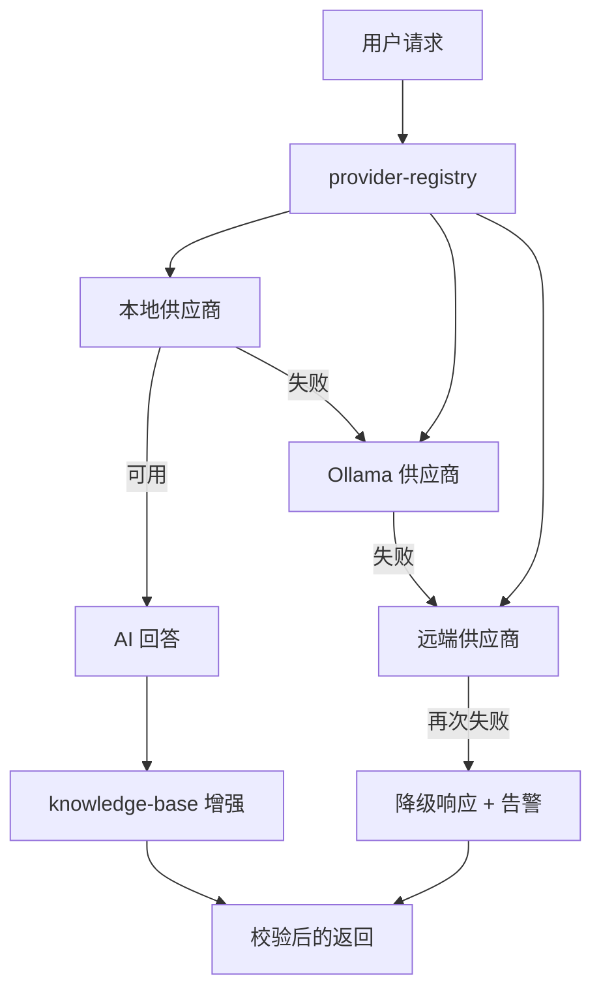

### 中文

供应商链路按优先级编排，具备显式回退与校验门禁。

---

## Security and hardening / 安全与加固

### English

Hardening is layered:
request normalization, contract checks, static-asset validation, and deterministic failure outputs.

Security Charts / 安全图表

English

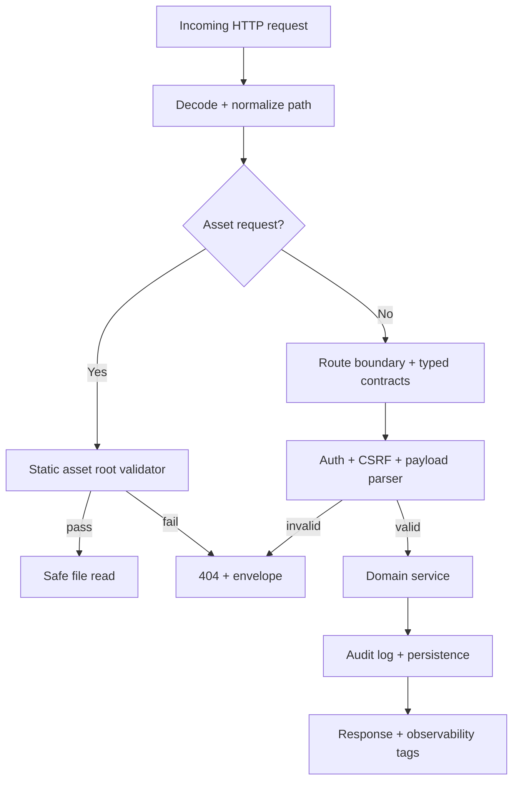

中文

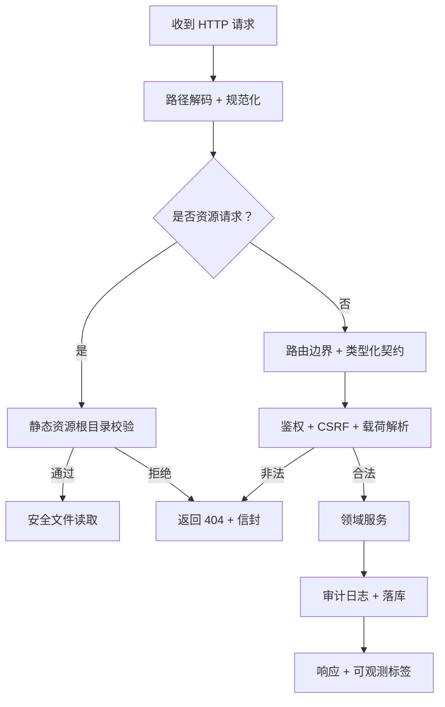

### 中文

安全加固采用分层设计：
请求规范化、契约校验、静态资源校验、确定性失败输出。

---

## Repository map / 仓库结构

### English

- `src/app.ts`: platform composition and route registration.
- `src/server.ts`: startup checks and lifecycle hooks.
- `src/routes/`: page, API, game, builder, and AI routing surfaces.
- `src/domain/`: authoritative game runtime, builder flow, and AI orchestration.
- `src/shared/`: contracts, configuration, and shared utilities.
- `src/playable-game/`: browser transport, Pixi.js/Three.js layers, input, debug.
- `src/htmx-extensions/`: layout-controls, focus-panel, SSE wiring.
- `src/plugins/`: game-plugin (HUD SSE, commands), sse-plugin.
- `scripts/`: archive/doc checks, asset pipeline, setup, maintenance tooling.
- `prisma/`: schema and migration metadata.
- `tests/`: unit and contract regression; `tests/e2e/` Playwright E2E.
- `notes/doc-archive/`: plaintext documentation archive.
- `.cursor/rules/`: llms-stack.mdc, context7.mdc (doc coverage rules).

### 中文

- `src/app.ts`：平台组合与路由注册。
- `src/server.ts`：启动检查与生命周期钩子。
- `src/routes/`：页面、API、游戏、构建器、AI 路由面。
- `src/domain/`：服务端权威游戏运行时、构建器与 AI 编排。
- `src/shared/`：契约、配置和通用工具。
- `src/playable-game/`：浏览器传输、Pixi.js/Three.js 层、输入、调试。
- `src/htmx-extensions/`：layout-controls、focus-panel、SSE 布线。
- `src/plugins/`：game-plugin（HUD SSE、命令）、sse-plugin。
- `scripts/`：文档归档检查、构建管线、setup、维护脚本。
- `prisma/`：schema 与迁移元数据。
- `tests/`：单元与契约回归；`tests/e2e/` Playwright E2E。
- `notes/doc-archive/`：纯文档归档区。
- `.cursor/rules/`：llms-stack.mdc、context7.mdc（文档覆盖规则）。

---

## State transitions exposed to UI / UI 暴露的状态流

### English

- `idle -> loading -> success | empty | error(retryable|non-retryable) | unauthorized`
- The same vocabulary is expected from pages, HTMX fragments, and JSON endpoints.

### 中文

- `idle -> loading -> success | empty | error(retryable|non-retryable) | unauthorized`
- 页面、HTMX 片段与 JSON 接口都必须使用同一状态词汇。

---

## Quality gates and operations / 质量门禁与运维

### English

Recommended command order after changes:

`bun install` → `bun run setup` → `bun run dev` → `bun run build:assets` → `bun run docs:check` → `bun run lint` → `bun run typecheck` → `bun test` → `bun run dependency:drift` → `bun run verify`

Run `bun run verify` after docs/runtime edits to ensure markdown path dependency is removed from checks.

### 中文

变更后建议执行顺序：

`bun install` → `bun run setup` → `bun run dev` → `bun run build:assets` → `bun run docs:check` → `bun run lint` → `bun run typecheck` → `bun test` → `bun run dependency:drift` → `bun run verify`

在文档或运行时改动后执行 `bun run verify`，确保检查脚本已移除 Markdown 路径依赖。

---

## Notes and contribution guidance / 说明与贡献规范

### English

When code changes, update implementation and archive entries in the same change set.

When runtime assumptions change, archive updates must be complete and synchronized.

Any new documentation block should preserve bilingual block structure: English then Simplified Chinese.

### 中文

代码变更应在同一次变更集中同步更新实现与归档。

运行时假设修改时，必须完整同步更新相关归档条目。

新增文档必须保留“英文块 + 简体中文块”结构，避免混排导致歧义。

---

## Change log / 更新摘要

### English

- README moved to explicit EN/ZH block structure with clear section-level boundaries.
- Language blocks are separated by headings and visual separators to reduce confusion.
- Architecture charts: added Playable client layers (Pixi.js, Three.js, Input), WebSocket + SSE HUD, Command POST.
- Request lifecycle: added auth/session guard step.
- Builder publish: added asset consistency check.
- Documentation: added Context7 audit, maintenance audit, and doc workflow (archive + llms-stack + Context7)
- Repository map: added htmx-extensions, plugins, tests/e2e, .cursor/rules.
- Quick reference: added Documentation, Game session lifecycle, Data ownership links.

### 中文

- README 已改为明确的英中文块结构并按章节分隔。
- 每个语言块使用独立标题和分隔符，降低阅读歧义。
- 架构图：新增可游玩客户端层（Pixi.js、Three.js、输入）、WebSocket + SSE HUD、命令 POST。
- 请求生命周期：新增鉴权/会话守卫步骤。
- 构建器发布：新增资源一致性检查。
- 文档：新增 Context7 审计、维护审计及文档工作流（归档 + llms-stack + Context7）。
- 仓库结构：新增 htmx-extensions、plugins、tests/e2e、.cursor/rules。
- 快速索引：新增文档、游戏会话生命周期、数据所有权链接。
