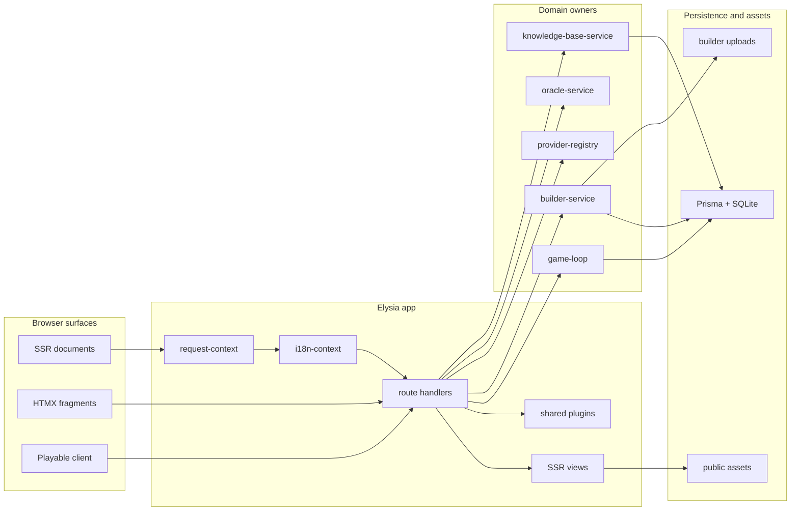
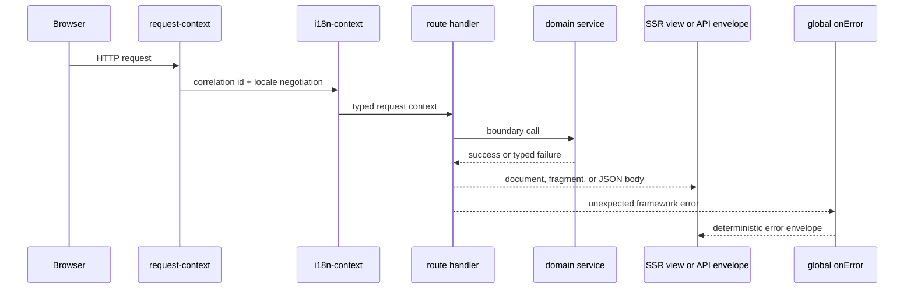
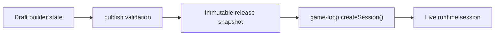
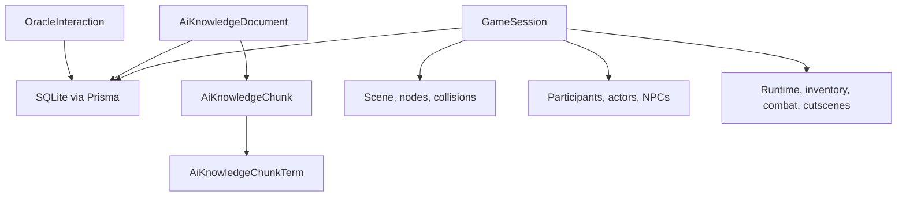

# TEA

[中文文档](./README.zh-CN.md) | [Architecture](./ARCHITECTURE.md) | [Docs index](./docs/index.md)

TEA is an SSR-first game runtime and builder platform built on Bun, Elysia, HTMX, Tailwind CSS, DaisyUI, Prisma, PixiJS, and Three.js. The repository combines a server-rendered web app, a game builder workspace, a server-authoritative multiplayer runtime, AI-assisted tooling, and an RPG Maker MZ companion pack in one Bun workspace.

## What the codebase contains

- SSR document rendering for the home page, builder workspace, AI surfaces, and game routes
- HTMX-driven fragment updates for forms, navigation, and panel refreshes
- A server-authoritative game loop with restore, invites, HUD transport, and persistence
- A builder domain that edits draft project state, validates publishability, and seeds immutable releases into runtime sessions
- AI provider routing across local Transformers, Ollama, and OpenAI-compatible providers
- Prisma-backed persistence for game sessions, builder artifacts, and AI knowledge retrieval
- A companion `LOTFK_RMMZ_Agentic_Pack` artifact that ships beside the main TypeScript app

## Stack and pinned versions

| Layer | Package | Version |
| --- | --- | --- |
| Runtime | Bun | `1.3.10` |
| Language | TypeScript | `5.9.3` |
| Server | Elysia | `1.4.27` |
| ORM | Prisma / `@prisma/client` | `7.4.2` |
| Progressive enhancement | `htmx.org` | `2.0.8` |
| UI kit | DaisyUI | `5.5.19` |
| CSS | Tailwind CSS | `4.2.1` |
| 2D renderer | PixiJS | `8.17.0` |
| 3D renderer | Three.js | `0.183.2` |
| Browser automation/tests | Playwright | `1.58.2` |

Version governance lives in `scripts/dependency-drift-check.ts` and is enforced by `bun run dependency:drift`.

## Runtime architecture

The app is wired in `src/app.ts`. `createApp()` composes shared request plugins, SSR routes, typed API routes, AI routes, the playable game runtime, and the builder workspace into one Elysia application.



## Request and error flow

The shared HTTP path is deterministic: request context and locale resolution are applied up front, route handlers call typed domain services, and unexpected failures collapse into a single error envelope via the global Elysia `onError` handler.



## Builder-to-runtime publish model

The builder surface edits draft project state. Runtime sessions do not read from mutable drafts. Instead, the builder validates and publishes an immutable release snapshot, and the game loop seeds live sessions from that release.



## Persistence model at a glance

The Prisma schema splits persistent concerns into a few clear groups:

- `OracleInteraction` stores oracle prompts and responses.
- `AiKnowledgeDocument`, `AiKnowledgeChunk`, and `AiKnowledgeChunkTerm` back retrieval and search.
- `GameSession` and related tables persist authoritative runtime state, actors, scene data, inventory, combat, and cutscenes.
- Builder release and artifact data flows through the builder domain and into runtime session snapshots.



## Repository map

| Path | Responsibility |
| --- | --- |
| `src/app.ts` | Top-level Elysia composition |
| `src/server.ts` | Startup, readiness checks, and optional AI warmup |
| `src/routes/page-routes.ts` | SSR home page and oracle fragment routes |
| `src/routes/game-routes.ts` | Game page bootstrap, invite flow, and session hydration |
| `src/routes/api-routes.ts` | Health and oracle JSON APIs with typed envelopes |
| `src/routes/ai-routes.ts` | AI health, capability, speech, and knowledge APIs |
| `src/routes/builder-routes.ts` | SSR builder workspace pages and panels |
| `src/routes/builder-api.ts` | Builder mutations, publish flow, AI helpers, and SSE |
| `src/domain/game/` | Authoritative gameplay, combat, scene, inventory, and progression logic |
| `src/domain/builder/` | Draft state, publish orchestration, creator worker, readiness, and asset storage |
| `src/domain/ai/` | Provider registry, local model runtime, RAG, and AI adapters |
| `src/views/` | SSR layout, pages, builder panels, and shared UI rendering |
| `src/htmx-extensions/` | Shared HTMX lifecycle behavior for shell and panels |
| `src/playable-game/` | Browser-side runtime, renderer, transport, and bootstrap contract consumers |
| `src/shared/` | Contracts, config, constants, i18n, DB services, and utility functions |
| `prisma/` | Schema, migrations, and local SQLite DB files |
| `scripts/` | Setup, build, doctor, migration, dev, and docs verification workflows |
| `tests/` | Contract, route, provider, runtime, and bootstrap coverage |
| `packages/` | Workspace packages for shared contracts and seeded PRNG |
| `LOTFK_RMMZ_Agentic_Pack/` | Companion RPG Maker MZ pack |

## Route groups and ownership

| Surface | Owner | Notes |
| --- | --- | --- |
| Home and oracle SSR | `src/routes/page-routes.ts` | Uses `i18n-context` and auth session context |
| Game SSR entry | `src/routes/game-routes.ts` | Hydrates or joins sessions through `game-loop` |
| Builder SSR | `src/routes/builder-routes.ts` | Renders dashboard, editors, readiness, AI, and automation panels |
| Builder API | `src/routes/builder-api.ts` | Owns mutations, publish flow, AI previews, and streaming updates |
| Core JSON API | `src/routes/api-routes.ts` | Health and oracle envelopes |
| AI API | `src/routes/ai-routes.ts` | Provider health, local runtime status, speech, and knowledge |

## Rendering and UX model

- SSR is the default surface. The repository does not use a SPA shell.
- HTMX owns targeted swaps, validation responses, and progressive enhancement.
- Browser-only hydration is limited to the playable runtime and focused enhancement hooks.
- DaisyUI and Tailwind supply shared shell primitives for alerts, drawers, cards, tables, and loading states.
- Supported locales are `en-US` and `zh-CN` from `src/config/environment.ts`.
- The shared UI state vocabulary is `idle -> loading -> success | empty | error(retryable | non-retryable) | unauthorized`.

## Environment and operations

Key configuration lives in `src/config/environment.ts` and covers:

- network boot settings such as host, port, static asset paths, and Swagger docs path
- auth and session settings such as cookie naming, resume token signing, and retention windows
- playable runtime settings such as reconnect delay, restore timeouts, viewport sizing, and command TTL
- AI runtime settings such as provider enablement, local model paths, ONNX configuration, and fallback policy
- builder automation settings such as polling cadence and automation probe timeout

The codebase is intentionally config-heavy. Defaults are typed, and most operational values can be overridden per environment.

## Quick start

```bash
bun install
bun run setup
bun run dev
```

Fresh-machine bootstrap scripts:

- `./scripts/install-macos.sh`
- `./scripts/install-linux.sh`
- `powershell -ExecutionPolicy Bypass -File .\scripts\install-windows.ps1`

## Commands

| Command | Purpose |
| --- | --- |
| `bun run dev` | Run the local app plus asset/watch workflows |
| `bun run setup` | Bootstrap env, Prisma, assets, and readiness checks |
| `bun run doctor` | Emit a structured readiness report |
| `bun run build:assets` | Build CSS, HTMX extensions, game client, and editor bundles |
| `bun run docs:check` | Validate the documentation surface |
| `bun run lint` | Run Biome checks |
| `bun run typecheck` | Run strict TypeScript checking |
| `bun test` | Run the Bun test suite |
| `bun run dependency:drift` | Enforce dependency pinning policy |
| `bun run audit:security` | Run `bun audit` on demand |
| `bun run verify` | Run assets, drift, docs, lint, typecheck, and tests in one pass |
| `bun run start` | Start the built app locally |

## Test and verification surface

Current coverage in `tests/` and `src/**/*.test.ts` focuses on:

- API contracts and error envelopes
- auth session behavior
- runtime bootstrap and configuration
- game engine and scene behavior
- AI providers and local runtime behavior
- builder automation and authoring flows
- shared contracts and async-result utilities

Run this before shipping changes:

```bash
bun run verify
```

## Documentation map

- [Chinese README](./README.zh-CN.md)
- [Architecture](./ARCHITECTURE.md)
- [Docs index](./docs/index.md)
- [API and transport contracts](./docs/api-contracts.md)
- [Builder domain](./docs/builder-domain.md)
- [HTMX extensions](./docs/htmx-extensions.md)
- [Playable runtime](./docs/playable-runtime.md)
- [Local AI runtime](./docs/local-ai-runtime.md)
- [Operator runbook](./docs/operator-runbook.md)
- [RMMZ companion pack](./docs/rmmz-pack.md)

## Contributor notes

- Treat `src/shared/contracts/` as the contract layer for server, builder, and playable runtime boundaries.
- Keep SSR as the default when adding new screens; use HTMX for progressive enhancement before reaching for client-side runtime work.
- Route all AI capability work through `src/domain/ai/providers/provider-registry.ts` or the local model facade instead of bypassing the shared owner.
- Publish flow changes should be validated against both builder docs and the runtime session seeding rules.
- The repository may have active local changes; account for them rather than resetting the worktree.
