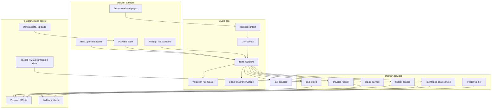
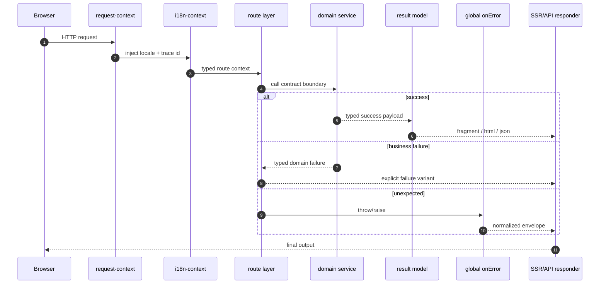
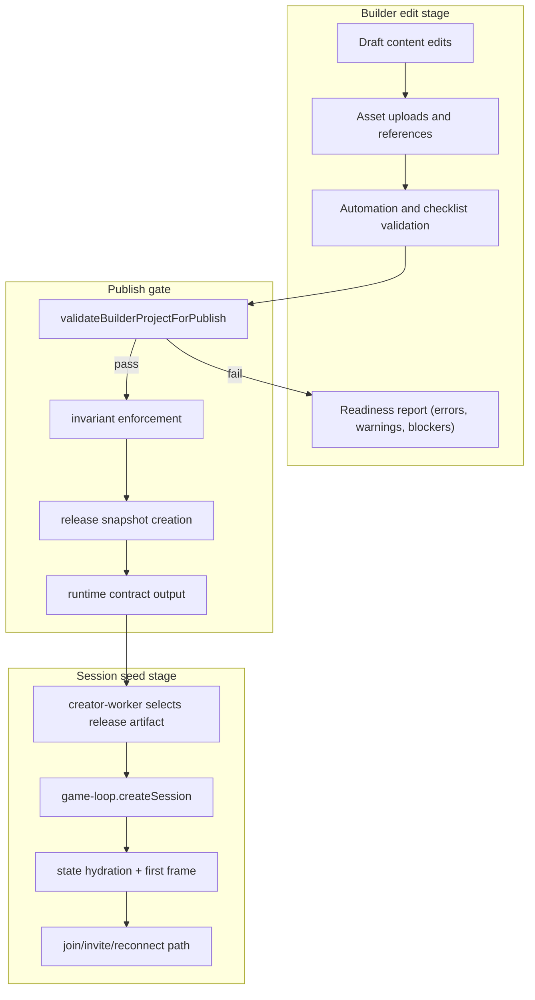
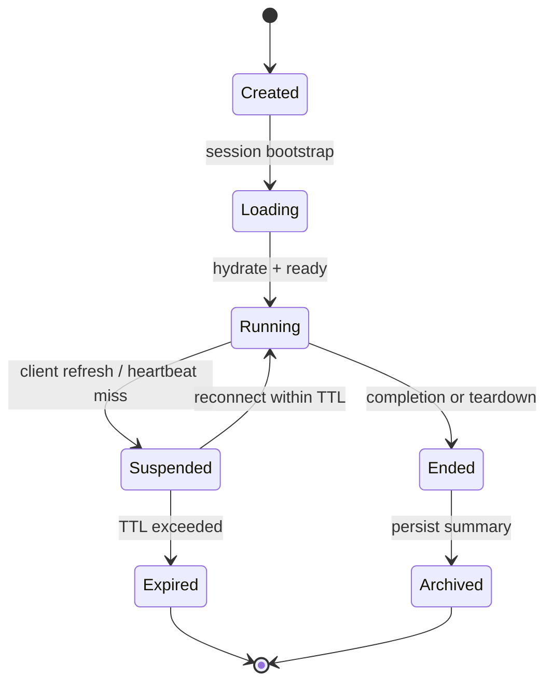
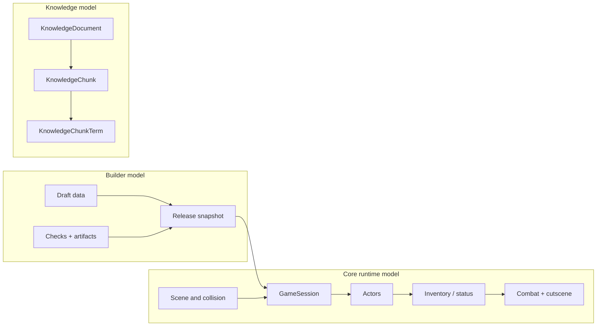
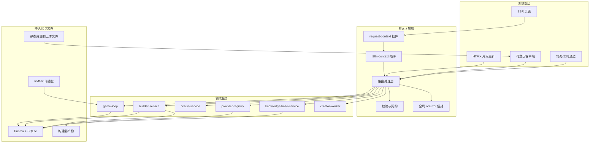
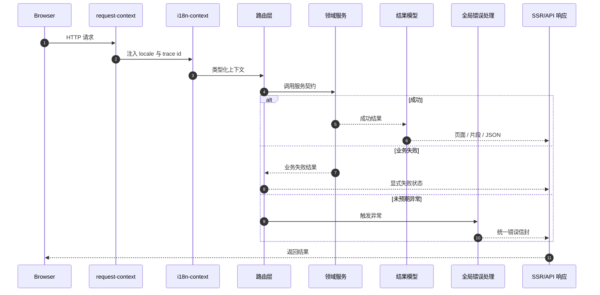
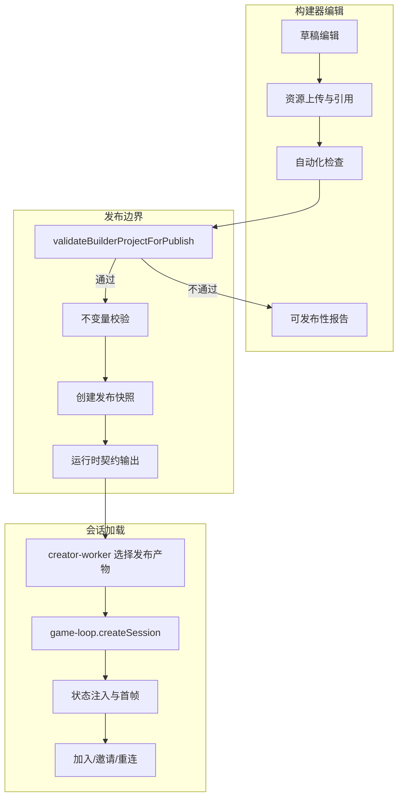
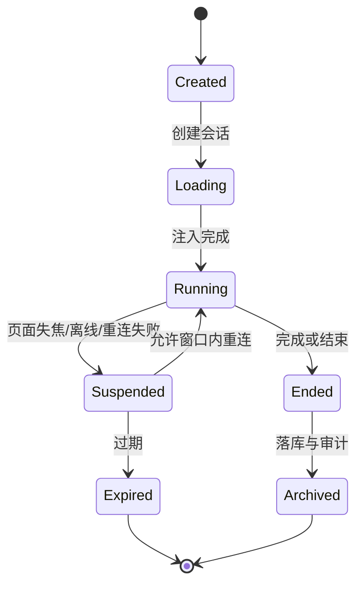
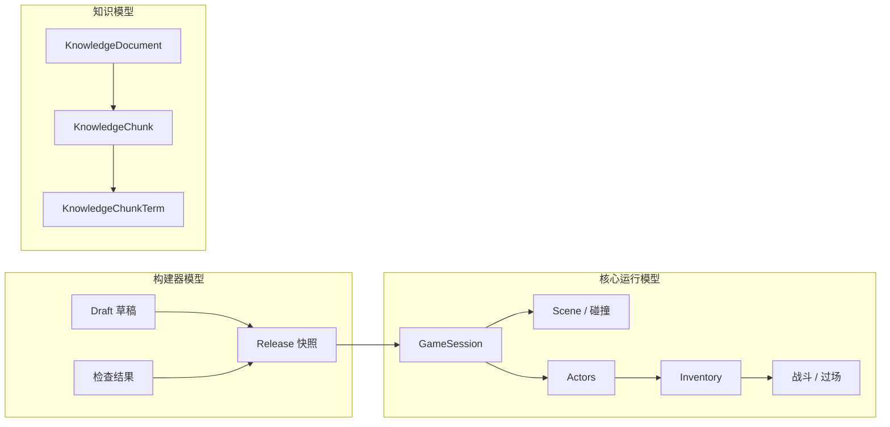

# TEA

**SSR-first game runtime, builder workspace, and AI-assisted tooling for Bun + TypeScript**

## Documentation

- English overview: below (top section).
- Chinese overview: below (immediately after English section).
- Architecture archive: [`notes/doc-archive/ARCHITECTURE.txt`](./notes/doc-archive/ARCHITECTURE.txt)
- Docs index archive: [`notes/doc-archive/docs__index.txt`](./notes/doc-archive/docs__index.txt)
- API contracts archive: [`notes/doc-archive/docs__api-contracts.txt`](./notes/doc-archive/docs__api-contracts.txt)
- Builder domain archive: [`notes/doc-archive/docs__builder-domain.txt`](./notes/doc-archive/docs__builder-domain.txt)
- HTMX extensions archive: [`notes/doc-archive/docs__htmx-extensions.txt`](./notes/doc-archive/docs__htmx-extensions.txt)
- Playable runtime archive: [`notes/doc-archive/docs__playable-runtime.txt`](./notes/doc-archive/docs__playable-runtime.txt)
- Local AI runtime archive: [`notes/doc-archive/docs__local-ai-runtime.txt`](./notes/doc-archive/docs__local-ai-runtime.txt)
- Operator runbook archive: [`notes/doc-archive/docs__operator-runbook.txt`](./notes/doc-archive/docs__operator-runbook.txt)
- RMMZ pack archive: [`notes/doc-archive/docs__rmmz-pack.txt`](./notes/doc-archive/docs__rmmz-pack.txt)
- Companion pack status archive: [`notes/doc-archive/LOTFK_RMMZ_Agentic_Pack__STATUS.txt`](./notes/doc-archive/LOTFK_RMMZ_Agentic_Pack__STATUS.txt)

---

## Executive summary

TEA is a **full backend-driven game platform** that ships a builder and a server-authoritative runtime inside one Bun application.
The primary design constraints are:

- **SSR-first UX** with minimal client bootstrap.
- **Contract-first boundaries** between route handlers and domain services.
- **Immutable release artifacts** for playable sessions.
- **Bun-native path handling and file access** in runtime and scripts.
- **Bilingual, archive-backed documentation** with explicit migration of markdown content.

The platform currently supports:

- Home/oracle pages, a game runtime, builder workspace pages, and AI surfaces.
- Game sessions with persistence, join/rejoin flow, combat/cutscene progression, and resumable state.
- Builder drafting with policy checks and publish gating.
- AI provider routing with retrieval-backed prompts and fallback behavior.

## Repository architecture

`src/app.ts` creates a single Elysia composition that wires:

- request/session/context plugins,
- SSR pages and fragment routes,
- JSON API routes,
- AI routes,
- playable runtime endpoints,
- builder endpoints.

Everything is designed so each call path has explicit ownership and predictable error semantics.



## End-to-end request and error flow

TEA enforces deterministic request behavior:

- Context enrichment first (locale + correlation id + request metadata).
- Contract-bound service call next.
- Typed failures mapped to the same response envelope shape.
- No unhandled branch leaks when possible; `onError` normalizes unexpected exceptions.



## Builder to playable runtime pipeline

The publish flow is designed so live runtime never reads mutable draft state.



## Game runtime lifecycle



## Security and hardening notes

- Asset serving uses mount-root checks and path normalization before read.
- Query/path parameters for file access are normalized and denied unless canonical checks pass.
- Builder publish payload parsing avoids permissive assumptions and weakly-typed fallthrough.
- AI provider chain includes fallback and observability hooks for degraded paths.
- Scripts now avoid Node-only assumptions where practical and prefer Bun file APIs.
- Error envelopes keep user-visible failures deterministic and machine-parseable.

## Data model and ownership

The following table expresses ownership boundaries so there is no duplicate implementation across layers:

| Owner | Responsibility | Main tables / domains |
| --- | --- | --- |
| Route surface | Input validation, response mapping, navigation fragments | API envelopes, HTMX swap payloads |
| Game domain | Session state, scene state, combat, inventory, progress | `GameSession`, runtime state tables |
| Builder domain | Draft state transitions, publish policy, artifacts | builder project + release artifacts |
| AI domain | Provider registry, generation + fallback, retrieval docs/chunks | `AiKnowledgeDocument`, `AiKnowledgeChunk`, `AiKnowledgeChunkTerm` |
| Knowledge/Oracle domain | query/response storage and audit context | `OracleInteraction` |
| Infrastructure | DB lifecycle, startup checks, static assets, docs archive checks | Prisma client, scripts |



## UI/UX model and state contract

TEA uses a shared state vocabulary across SSR and API surfaces:

- `idle`
- `loading`
- `success`
- `empty`
- `retryable_error`
- `non_retryable_error`
- `unauthorized`

### State intent

| Surface | Success path | Error path | Retry behavior |
| --- | --- | --- | --- |
| SSR pages | full render or clean partial | typed envelope + fallback UI | user-triggered or automatic in loading contexts |
| Fragments (HTMX) | precise region swap | status chip + explicit action | automatic retry for retryable case |
| JSON APIs | structured envelope | structured reason + code | caller-level policy |
| Game loop endpoints | session creation / hydration result | explicit termination | no silent fallback |

## Local and runtime configuration

- Environment defaults come from `src/config/environment.ts`.
- Host/port, storage paths, cookie/session settings, auth settings, polling intervals, and AI behavior toggles are centralized in configuration.
- All non-code settings are expected to flow through typed environment parsing where available.

## Repository map

| Path | Responsibility |
| --- | --- |
| `src/app.ts` | Elysia root composition |
| `src/server.ts` | server bootstrap and lifecycle |
| `src/routes/page-routes.ts` | SSR pages and fragment routes |
| `src/routes/game-routes.ts` | session bootstrap, hydration, and invite flow |
| `src/routes/builder-routes.ts` | SSR builder workspace |
| `src/routes/builder-api.ts` | builder mutations, publish flow, SSE / automation |
| `src/routes/api-routes.ts` | health + oracle API surface |
| `src/routes/ai-routes.ts` | provider + knowledge endpoints |
| `src/domain/game/` | authoritative runtime operations |
| `src/domain/builder/` | builder lifecycle, release, readiness |
| `src/domain/ai/` | provider registry and inference orchestration |
| `src/shared/` | contracts, constants, config, shared helpers |
| `src/playable-game/` | browser bootstrap and transport layer |
| `src/views/` | SSR templates and partial rendering |
| `src/htmx-extensions/` | HTMX helper fragments |
| `prisma/` | schema, migrations, local seed data |
| `scripts/` | build, docs checks, security and dependency verification |
| `tests/` | contract tests, runtime tests, integration tests |
| `notes/doc-archive/` | non-markdown documentation artifacts |
| `LOTFK_RMMZ_Agentic_Pack/` | RPG Maker companion artifacts |

## Recommended startup and quality commands

```bash
bun install
bun run setup
bun run dev
bun run verify
```

Common command list:

- `bun run setup` — initialize env, prisma, and checks.
- `bun run dev` — start server and watch-based build.
- `bun run build:assets` — build CSS / HTMX extensions / runtime bundles.
- `bun run lint` — static + style checks.
- `bun run typecheck` — strict TypeScript checks.
- `bun test` — test suite.
- `bun run docs:check` — archive surface completeness.
- `bun run dependency:drift` — dependency policy audit.
- `bun run verify` — all quality gates in one command.

## Maintenance and document continuity

- `notes/doc-archive/index.json` tracks source/target mapping and checksums for archival validation.
- Markdown sources are retired in code while preserving searchable text-based artifacts.
- README is bilingual in a single file, with Chinese content directly below the English section.
- If any runtime or builder behavior changes, documentation should be updated and mirrored in archive artifacts.

## Chinese / 中文说明

# TEA

**基于 Bun + TypeScript 的 SSR 优先游戏运行时、构建器与 AI 辅助工具平台**

## 文档

- 英文说明：本文档上方。
- 中文说明：本文档下方。
- 架构归档：[`notes/doc-archive/ARCHITECTURE.txt`](./notes/doc-archive/ARCHITECTURE.txt)
- 文档索引归档：[`notes/doc-archive/docs__index.txt`](./notes/doc-archive/docs__index.txt)
- API 契约归档：[`notes/doc-archive/docs__api-contracts.txt`](./notes/doc-archive/docs__api-contracts.txt)
- 构建器域归档：[`notes/doc-archive/docs__builder-domain.txt`](./notes/doc-archive/docs__builder-domain.txt)
- HTMX 扩展归档：[`notes/doc-archive/docs__htmx-extensions.txt`](./notes/doc-archive/docs__htmx-extensions.txt)
- 可游玩运行时归档：[`notes/doc-archive/docs__playable-runtime.txt`](./notes/doc-archive/docs__playable-runtime.txt)
- 本地 AI 运行时归档：[`notes/doc-archive/docs__local-ai-runtime.txt`](./notes/doc-archive/docs__local-ai-runtime.txt)
- 运维手册归档：[`notes/doc-archive/docs__operator-runbook.txt`](./notes/doc-archive/docs__operator-runbook.txt)
- RMMZ 包归档：[`notes/doc-archive/docs__rmmz-pack.txt`](./notes/doc-archive/docs__rmmz-pack.txt)
- 伴随包状态归档：[`notes/doc-archive/LOTFK_RMMZ_Agentic_Pack__STATUS.txt`](./notes/doc-archive/LOTFK_RMMZ_Agentic_Pack__STATUS.txt)

## 总体说明

TEA 是一个把 **服务器渲染（SSR）游戏运行时 + 构建器 + AI 工具链** 集成在单体 Bun 应用中的平台。它的目标是：

- 保持可预期的请求行为；
- 让可发布内容始终来自不可变快照；
- 用统一契约驱动路由与服务之间的数据交换；
- 让中文文档与英文文档在同一文件中可读、可追踪、可归档。

目前支持：

- 首页/Oracle 页面、游戏页面、构建器页面、AI 接口。
- 可恢复的会话运行时（创建、恢复、邀请、重新加入）。
- 战斗、场景、背包、过场动画的服务器权威状态更新。
- 构建器草稿编辑、校验、发布并转入运行时会话。
- 本地模型/远端模型路由与降级链路。

## 统一架构视图

`src/app.ts` 将请求插件、SSR 路由、API 路由、AI 路由、游戏运行时与构建器工作区组装进一个 Elysia 应用，核心路径始终可追溯。



## 请求生命周期与错误处理



## 构建器到运行时发布链路



## 会话生命周期



## 数据模型和职责分离



## 安全与稳定性

- 文件服务采用路径规范化与挂载根目录检查，避免越权读取。
- 发布解析与自动化输入使用明确校验，避免格式漂移导致未定义行为。
- AI 提供商调用带有回退策略和超时边界，降低单点失败风险。
- 所有关键脚本优先采用 Bun API，减少运行时耦合和兼容性漂移。

## 状态状态机与前端反馈

统一状态用于 SSR 与 API：

- `idle`
- `loading`
- `success`
- `empty`
- `error(retryable)`
- `error(non-retryable)`
- `unauthorized`

### 应用映射

| 场景 | 成功态 | 失败态 | 重试策略 |
| --- | --- | --- | --- |
| 页面 | 全量/片段渲染 | 可读性错误页或空状态 | 页面动作可重试 |
| HTMX 片段 | 精准刷新 | 告警块 + 文案动作 | 可自动可手动 |
| API | 契约化 json | 标准化错误码与原因 | 由调用方策略决定 |
| 游戏入口 | 会话创建/恢复成功 | 非静默错误关闭或提示 | 需要用户确认 |

## 配置与运维

核心配置在 `src/config/environment.ts`，覆盖：

- 服务器地址与端口。
- 存储路径、静态目录、会话 cookie、恢复窗口。
- Websocket/polling 定时、重连与超时参数。
- AI 启用开关、模型路径、回退策略参数。
- 构建器自动化相关阈值与检测开关。

## 提交前建议

- 修改逻辑后更新对应文档段落。
- 变更接口时同时更新合约与测试。
- 运行 `bun run docs:check` 与 `bun run verify`。
- 使用 `notes/doc-archive/index.json` 跟踪归档文件一致性。

## 常用命令

```bash
bun install
bun run setup
bun run dev
bun run verify
```

常见命令：

- `bun run setup`：初始化环境和数据库。
- `bun run dev`：启动开发环境。
- `bun run build:assets`：构建静态资源和可游玩脚本。
- `bun run lint`：静态检查。
- `bun run typecheck`：类型检查。
- `bun test`：测试。
- `bun run docs:check`：文档归档完整性检查。
- `bun run dependency:drift`：依赖漂移检测。
- `bun run verify`：一次性跑完整体检查。

