# TEA

**SSR-first game runtime, builder workspace, and AI tooling powered by Bun/TypeScript**

## Documentation

- English: [`README.md`](./README.md)
- Chinese: below (in this file, after English)
- Architecture archive: [`notes/doc-archive/ARCHITECTURE.txt`](./notes/doc-archive/ARCHITECTURE.txt)
- Docs index archive: [`notes/doc-archive/docs__index.txt`](./notes/doc-archive/docs__index.txt)
- API contracts: [`notes/doc-archive/docs__api-contracts.txt`](./notes/doc-archive/docs__api-contracts.txt)
- Builder domain: [`notes/doc-archive/docs__builder-domain.txt`](./notes/doc-archive/docs__builder-domain.txt)
- HTMX extensions: [`notes/doc-archive/docs__htmx-extensions.txt`](./notes/doc-archive/docs__htmx-extensions.txt)
- Playable runtime: [`notes/doc-archive/docs__playable-runtime.txt`](./notes/doc-archive/docs__playable-runtime.txt)
- Local AI runtime: [`notes/doc-archive/docs__local-ai-runtime.txt`](./notes/doc-archive/docs__local-ai-runtime.txt)
- Operator runbook: [`notes/doc-archive/docs__operator-runbook.txt`](./notes/doc-archive/docs__operator-runbook.txt)
- RMMZ pack: [`notes/doc-archive/docs__rmmz-pack.txt`](./notes/doc-archive/docs__rmmz-pack.txt)
- Companion pack status notes: [`notes/doc-archive/LOTFK_RMMZ_Agentic_Pack__STATUS.txt`](./notes/doc-archive/LOTFK_RMMZ_Agentic_Pack__STATUS.txt)

## What TEA is

TEA is an opinionated platform that combines:

- A server-authoritative game runtime.
- A web-based builder that composes immutable playable releases.
- AI-assisted tooling (local or remote providers) with a retrieval path.
- Contracted interfaces across pages, APIs, game engine, and builder services.

The repository is intentionally **SSR-first**. Browser-side JavaScript is only loaded where it is explicitly needed (game runtime, live canvas interactions, and selected HTMX helpers).

## Architecture at a glance

| Area | Responsibility |
| --- | --- |
| Runtime | Bun + Elysia composition, request lifecycle, typed error envelope |
| UI | SSR views with HTMX progressive enhancement |
| Builder | Draft editing, validation, publish, immutable release artifacts |
| Game | Session lifecycle, persistence, multiplayer state orchestration |
| AI | Provider registry, fallback strategy, retrieval + generation orchestration |
| Storage | Prisma + SQLite for sessions, content, builder metadata, and logs |
| Tooling | Scripts for docs, security, dependency validation, and asset pipeline |

## High-level dataflow

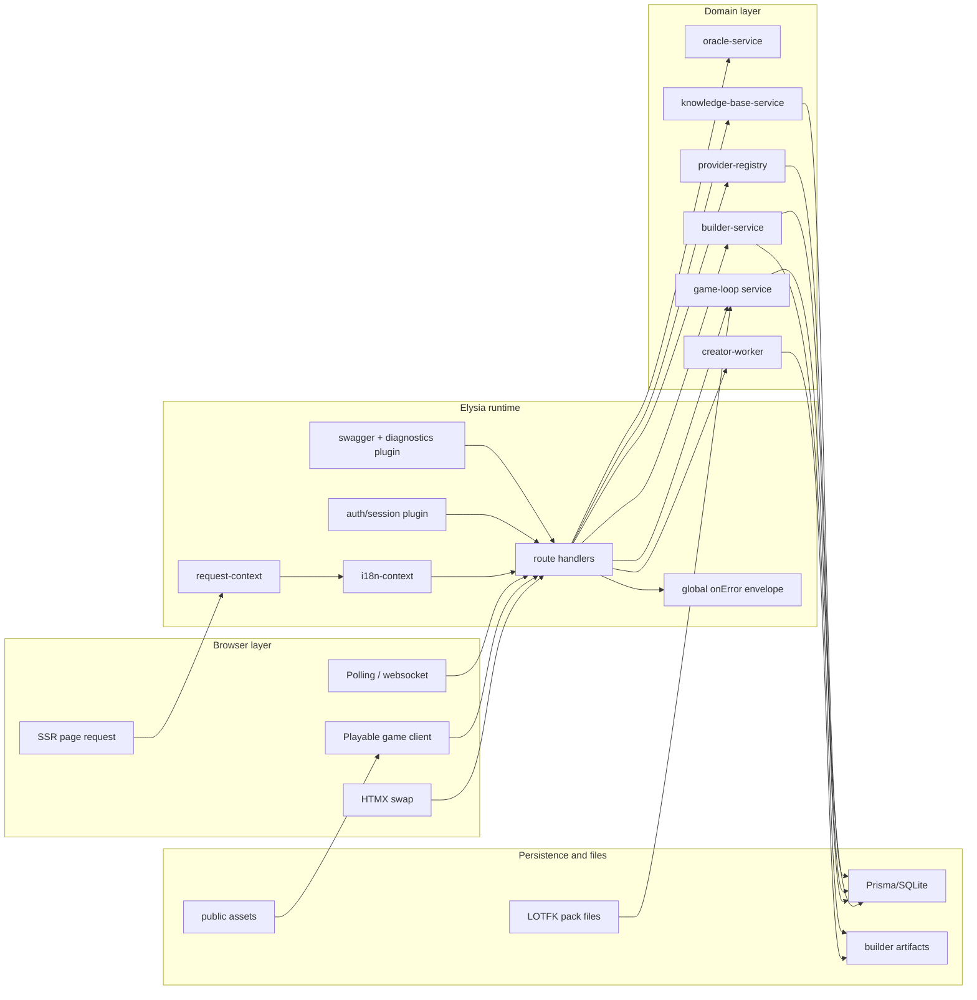

## Request lifecycle (deterministic and contract-first)

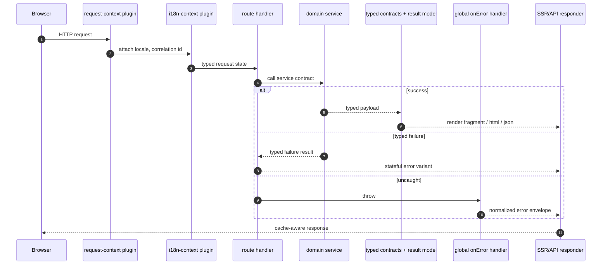

## Builder end-to-end publish flow

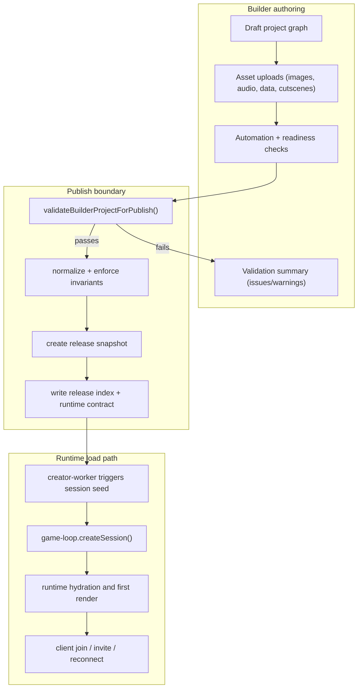

## Game session lifecycle

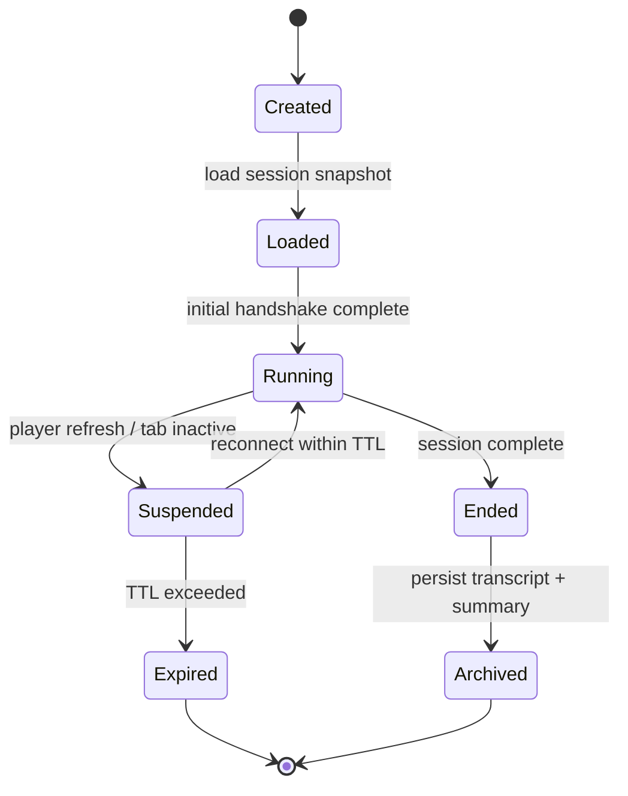

## Data model and service boundaries

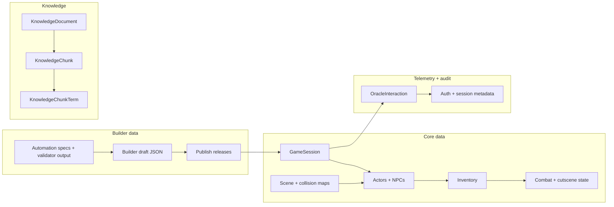

## AI routing and reliability

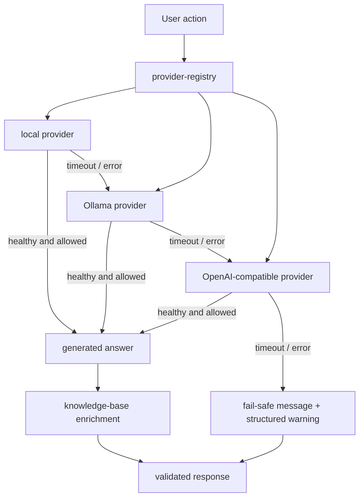

## Security and correctness checks

- `src/plugins/static-assets.ts` validates file roots and normalized paths before read.
- Builder payload parsing is intentionally strict for publish approval data.
- Static checks prevent directory traversal using canonicalized path comparison.
- All major interfaces expose typed result structures rather than ad-hoc `any`.
- Script paths and file reads are Bun-native where practical, reducing Node runtime coupling.

## Repository map

| Path | Responsibility |
| --- | --- |
| `src/app.ts` | Compose request plugins, routes, and shared middleware |
| `src/server.ts` | bootstrap, readiness, shutdown lifecycle |
| `src/routes/page-routes.ts` | SSR pages and fragments |
| `src/routes/game-routes.ts` | playable game entry and session hydration |
| `src/routes/builder-routes.ts` | SSR builder dashboard and panels |
| `src/routes/builder-api.ts` | builder mutations, publish, SSE and AI helpers |
| `src/routes/api-routes.ts` | health + JSON envelopes |
| `src/routes/ai-routes.ts` | model provider and retrieval APIs |
| `src/domain/game/` | authoritative runtime services |
| `src/domain/builder/` | draft/edit/publish and automation orchestration |
| `src/domain/ai/` | provider registry and local inference orchestration |
| `src/shared/` | contracts, constants, config, serializers, and utilities |
| `src/playable-game/` | browser game bootstrap and transport |
| `src/views/` | SSR templates, partials, and layout |
| `src/htmx-extensions/` | HTMX snippets and extension behavior |
| `prisma/` | schema, migrations, and seed/maintenance data |
| `scripts/` | docs/verify, dependency drift, build tooling, asset pipeline |
| `notes/doc-archive/` | machine-readable markdown retirement archives |
| `LOTFK_RMMZ_Agentic_Pack/` | RPG Maker MZ companion pack artifacts |

## Local setup

```bash
bun install
bun run setup
bun run dev
```

Common scripts:

- `bun run setup` – install, env validation, and initial migrations.
- `bun run dev` – start dev server and asset watch/build pipeline.
- `bun run build` – full production build.
- `bun run build:assets` – compile CSS, extensions, runtime bundles.
- `bun run lint` – lint/style checks.
- `bun run typecheck` – strict TypeScript checks.
- `bun test` – test suite.
- `bun run docs:check` – archive and doc surface validation.
- `bun run dependency:drift` – version governance.
- `bun run verify` – end-to-end quality gate.

## Acceptance and operating states

Use this common state vocabulary across SSR and API surfaces:

`idle -> loading -> success | empty | error(retryable|non-retryable) | unauthorized`

In practice this means every endpoint should emit deterministic rendering states, avoid hidden fallback paths, and render one explicit fallback in each branch.

## Quality contract

- Schema-first contracts in `src/shared/contracts/` and service owners by module.
- Typed failure envelopes for API and builder flows.
- Deterministic session startup and explicit release snapshots.
- Structured scripts and checks to prevent drift between source docs and archive references.

## Contribution notes

1. Keep new features SSR-first; add browser logic only where persistence or user interaction requires it.
2. Update docs archive entries when source narrative moves from `.md` files to `notes/doc-archive/`.
3. Maintain parity between English and Chinese docs for external-facing documentation pages.
4. Run `bun run verify` before handoff if feasible.

## Maintenance index

`notes/doc-archive/index.json` tracks archived source/target mappings for docs checks and retention.

TEA is designed so editor tooling, builder workflows, and runtime behavior can be reasoned about from these documents and service contracts. The core intent is to keep game delivery stable while allowing AI-assisted content and publishing tooling to evolve independently from runtime state persistence.


---

## 中文 / Chinese

# TEA

**基于 Bun/TypeScript 的 SSR 优先游戏运行时、构建器与 AI 工具平台**

## 文档

- 英文版：[README.md](./README.md)
- 中文版：本文件下方
- 架构归档：[notes/doc-archive/ARCHITECTURE.txt](./notes/doc-archive/ARCHITECTURE.txt)
- 文档索引归档：[notes/doc-archive/docs__index.txt](./notes/doc-archive/docs__index.txt)
- API 契约归档：[notes/doc-archive/docs__api-contracts.txt](./notes/doc-archive/docs__api-contracts.txt)
- 构建器域归档：[notes/doc-archive/docs__builder-domain.txt](./notes/doc-archive/docs__builder-domain.txt)
- HTMX 扩展归档：[notes/doc-archive/docs__htmx-extensions.txt](./notes/doc-archive/docs__htmx-extensions.txt)
- 可游玩运行时归档：[notes/doc-archive/docs__playable-runtime.txt](./notes/doc-archive/docs__playable-runtime.txt)
- 本地 AI 运行时归档：[notes/doc-archive/docs__local-ai-runtime.txt](./notes/doc-archive/docs__local-ai-runtime.txt)
- 运维手册归档：[notes/doc-archive/docs__operator-runbook.txt](./notes/doc-archive/docs__operator-runbook.txt)
- RMMZ 包归档：[notes/doc-archive/docs__rmmz-pack.txt](./notes/doc-archive/docs__rmmz-pack.txt)
- 伴随包状态归档：[notes/doc-archive/LOTFK_RMMZ_Agentic_Pack__STATUS.txt](./notes/doc-archive/LOTFK_RMMZ_Agentic_Pack__STATUS.txt)

## TEA 是什么

TEA 是一个将以下能力组合在一起的平台：

- 一个服务端权威的游戏运行时。
- 一个负责创建不可变可发布版本的网页版构建器。
- AI 辅助工具链（本地或远端模型）和检索增强流程。
- 页面、API、游戏引擎、构建器之间的契约化接口层。

仓库默认采用 **SSR-first** 策略，只有在确实需要时才加载浏览器端代码（可游玩运行时、局部 HTMX 增强等）。

## 架构一览

| 模块 | 职责 |
| --- | --- |
| 运行时 | Bun + Elysia 组装、请求生命周期、统一错误信封 |
| UI | SSR 页面 + HTMX 渐进增强 |
| 构建器 | 草稿编辑、验证、发布、不可变发布产物 |
| 游戏 | 会话生命周期、持久化、多人状态协调 |
| AI | 供应商注册表、降级策略、RAG 增强 |
| 存储 | Prisma + SQLite 处理会话、内容、构建器元数据和日志 |
| 工具链 | 文档校验、依赖检查、资产构建和质量验证脚本 |

## 顶层数据流

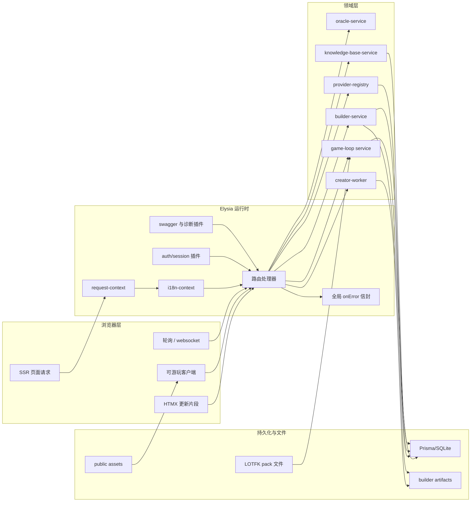

## 请求生命周期（可预测且契约优先）

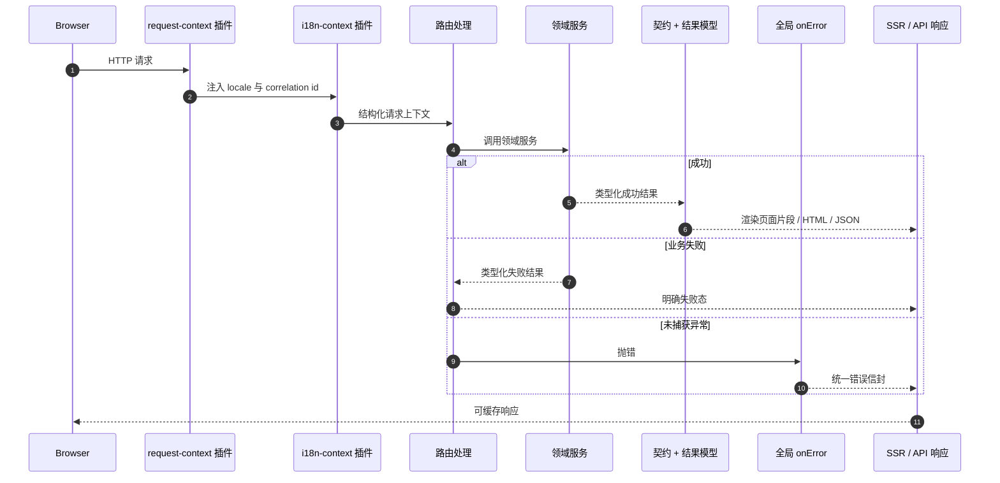

## 构建器到运行时的端到端发布流

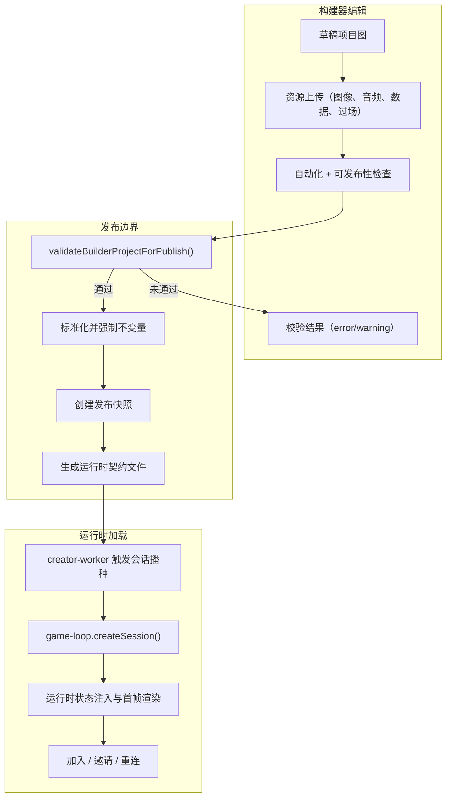

## 游戏会话生命周期

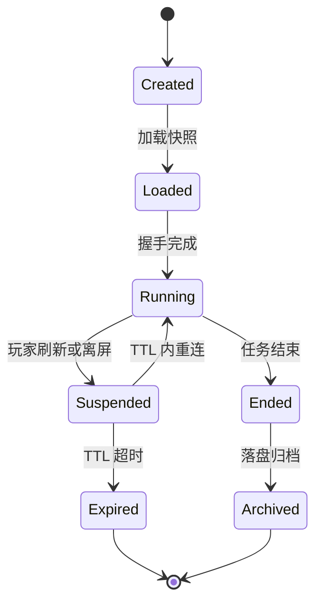

## 数据模型与服务边界

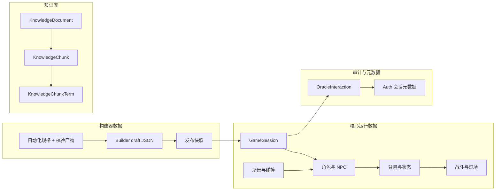

## AI 路由与可靠性策略

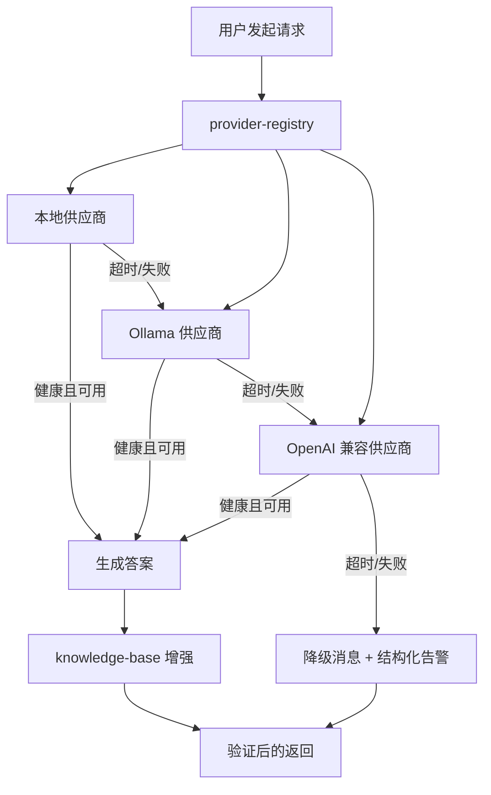

## 安全与正确性

- `src/plugins/static-assets.ts` 在读取文件前执行路径规范化和挂载根目录前缀校验，抑制目录穿越风险。
- 发布审批路径和建议计划的解析逻辑保持强约束，拒绝不完整或不合法输入。
- 不依赖模糊异常流程，优先使用明确的结果模型表达失败语义。
- 文档与路径引用尽量使用配置化/归档路径，避免环境耦合。
- 通过脚本与约束文件维持依赖版本与文档完整性。

## 仓库地图

| 路径 | 职责 |
| --- | --- |
| `src/app.ts` | 组装通用中间件、路由与服务 |
| `src/server.ts` | 启动初始化、就绪检查、优雅关闭 |
| `src/routes/page-routes.ts` | SSR 页面与片段 |
| `src/routes/game-routes.ts` | 可游玩入口与会话注入 |
| `src/routes/builder-routes.ts` | SSR 构建器页与面板 |
| `src/routes/builder-api.ts` | 构建器变更、发布、SSE 和 AI 辅助 |
| `src/routes/api-routes.ts` | 健康检查与 JSON 信封 |
| `src/routes/ai-routes.ts` | 模型供应商与检索 API |
| `src/domain/game/` | 服务端权威运行逻辑 |
| `src/domain/builder/` | 草稿、发布、自动化编排 |
| `src/domain/ai/` | 供应商管理与本地推理编排 |
| `src/shared/` | 契约、常量、配置、序列化和工具 |
| `src/playable-game/` | 浏览器侧启动与网络传输 |
| `src/views/` | SSR 模板、局部视图和布局 |
| `src/htmx-extensions/` | HTMX 扩展脚本与行为 |
| `prisma/` | schema、迁移和维护数据 |
| `scripts/` | 文档校验、依赖检查、资源构建脚本 |
| `notes/doc-archive/` | Markdown 退役后的归档文本 |
| `LOTFK_RMMZ_Agentic_Pack/` | RPG Maker MZ 伴随包产物 |

## 本地启动

```bash
bun install
bun run setup
bun run dev
```

常用脚本：

- `bun run setup` – 安装、环境检查与初始化数据库/资产。
- `bun run dev` – 启动开发服务器与资源监听构建。
- `bun run build` – 生产构建。
- `bun run build:assets` – 构建 CSS、扩展和运行时 bundle。
- `bun run lint` – 风格与静态检查。
- `bun run typecheck` – 严格 TS 检查。
- `bun test` – 测试套件。
- `bun run docs:check` – 文档归档与表面校验。
- `bun run dependency:drift` – 依赖版本治理。
- `bun run verify` – 资源、依赖、文档、lint、typecheck、测试一次性检查。

## 状态模型

文档与 UI 共用状态口径：

`idle -> loading -> success | empty | error(retryable|non-retryable) | unauthorized`

这意味着每个接口与片段必须返回显式状态，避免“默默失败”或不可追踪的空白分支。

## 质量契约

- `src/shared/contracts/` 维持服务边界与类型。
- 所有变更保持模块单一所有权，不在多个层重复实现同一职责。
- API 与构建流程使用统一错误信封与可判定失败分支。
- 会话启动仅使用快照化发布产物，避免运行态消费可变草稿。
- 文档入口、归档与校验保持一致，避免链接失效。

## 贡献准则

1. 新特性优先 SSR；确有需要再引入浏览器端代码。
2. 修改业务流时，先同步更新对应 `notes/doc-archive/` 文本归档。
3. 英文与中文文档保持同等覆盖与结构对齐。
4. 可行时在交付前执行 `bun run verify`。

## 维护索引

`notes/doc-archive/index.json` 记录归档来源路径、归档路径、哈希与归档时间，供 `docs:check` 与审计脚本消费。

TEA 的目标是通过清晰的服务边界与可审计的数据流，在确保运行稳定的同时，让 AI 辅助编排和构建器发布流程持续演进。
