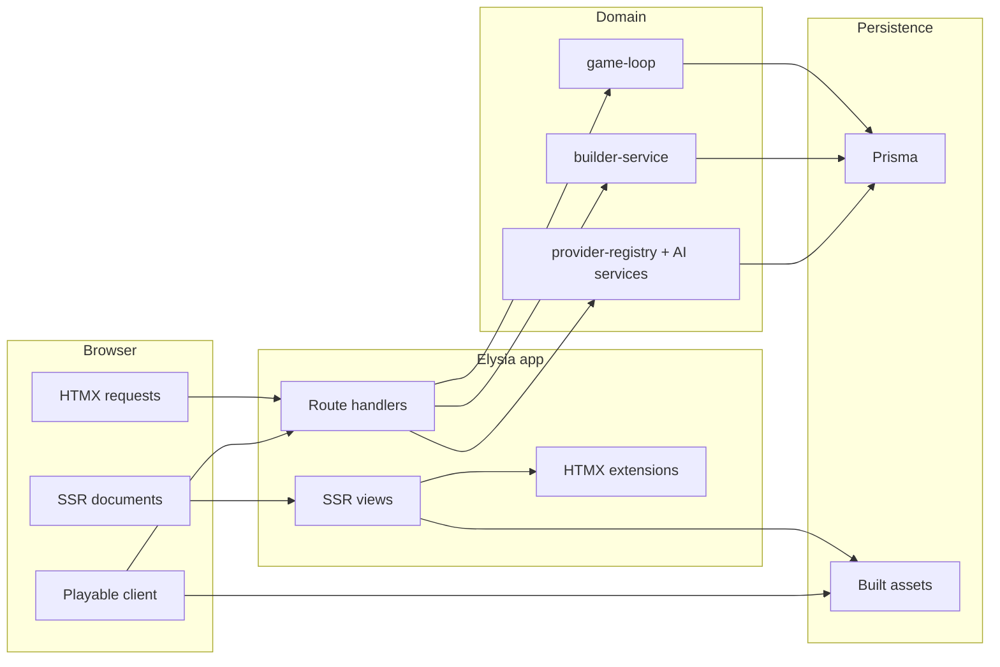
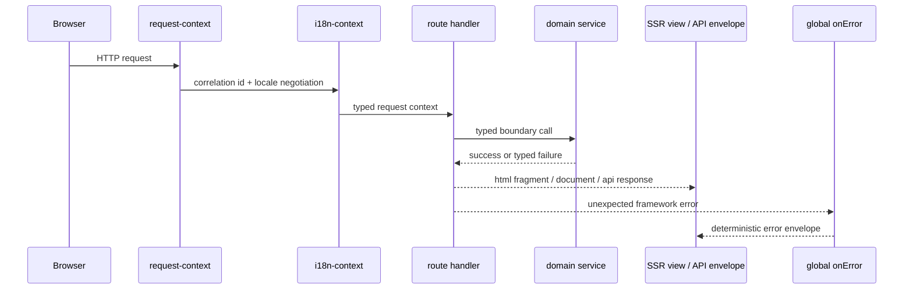
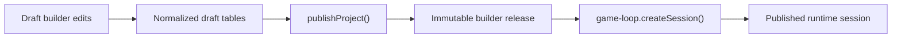

# TEA

TEA is an SSR-first game runtime and builder platform built on Bun, Elysia, HTMX, DaisyUI, Prisma, PixiJS, and Three.js. Server-rendered documents are the default interface. HTMX owns progressive enhancement for navigation and forms. Browser-only hydration is limited to the playable canvas runtime and small shared enhancement hooks.

## Stack and version governance

| Layer | Package | Version |
| --- | --- | --- |
| Runtime | Bun | `1.3.10` |
| Language | TypeScript | `5.9.3` |
| Server | Elysia | `1.4.27` |
| ORM | Prisma / `@prisma/client` | `7.4.2` |
| Progressive enhancement | `htmx.org` | `2.0.8` |
| UI kit | DaisyUI | `5.5.19` |
| CSS | Tailwind CSS | `4.2.1` |
| 2D renderer | PixiJS | `8.17.0` |
| 3D renderer | Three.js | pinned in `package.json` |

Version drift is governed by `bun run dependency:drift`. The repo policy is exact stable pins unless a runtime/type package has explicitly documented patch drift.

## Platform model

TEA combines four runtime surfaces:

- SSR document rendering for home, builder, AI, and game routes
- HTMX fragment mutation and progressive enhancement
- authoritative multiplayer game simulation on the server
- a browser-side playable renderer that consumes a canonical SSR bootstrap contract



## Request and rendering flow



## Product responsibilities

- Serve SSR pages for home, builder, AI, and game routes.
- Enhance forms and navigation with HTMX instead of a SPA shell.
- Publish immutable builder releases and seed runtime sessions from those releases.
- Run a server-authoritative multiplayer loop.
- Route local and external AI capabilities through one provider registry.
- Persist project, release, runtime, and knowledge data through Prisma.

## Non-negotiable architecture rules

- SSR-first by default.
- HTMX for progressive enhancement, targeted swaps, and loading/error states.
- DaisyUI primitives for shared shell interaction patterns.
- No hardcoded user-facing copy outside typed i18n message catalogs.
- One typed error envelope at HTTP boundaries.
- One typed UI fragment state vocabulary:

```text
idle -> loading -> success | empty | error(retryable | non-retryable) | unauthorized
```

## Documentation map

- [Docs index](/Users/brandondonnelly/Downloads/tea/docs/index.md)
- [Architecture](/Users/brandondonnelly/Downloads/tea/ARCHITECTURE.md)
- [API and transport contracts](/Users/brandondonnelly/Downloads/tea/docs/api-contracts.md)
- [Builder domain](/Users/brandondonnelly/Downloads/tea/docs/builder-domain.md)
- [HTMX extensions](/Users/brandondonnelly/Downloads/tea/docs/htmx-extensions.md)
- [Playable runtime](/Users/brandondonnelly/Downloads/tea/docs/playable-runtime.md)
- [Local AI runtime](/Users/brandondonnelly/Downloads/tea/docs/local-ai-runtime.md)
- [Operator runbook](/Users/brandondonnelly/Downloads/tea/docs/operator-runbook.md)
- [RMMZ companion pack](/Users/brandondonnelly/Downloads/tea/docs/rmmz-pack.md)

## Quick start

```bash
bun install
bun run setup
bun run dev
```

Fresh-machine bootstrap entrypoints:

- `./scripts/install-macos.sh`
- `./scripts/install-linux.sh`
- `powershell -ExecutionPolicy Bypass -File .\scripts\install-windows.ps1`

## Commands

| Command | Purpose |
| --- | --- |
| `bun run dev` | Run the app and asset/watch workflows |
| `bun run setup` | Install, env bootstrap, Prisma generate/migrate, asset build, readiness checks |
| `bun run doctor` | Structured readiness report |
| `bun run build:assets` | Build CSS, HTMX extensions, game client, and editor assets |
| `bun run docs:check` | Validate the current-state documentation surface |
| `bun run lint` | Biome check |
| `bun run typecheck` | TypeScript strict check |
| `bun test` | Test suite |
| `bun run dependency:drift` | Dependency policy gate |
| `bun run audit:security` | On-demand security audit |
| `bun run verify` | Build assets + drift + lint + typecheck + tests |
| `bun run start` | Production-like local boot |

## Route groups

| Surface | Responsibility |
| --- | --- |
| `src/routes/page-routes.ts` | Marketing/home shell and shared SSR entry routes |
| `src/routes/game-routes.ts` | Game page bootstrap, restore, commands, HUD, websocket transport |
| `src/routes/builder-routes.ts` | Builder SSR workspaces |
| `src/routes/api-routes.ts` | Application APIs, contracts, and typed envelopes |

## Core ownership map

| Concern | Owner |
| --- | --- |
| Environment + defaults | `src/config/environment.ts` |
| Shared layout shell | `src/views/layout.ts` |
| i18n messages | `src/shared/i18n/messages.ts` |
| Locale resolution | `src/shared/i18n/translator.ts` |
| UI state contracts | `src/shared/contracts/ui-state.ts` |
| External failure contracts | `src/shared/contracts/external-boundary.ts` |
| Game bootstrap contract | `src/shared/contracts/game-client-bootstrap.ts` |
| Game runtime contracts | `src/shared/contracts/game.ts` |
| Async result normalization | `src/shared/utils/async-result.ts` |
| Game authority | `src/domain/game/game-loop.ts` |
| Builder domain | `src/domain/builder/builder-service.ts` |
| AI routing | `src/domain/ai/providers/provider-registry.ts` |
| Local model facade | `src/domain/ai/model-manager.ts` |

## Builder-to-player release model



Runtime sessions seed from published releases, not mutable draft state.

## Runtime boundaries

### Shared shell and HTMX

- HTMX requests use explicit `hx-target`, `hx-swap`, `hx-indicator`, and extension-managed lifecycle hooks.
- Validation responses may intentionally swap on `422`.
- Unauthorized and non-retryable failures map to deterministic view states.
- Focus restoration is handled centrally after swaps.

### Playable runtime

The playable client uses one canonical SSR bootstrap contract and a decomposed runtime:

- bootstrap/session persistence
- transport/reconnect/restore flow
- input/focus/runtime status
- renderer lifecycle

### Local AI runtime

The local model stack uses one public facade with internal owners for:

- health and circuit state
- pipeline cache
- pipeline loading
- operation execution
- typed result/failure normalization

### RMMZ companion pack

The repository also ships an RPG Maker MZ companion pack as an active companion artifact. It is documented and maintained, but remains outside the main TypeScript compile surface.

## Environment variables

Key runtime variables:

| Variable | Purpose |
| --- | --- |
| `DATABASE_URL` | Prisma database connection |
| `PORT` | HTTP port |
| `SESSION_RESUME_TOKEN_SECRET` | Required game session signing secret |
| `DEFAULT_LOCALE` | Default locale id |
| `AI_ONNX_DEVICE` | Local ONNX execution target |
| `AI_LOCAL_EMBEDDINGS_ENABLED` | Local embedding lane toggle |
| `GAME_SESSION_TTL_MS` | Session retention window |
| `GAME_RESTORE_MAX_ATTEMPTS` | Client restore retry budget |
| `GAME_SOCKET_RECONNECT_DELAY_MS` | Socket reconnect delay |
| `GAME_COMMAND_TTL_MS` | Client command TTL |

See `.env.example` and [Architecture](/Users/brandondonnelly/Downloads/tea/ARCHITECTURE.md) for the full operational model.

## Accessibility and i18n

- Keyboard-first navigation across the shared shell.
- Explicit focus return after HTMX swaps and panel transitions.
- Live-region and alert semantics for loading, success, and failure surfaces where appropriate.
- Locale-aware rendering through typed message keys only.
- English is the source locale, but rendering is locale-abstracted now.

## Verification policy

Before shipping code changes:

1. Run `bun run build:assets`.
2. Run `bun run dependency:drift`.
3. Run `bun run docs:check`.
4. Run `bun run lint`.
5. Run `bun run typecheck`.
6. Run `bun test`.

`bun run verify` executes the full chain.

Run `bun run audit:security` separately when you want an explicit vulnerability audit without turning it into a hard verification gate.

## Contributor rules

- Do not add client-side fetch patterns where SSR or HTMX already owns the flow.
- Do not introduce fallback bootstrap paths for the game page; use the canonical JSON bootstrap contract.
- Do not add provider-specific route logic; adapt inside the provider boundary.
- Do not add new user-visible strings without typed i18n entries.
