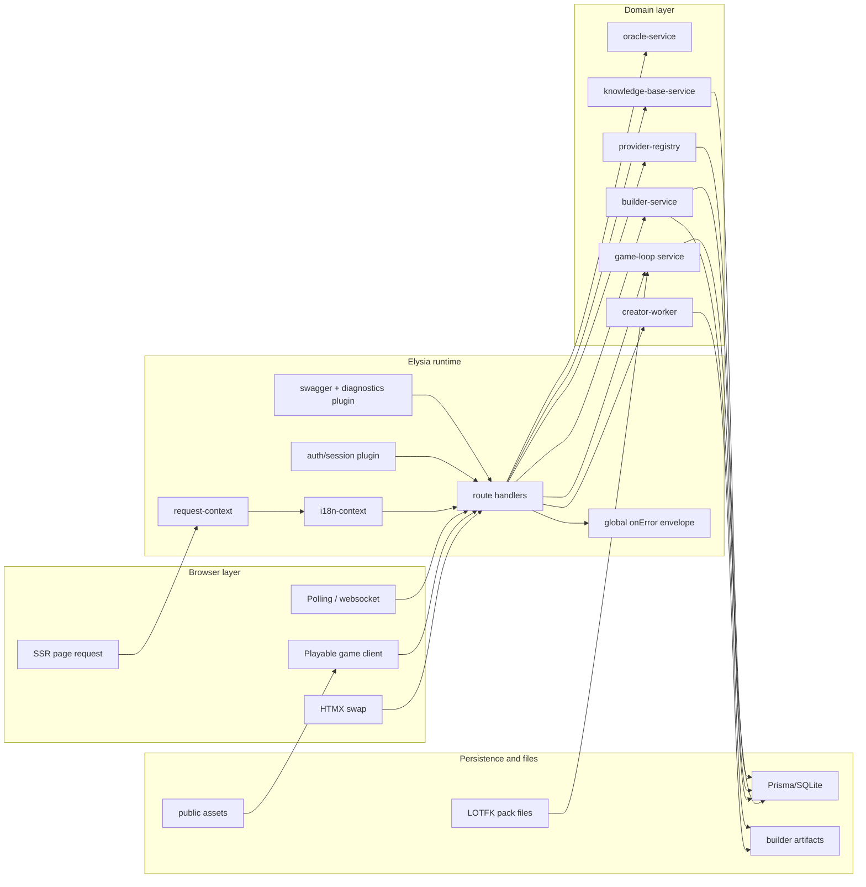
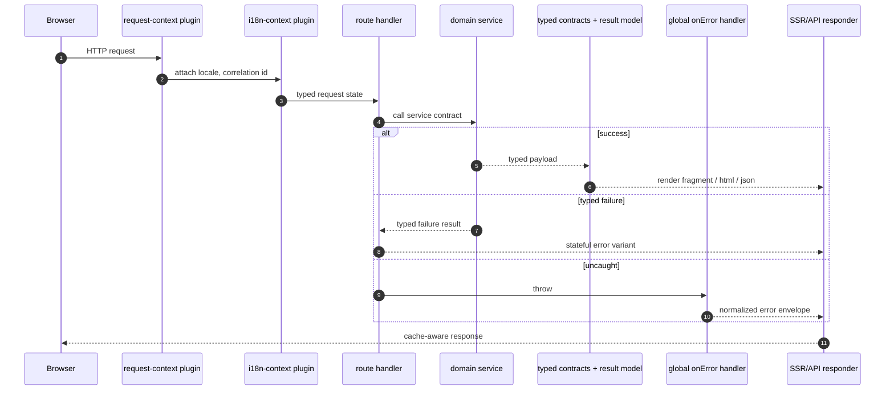
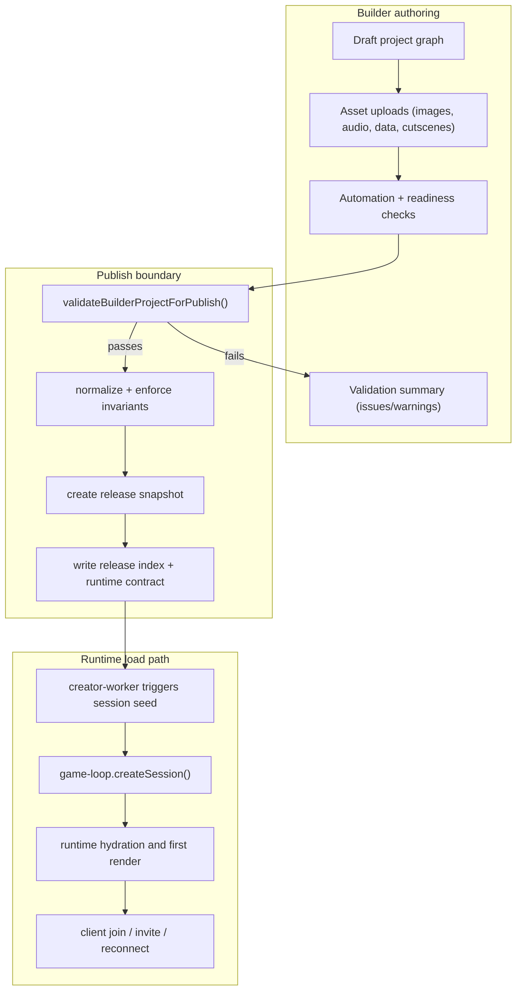
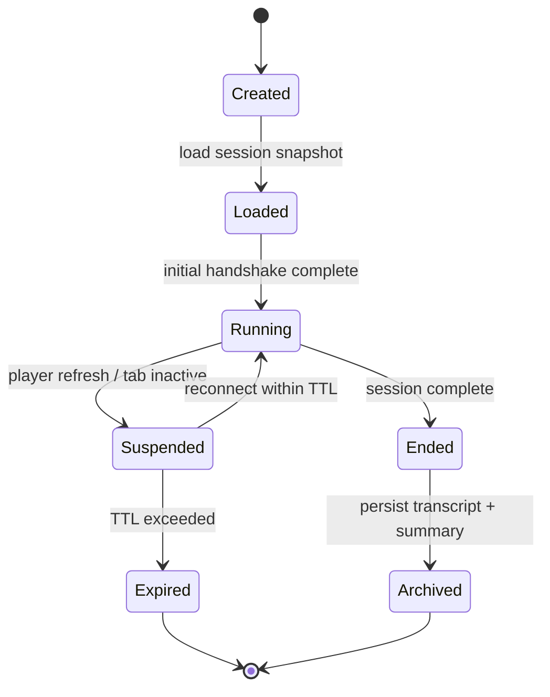
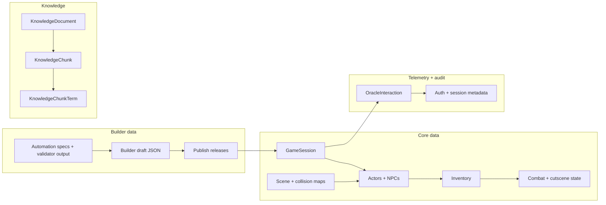
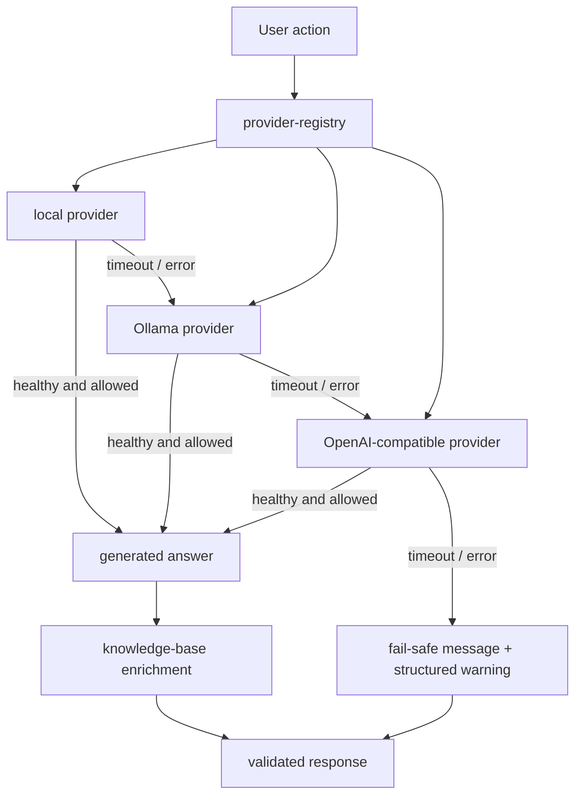

# TEA

**SSR-first game runtime, builder workspace, and AI tooling powered by Bun/TypeScript**

## Documentation

- English: [`README.md`](./README.md)
- Chinese: [`README.zh-CN.md`](./README.zh-CN.md)
- Architecture archive: [`notes/doc-archive/ARCHITECTURE.txt`](./notes/doc-archive/ARCHITECTURE.txt)
- Docs index archive: [`notes/doc-archive/docs__index.txt`](./notes/doc-archive/docs__index.txt)
- API contracts: [`notes/doc-archive/docs__api-contracts.txt`](./notes/doc-archive/docs__api-contracts.txt)
- Builder domain: [`notes/doc-archive/docs__builder-domain.txt`](./notes/doc-archive/docs__builder-domain.txt)
- HTMX extensions: [`notes/doc-archive/docs__htmx-extensions.txt`](./notes/doc-archive/docs__htmx-extensions.txt)
- Playable runtime: [`notes/doc-archive/docs__playable-runtime.txt`](./notes/doc-archive/docs__playable-runtime.txt)
- Local AI runtime: [`notes/doc-archive/docs__local-ai-runtime.txt`](./notes/doc-archive/docs__local-ai-runtime.txt)
- Operator runbook: [`notes/doc-archive/docs__operator-runbook.txt`](./notes/doc-archive/docs__operator-runbook.txt)
- RMMZ pack: [`notes/doc-archive/docs__rmmz-pack.txt`](./notes/doc-archive/docs__rmmz-pack.txt)
- Companion pack status notes: [`notes/doc-archive/LOTFK_RMMZ_Agentic_Pack__STATUS.txt`](./notes/doc-archive/LOTFK_RMMZ_Agentic_Pack__STATUS.txt)

## What TEA is

TEA is an opinionated platform that combines:

- A server-authoritative game runtime.
- A web-based builder that composes immutable playable releases.
- AI-assisted tooling (local or remote providers) with a retrieval path.
- Contracted interfaces across pages, APIs, game engine, and builder services.

The repository is intentionally **SSR-first**. Browser-side JavaScript is only loaded where it is explicitly needed (game runtime, live canvas interactions, and selected HTMX helpers).

## Architecture at a glance

| Area | Responsibility |
| --- | --- |
| Runtime | Bun + Elysia composition, request lifecycle, typed error envelope |
| UI | SSR views with HTMX progressive enhancement |
| Builder | Draft editing, validation, publish, immutable release artifacts |
| Game | Session lifecycle, persistence, multiplayer state orchestration |
| AI | Provider registry, fallback strategy, retrieval + generation orchestration |
| Storage | Prisma + SQLite for sessions, content, builder metadata, and logs |
| Tooling | Scripts for docs, security, dependency validation, and asset pipeline |

## High-level dataflow



## Request lifecycle (deterministic and contract-first)



## Builder end-to-end publish flow



## Game session lifecycle



## Data model and service boundaries



## AI routing and reliability



## Security and correctness checks

- `src/plugins/static-assets.ts` validates file roots and normalized paths before read.
- Builder payload parsing is intentionally strict for publish approval data.
- Static checks prevent directory traversal using canonicalized path comparison.
- All major interfaces expose typed result structures rather than ad-hoc `any`.
- Script paths and file reads are Bun-native where practical, reducing Node runtime coupling.

## Repository map

| Path | Responsibility |
| --- | --- |
| `src/app.ts` | Compose request plugins, routes, and shared middleware |
| `src/server.ts` | bootstrap, readiness, shutdown lifecycle |
| `src/routes/page-routes.ts` | SSR pages and fragments |
| `src/routes/game-routes.ts` | playable game entry and session hydration |
| `src/routes/builder-routes.ts` | SSR builder dashboard and panels |
| `src/routes/builder-api.ts` | builder mutations, publish, SSE and AI helpers |
| `src/routes/api-routes.ts` | health + JSON envelopes |
| `src/routes/ai-routes.ts` | model provider and retrieval APIs |
| `src/domain/game/` | authoritative runtime services |
| `src/domain/builder/` | draft/edit/publish and automation orchestration |
| `src/domain/ai/` | provider registry and local inference orchestration |
| `src/shared/` | contracts, constants, config, serializers, and utilities |
| `src/playable-game/` | browser game bootstrap and transport |
| `src/views/` | SSR templates, partials, and layout |
| `src/htmx-extensions/` | HTMX snippets and extension behavior |
| `prisma/` | schema, migrations, and seed/maintenance data |
| `scripts/` | docs/verify, dependency drift, build tooling, asset pipeline |
| `notes/doc-archive/` | machine-readable markdown retirement archives |
| `LOTFK_RMMZ_Agentic_Pack/` | RPG Maker MZ companion pack artifacts |

## Local setup

```bash
bun install
bun run setup
bun run dev
```

Common scripts:

- `bun run setup` – install, env validation, and initial migrations.
- `bun run dev` – start dev server and asset watch/build pipeline.
- `bun run build` – full production build.
- `bun run build:assets` – compile CSS, extensions, runtime bundles.
- `bun run lint` – lint/style checks.
- `bun run typecheck` – strict TypeScript checks.
- `bun test` – test suite.
- `bun run docs:check` – archive and doc surface validation.
- `bun run dependency:drift` – version governance.
- `bun run verify` – end-to-end quality gate.

## Acceptance and operating states

Use this common state vocabulary across SSR and API surfaces:

`idle -> loading -> success | empty | error(retryable|non-retryable) | unauthorized`

In practice this means every endpoint should emit deterministic rendering states, avoid hidden fallback paths, and render one explicit fallback in each branch.

## Quality contract

- Schema-first contracts in `src/shared/contracts/` and service owners by module.
- Typed failure envelopes for API and builder flows.
- Deterministic session startup and explicit release snapshots.
- Structured scripts and checks to prevent drift between source docs and archive references.

## Contribution notes

1. Keep new features SSR-first; add browser logic only where persistence or user interaction requires it.
2. Update docs archive entries when source narrative moves from `.md` files to `notes/doc-archive/`.
3. Maintain parity between English and Chinese docs for external-facing documentation pages.
4. Run `bun run verify` before handoff if feasible.

## Maintenance index

`notes/doc-archive/index.json` tracks archived source/target mappings for docs checks and retention.

TEA is designed so editor tooling, builder workflows, and runtime behavior can be reasoned about from these documents and service contracts. The core intent is to keep game delivery stable while allowing AI-assisted content and publishing tooling to evolve independently from runtime state persistence.
