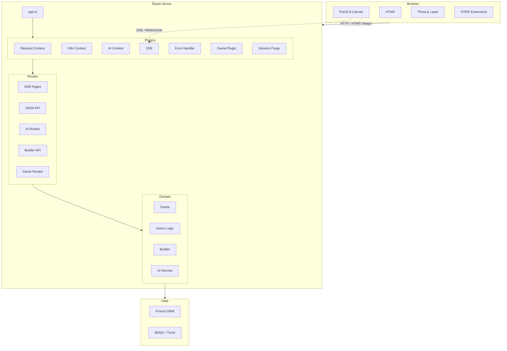
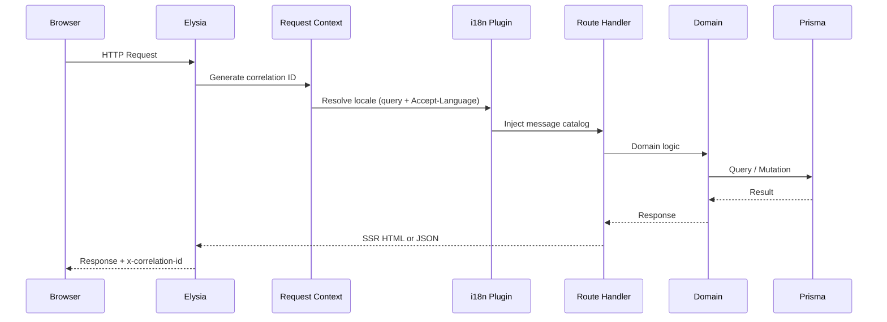
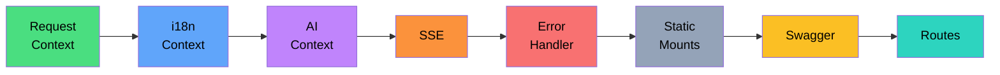
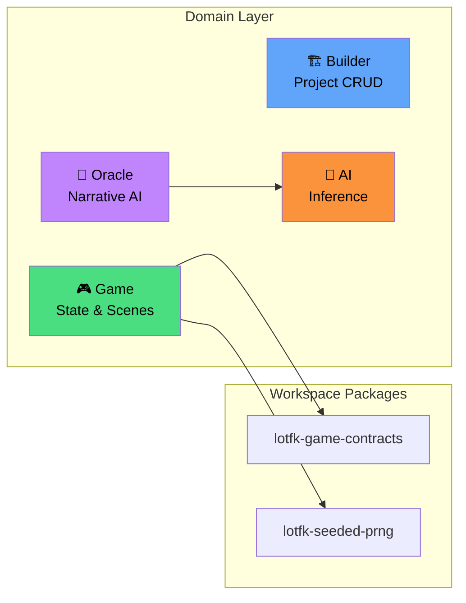
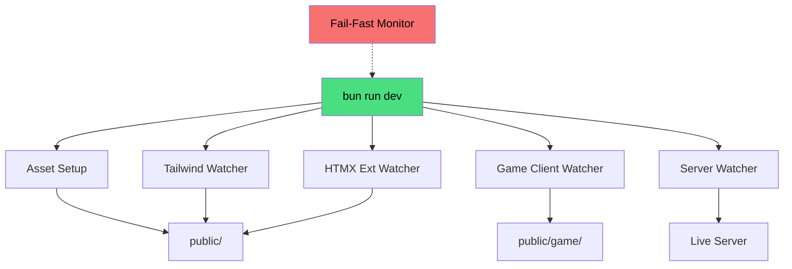
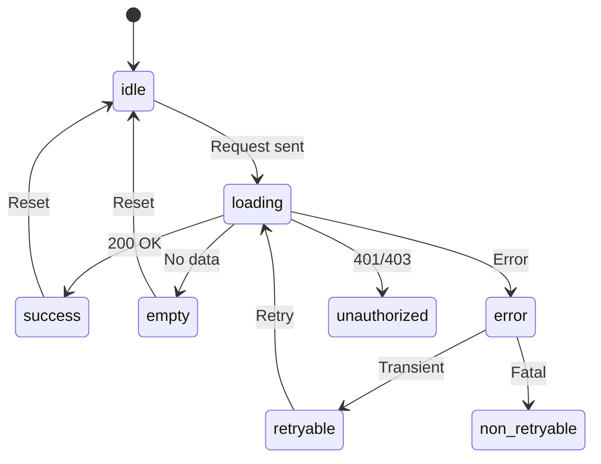
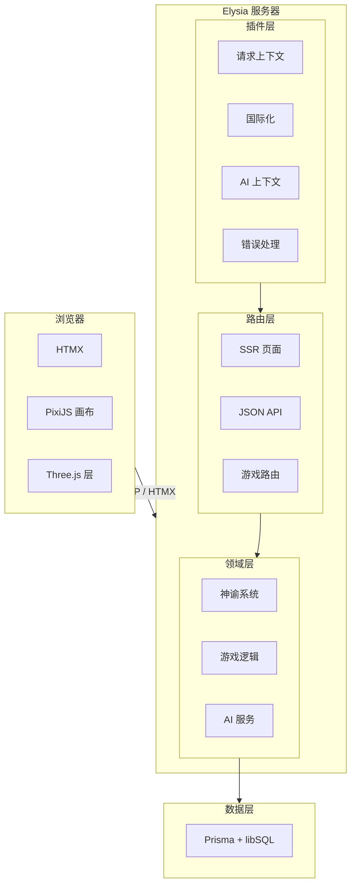
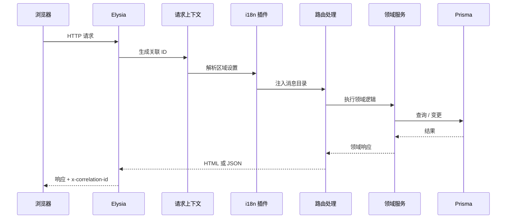

<div align="center">

```

        ) )  )
       ( ( (          ╔════════════════════════════════════════════╗
    ┌───────────┐     ║                                            ║
    │  ~~~~~~~  │     ║   ████████╗███████╗ █████╗                 ║
    │  ~ 茶 ~  │     ║   ╚══██╔══╝██╔════╝██╔══██╗                ║
    │  ~~~~~~~  │╗    ║      ██║   █████╗  ███████║                ║
    │           ││    ║      ██║   ██╔══╝  ██╔══██║                ║
    └───────────┘│    ║      ██║   ███████╗██║  ██║                ║
     └───────────┘    ║      ╚═╝   ╚══════╝╚═╝  ╚═╝               ║
    ═══════════════   ║                                            ║
                      ║   Templated · Event-driven · Agentic       ║
                      ║   模板化     · 事件驱动     · 智能体        ║
                      ║                                            ║
                      ║   Game Engine  ·  游戏引擎                  ║
                      ╚════════════════════════════════════════════╝

```

# 🍵 TEA Game Engine

### **T**emplated · **E**vent-driven · **A**gentic

A server-driven game engine and worldbuilding platform.<br/>服务端驱动的游戏引擎与世界构建平台。

[](https://bun.sh)
[](https://www.typescriptlang.org)
[](https://elysiajs.com)
[](https://htmx.org)
[](https://pixijs.com)
[](https://www.prisma.io)

[English](#overview)&ensp;·&ensp;[中文说明](#中文说明)

</div>

---

## Table of Contents

- [Overview](#overview)
- [Quick Start](#quick-start)
- [Architecture](#architecture)
- [Project Structure](#project-structure)
- [Commands](#commands)
- [Environment](#environment)
- [API Reference](#api-reference)
- [Acknowledgements](#acknowledgements)
- [中文说明](#中文说明)

---

## Overview

TEA Game Engine is an SSR-first game development platform that unifies server-rendered pages, real-time AI narrative generation, and a browser-native playable game client into a single runtime. Built for **Leaves of the Fallen Kingdom (LOTFK)** — a strategy worldbuilding experience.

### Key Capabilities

- **Server-Side Rendering** — all pages render on the server via Elysia; HTMX provides progressive enhancement
- **AI Narrative Engine** — on-device inference via 🤗 Transformers with ONNX/WebGPU acceleration
- **Playable Game Client** — PixiJS 8 canvas with Three.js 3D layer, bundled and hot-reloaded during development
- **Type-Safe Stack** — end-to-end types from Prisma schema through Elysia routes to Eden Treaty client
- **Internationalization** — `Accept-Language` q-weight parsing with deterministic locale persistence
- **Structured Observability** — correlation ID propagation, levelled JSON logging, typed error envelopes

---

## Quick Start

```bash
# Clone
git clone https://github.com/d4551/tea.git && cd tea

# Install dependencies
bun install

# Configure environment
cp .env.example .env

# Generate Prisma client (Prisma 7 reads DATABASE_URL from prisma.config.ts)
bun run prisma:generate

# Start development (launches all watchers)
bun run dev
```

---

## Architecture

### System Overview



### Request Lifecycle

Every inbound request flows through the plugin chain before reaching a route handler:



### Plugin Pipeline

Plugins are composed in strict order. Each plugin decorates the request context for downstream consumers:



### Domain Model



### Dev Pipeline

`bun run dev` orchestrates concurrent watchers with signal-aware cleanup and fail-fast shutdown:



### UI State Machine

All interactive panels follow a deterministic state model:



---

## Project Structure

```
tea/
├── src/
│   ├── app.ts                 # Plugin + route composition
│   ├── server.ts              # Boot entry
│   ├── config/                # Typed environment config
│   ├── domain/
│   │   ├── ai/               # AI inference pipeline
│   │   ├── builder/          # Project builder service
│   │   ├── game/             # Game state, scenes, progression
│   │   └── oracle/           # Oracle narrative engine
│   ├── htmx-extensions/      # Custom HTMX extensions
│   ├── lib/                  # Logger, error envelope, correlation ID
│   ├── playable-game/        # Browser game client (PixiJS + Three.js)
│   ├── plugins/              # Elysia plugins
│   ├── routes/               # SSR pages, JSON API, HTMX partials
│   ├── shared/               # Constants, i18n, contracts, utils
│   ├── styles/               # Tailwind CSS + DaisyUI theme
│   └── views/                # SSR HTML templates
├── packages/
│   ├── lotfk-game-contracts/ # Shared type-safe game schemas
│   └── lotfk-seeded-prng/    # Deterministic PRNG
├── prisma/                   # Schema + migrations
├── scripts/                  # Build, dev orchestrator, sprite processing
├── public/                   # Compiled static assets
├── tests/                    # API contract + config tests
└── LOTFK_RMMZ_Agentic_Pack/  # RPG Maker MZ plugin pack
```

---

## Commands

| Command | Description |
|---|---|
| `bun run dev` | Start all dev watchers (CSS, HTMX, game client, server) |
| `bun run build:assets` | One-shot asset compilation |
| `bun run start` | Production: build + start |
| `bun run lint` | Biome lint |
| `bun run typecheck` | TypeScript strict check |
| `bun test` | Run test suite |
| `bun run verify` | Full pipeline: build → lint → typecheck → test |
| `bun run prisma:generate` | Regenerate Prisma client |
| `bunx prisma db push` | Sync local schema changes using Prisma 7 datasource config |

---

## Environment

Copy `.env.example` → `.env` and configure:

| Variable | Description |
|---|---|
| `PUBLIC_ASSET_PREFIX` | Base URL prefix for static assets |
| `PLAYABLE_GAME_MOUNT_PATH` | URL path for game client (default: `/game`) |
| `PLAYABLE_GAME_SOURCE_DIRECTORY` | Game client build output directory |
| `RMMZ_PACK_PREFIX` | RPG Maker plugin pack mount (default: `/rmmz-pack`) |
| `API_DOCS_PATH` | Swagger docs path (default: `/docs`) |
| `IMAGES_ASSET_PREFIX` | Shared image asset mount |
| `STYLESHEET_PATH` | Optional CSS path override |
| `HTMX_SCRIPT_PATH` | Optional HTMX script path override |

Session cookie keys, oracle hash multiplier, and sprite extraction thresholds are also environment-driven.

---

## API Reference

| Endpoint | Method | Description |
|---|---|---|
| `/api/health` | `GET` | Health check |
| `/api/oracle` | `POST` | Oracle query (typed request/response) |
| `/partials/oracle` | `POST` | HTMX partial for oracle panel |
| `/game` | `GET` | Playable game client |
| `/docs` | `GET` | Swagger UI |

- Validation errors return `422` with typed error envelopes
- Framework errors are localized via `Accept-Language`
- All responses include `x-correlation-id` for distributed tracing

---

## Accessibility

- WCAG AA minimum
- Skip-to-content link for keyboard navigation
- `aria-current="page"` on active nav items
- Focus management on all interactive elements
- All user-facing text via i18n message catalogs

---

## Acknowledgements

<div align="center">

```
    ·  ˚ . ·  ✦  ˚
  ˚  · Thank you ·  ˚
  ✦  ·  谢谢你们  ·  ✦
    ˚  ·    🍵   ·  ˚
    ·  ˚ . ·  ✦  ˚
```

*Dedicated to **Estrella** and **Ioanin** — the heart and inspiration behind this engine.*

</div>

---

<details>
<summary><h2>中文说明</h2></summary>

### 概述

TEA 游戏引擎是一个以服务端渲染 (SSR) 为核心的游戏开发平台，将服务端页面交付、实时 AI 叙事生成和浏览器原生可玩游戏客户端统一在单一运行时中。专为 **落叶王国 (LOTFK)** 策略世界构建体验而打造。

### 核心能力

- **服务端渲染** — 所有页面由 Elysia 在服务端渲染，HTMX 提供渐进增强
- **AI 叙事引擎** — 通过 🤗 Transformers 进行设备端推理，支持 ONNX/WebGPU 加速
- **可玩游戏客户端** — PixiJS 8 画布 + Three.js 3D 层，开发期间支持热重载
- **全链路类型安全** — 从 Prisma 模式到 Elysia 路由到 Eden Treaty 客户端的端到端类型
- **国际化** — `Accept-Language` q 权重解析与确定性区域设置持久化
- **结构化可观察性** — 关联 ID 传播、分级 JSON 日志、类型化错误信封

### 快速开始

```bash
git clone https://github.com/d4551/tea.git && cd tea
bun install
cp .env.example .env
bun run prisma:generate
bun run dev
```

### 技术栈

| 层级 | 技术 | 版本 |
|---|---|---|
| 运行时 | Bun | 1.3 |
| 语言 | TypeScript (strict) | 5.9 |
| 服务端框架 | Elysia | 1.4 |
| 类型安全客户端 | Eden Treaty | 1.4 |
| SSR 增强 | HTMX | 2.0 |
| CSS 框架 | Tailwind CSS | 4.x |
| UI 组件库 | DaisyUI | 5.x |
| ORM | Prisma + libSQL | 7.x |
| 2D 渲染 | PixiJS | 8.x |
| 3D 渲染 | Three.js | 0.183 |
| AI 推理 | 🤗 Transformers (ONNX) | 3.8 |
| 图像处理 | Sharp | 0.34 |

### 系统架构



### 请求生命周期



### 命令

| 命令 | 说明 |
|---|---|
| `bun run dev` | 启动所有开发监听器 |
| `bun run build:assets` | 一次性资产编译 |
| `bun run start` | 生产环境：构建并启动 |
| `bun run lint` | Biome 代码检查 |
| `bun run typecheck` | TypeScript 严格类型检查 |
| `bun test` | 运行测试套件 |
| `bun run verify` | 完整流水线：构建 → 检查 → 类型检查 → 测试 |

### 无障碍

- 最低 WCAG AA 合规
- 键盘用户跳转至内容链接
- 活动导航项 `aria-current="page"`
- 交互元素焦点管理
- 所有面向用户文本通过国际化目录管理

### 致谢

*本引擎献给 **Estrella** 和 **Ioanin** — 你们是这一切背后的灵感与灵魂。* 🍵

</details>

---

## License

Private · All rights reserved.
