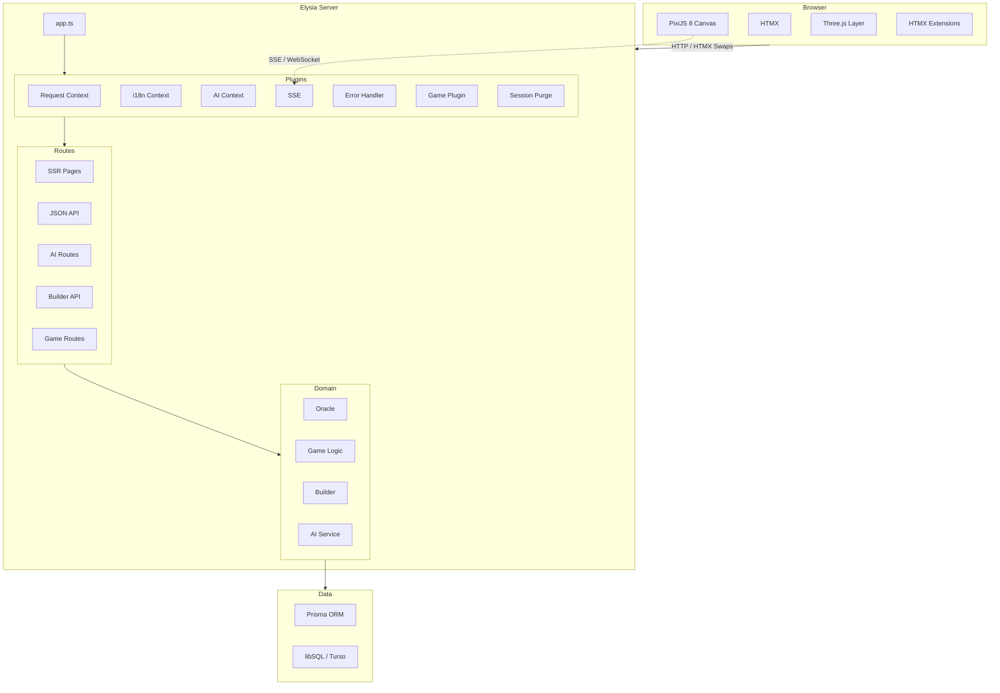
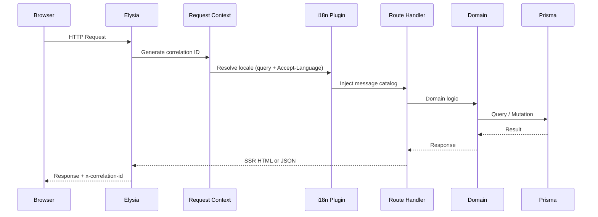
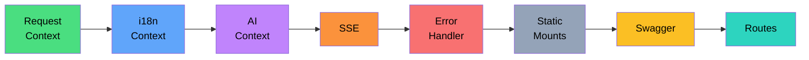
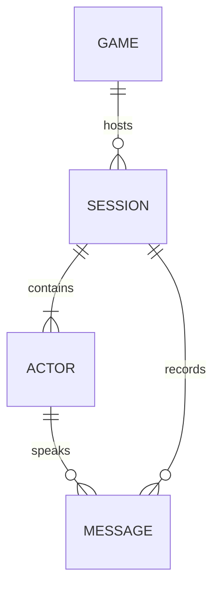
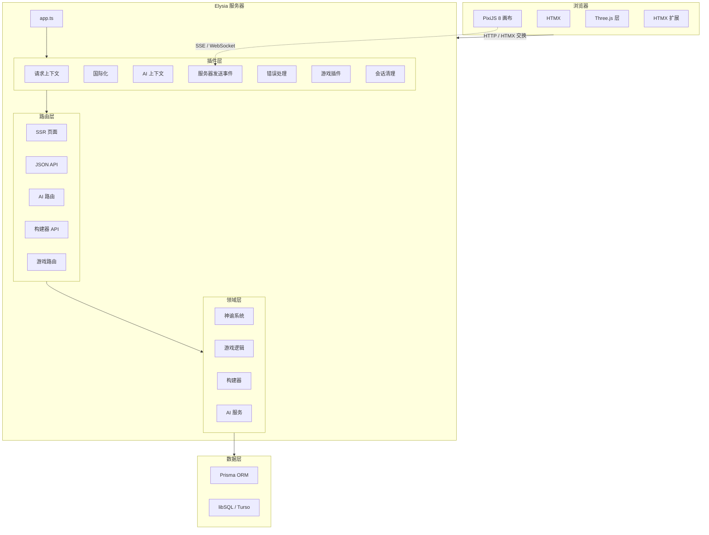
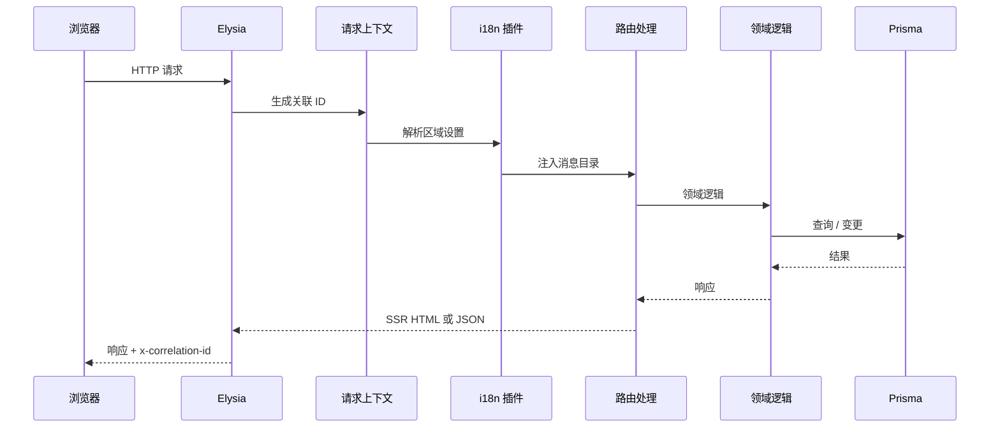
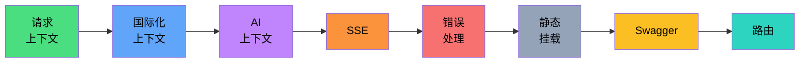
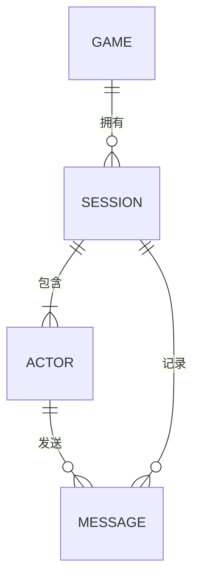

<div align="center">

```text
             )  (   )  (
            (   ) )   ( )
             ) ( (   ) (
          .--------------.
          |  ~   ~   ~   |          _____  _____     _
          |              |___      |_   _|| ____|   / \
          |              |__ \       | |  |  _|    / _ \
          |              |__| |      | |  | |___  / ___ \
          \              /____/      |_|  |_____|/_/   \_\
           \____________/
         .================.        Templated · Event-driven · Agentic
        '------------------'           模板化 · 事件驱动 · 智能体

                                       Game Engine · 游戏引擎
```

**服务端驱动的游戏引擎与世界构建平台**<br/>
A server-driven game engine and worldbuilding platform.

[](https://bun.sh)
[](https://www.typescriptlang.org)
[](https://elysiajs.com)
[](https://htmx.org)
[](https://pixijs.com)
[](https://www.prisma.io)

[English](#overview)&ensp;·&ensp;[中文说明](#中文说明)

</div>

---

## Table of Contents

- [Overview](#overview)
  - [Key Capabilities](#key-capabilities)
- [Tech Stack](#tech-stack)
- [Quick Start](#quick-start)
- [Architecture](#architecture)
  - [System Overview](#system-overview)
  - [Request Lifecycle](#request-lifecycle)
  - [Plugin Pipeline](#plugin-pipeline)
  - [Domain Model](#domain-model)
- [Project Structure](#project-structure)
- [Commands](#commands)
- [Environment](#environment)
- [API Reference](#api-reference)
- [Accessibility](#accessibility)
- [Acknowledgements](#acknowledgements)
- [中文说明](#%E4%B8%AD%E6%96%87%E8%AF%B4%E6%98%8E)

---

## Overview

TEA Game Engine is an SSR-first game development platform that unifies server-rendered pages, real-time AI narrative generation, and a browser-native playable game client into a single runtime. Built for **Leaves of the Fallen Kingdom (LOTFK)** — a strategy worldbuilding experience.

### Key Capabilities

- **Server-Side Rendering** — all pages render on the server via Elysia; HTMX provides progressive enhancement
- **AI Narrative Engine** — on-device inference via 🤗 Transformers with ONNX/WebGPU acceleration
- **Playable Game Client** — PixiJS 8 canvas with Three.js 3D layer, bundled and hot-reloaded during development
- **Type-Safe Stack** — end-to-end types from Prisma schema through Elysia routes to Eden Treaty client
- **Internationalization** — `Accept-Language` q-weight parsing with deterministic locale persistence
- **Structured Observability** — correlation ID propagation, levelled JSON logging, typed error envelopes

---

## Tech Stack

| Layer | Technology | Version |
|---|---|---|
| Runtime | Bun | 1.3 |
| Language | TypeScript (strict) | 5.9 |
| Server Framework | Elysia | 1.4 |
| Type-safe Client | Eden Treaty | 1.4 |
| SSR Enhancement | HTMX | 2.0 |
| CSS Framework | Tailwind CSS | 4.x |
| UI Components | DaisyUI | 5.x |
| ORM | Prisma + libSQL | 7.x |
| 2D Render | PixiJS | 8.x |
| 3D Render | Three.js | 0.183 |
| AI Inference | 🤗 Transformers (ONNX) | 3.8 |
| Image Ops | Sharp | 0.34 |

---

## Quick Start

```bash
# Clone
git clone https://github.com/d4551/tea.git && cd tea

# Install dependencies
bun install

# Configure environment
cp .env.example .env

# Generate Prisma client
bun run prisma:generate

# Start development (launches all watchers)
bun run dev
```

---

## Architecture

### System Overview



### Request Lifecycle

Every inbound request flows through the plugin chain before reaching a route handler:



### Plugin Pipeline

Plugins are composed in strict order. Each plugin decorates the request context for downstream consumers:



### Domain Model



---

## Project Structure

```text
tea/
├── apps/                 # Future multi-app support
├── libs/                 # Shared libraries
├── packages/             # Bun workspaces
├── prisma/               # Schema and migrations
│   └── schema.prisma     # Single source of truth
├── public/               # Static web assets
├── src/                  # Server / Backend
│   ├── build/            # Asset pipeline (esbuild/bun)
│   ├── config/           # Envs and constants
│   ├── db/               # Prisma client instantiation
│   ├── domain/           # Core game logic (Game, AI, Oracle)
│   ├── plugins/          # Elysia plugins (i18n, HTMX, Error)
│   └── app.ts            # Elysia entry point
├── tests/                # bun:test suites
└── index.html            # Core HTMX template
```

---

## Commands

| Command | Description |
|---|---|
| `bun run dev` | Start development server with all watchers |
| `bun run build:assets` | One-off asset compilation |
| `bun run start` | Production: build and start |
| `bun run lint` | Biome linting |
| `bun run typecheck` | Strict TypeScript checking |
| `bun test` | Run test suite |
| `bun run verify` | Full pipeline: lint → typecheck → test |

---

## Environment

Required `.env` variables:

| Variable | Purpose |
|---|---|
| `DATABASE_URL` | libSQL connection string (e.g., `file:./prisma/dev.db`) |
| `NODE_ENV` | `development` or `production` |
| `PORT` | Server port (default: 3000) |

---

## API Reference

| Endpoint | Method | Purpose |
|---|---|---|
| `/` | GET | SSR Application Entry |
| `/api/health` | GET | System metrics |
| `/api/game/:id` | GET | Game state |
| `/api/ai/chat` | POST | Oracle interaction |
| `/ws/events` | WS | Realtime game events |

---

## Accessibility

- WCAG AA minimum
- Skip-to-content link for keyboard navigation
- `aria-current="page"` on active nav items
- Focus management on all interactive elements
- All user-facing text via i18n message catalogs

---

## Acknowledgements

<div align="center">

```text
    ·  ˚ . ·  ✦  ˚
  ˚  · Thank you ·  ˚
  ✦  ·  谢谢你们  ·  ✦
    ˚  ·    🍵   ·  ˚
    ·  ˚ . ·  ✦  ˚
```

*Dedicated to **Estrella** and **Ioanin** — the heart and inspiration behind this engine.*

</div>

---

<details>
<summary><h2 id="中文说明">中文说明</h2></summary>

### 目录

- [概述](#概述)
  - [核心能力](#核心能力)
- [技术栈](#技术栈-1)
- [快速开始](#快速开始-1)
- [系统架构](#系统架构)
  - [系统概览](#系统概览)
  - [请求生命周期](#请求生命周期-1)
  - [插件流水线](#插件流水线-1)
  - [领域模型](#领域模型-1)
- [项目结构](#项目结构-1)
- [命令](#命令-1)
- [环境变量](#环境变量)
- [API 参考](#api-参考)
- [无障碍](#无障碍)
- [致谢](#致谢)

### 概述

TEA 游戏引擎是一个以服务端渲染 (SSR) 为核心的游戏开发平台，将服务端页面交付、实时 AI 叙事生成和浏览器原生可玩游戏客户端统一在单一运行时中。专为 **落叶王国 (LOTFK)** 策略世界构建体验而打造。

#### 核心能力

- **服务端渲染** — 所有页面由 Elysia 在服务端渲染，HTMX 提供渐进增强
- **AI 叙事引擎** — 通过 🤗 Transformers 进行设备端推理，支持 ONNX/WebGPU 加速
- **可玩游戏客户端** — PixiJS 8 画布 + Three.js 3D 层，开发期间支持热重载
- **全链路类型安全** — 从 Prisma 模式到 Elysia 路由到 Eden Treaty 客户端的端到端类型
- **国际化** — `Accept-Language` q 权重解析与确定性区域设置持久化
- **结构化可观察性** — 关联 ID 传播、分级 JSON 日志、类型化错误信封

### 技术栈

| 层级 | 技术 | 版本 |
|---|---|---|
| 运行时 | Bun | 1.3 |
| 语言 | TypeScript (strict) | 5.9 |
| 服务端框架 | Elysia | 1.4 |
| 类型安全客户端 | Eden Treaty | 1.4 |
| SSR 增强 | HTMX | 2.0 |
| CSS 框架 | Tailwind CSS | 4.x |
| UI 组件库 | DaisyUI | 5.x |
| ORM | Prisma + libSQL | 7.x |
| 2D 渲染 | PixiJS | 8.x |
| 3D 渲染 | Three.js | 0.183 |
| AI 推理 | 🤗 Transformers (ONNX) | 3.8 |
| 图像处理 | Sharp | 0.34 |

### 快速开始

```bash
# 克隆仓库
git clone https://github.com/d4551/tea.git && cd tea

# 安装依赖
bun install

# 配置环境变量
cp .env.example .env

# 生成 Prisma 客户端
bun run prisma:generate

# 启动开发服务器
bun run dev
```

### 系统架构

#### 系统概览



#### 请求生命周期



#### 插件流水线



#### 领域模型



### 项目结构

```text
tea/
├── apps/                 # 未来多应用支持
├── libs/                 # 共享库
├── packages/             # Bun 工作区
├── prisma/               # 数据库模式与迁移
│   └── schema.prisma     # 唯一事实来源
├── public/               # 静态 Web 资产
├── src/                  # 服务器 / 后端
│   ├── build/            # 资产构建流水线 (esbuild/bun)
│   ├── config/           # 环境变量与常量
│   ├── db/               # Prisma 客户端实例化
│   ├── domain/           # 核心游戏逻辑 (游戏, AI, 神谕)
│   ├── plugins/          # Elysia 插件 (国际化, HTMX, 错误处理)
│   └── app.ts            # Elysia 入口点
├── tests/                # bun:test 测试套件
└── index.html            # 核心 HTMX 模板
```

### 命令

| 命令 | 说明 |
|---|---|
| `bun run dev` | 启动开发服务器 |
| `bun run build:assets` | 一次性资产编译 |
| `bun run start` | 生产环境：构建并启动 |
| `bun run lint` | Biome 代码检查 |
| `bun run typecheck` | TypeScript 严格类型检查 |
| `bun test` | 运行测试套件 |
| `bun run verify` | 完整流水线：检查 → 类型检查 → 测试 |

### 环境变量

必须的 `.env` 变量：

| 变量 | 用途 |
|---|---|
| `DATABASE_URL` | libSQL 连接字符串 (例如: `file:./prisma/dev.db`) |
| `NODE_ENV` | `development` (开发) 或 `production` (生产) |
| `PORT` | 服务器端口 (默认: 3000) |

### API 参考

| 端点 | 方法 | 用途 |
|---|---|---|
| `/` | GET | SSR 应用程序入口 |
| `/api/health` | GET | 系统指标查询 |
| `/api/game/:id` | GET | 获取游戏状态 |
| `/api/ai/chat` | POST | 神谕 AI 交互 |
| `/ws/events` | WS | 实时游戏事件流 |

### 无障碍

- 最低 WCAG AA 合规
- 键盘用户跳转至内容链接
- 活动导航项 `aria-current="page"`
- 交互元素焦点管理
- 所有面向用户文本通过国际化目录管理

### 致谢

*本引擎献给 **Estrella** 和 **Ioanin** — 你们是这一切背后的灵感与灵魂。* 🍵

</details>

---

## License

Private · All rights reserved.
