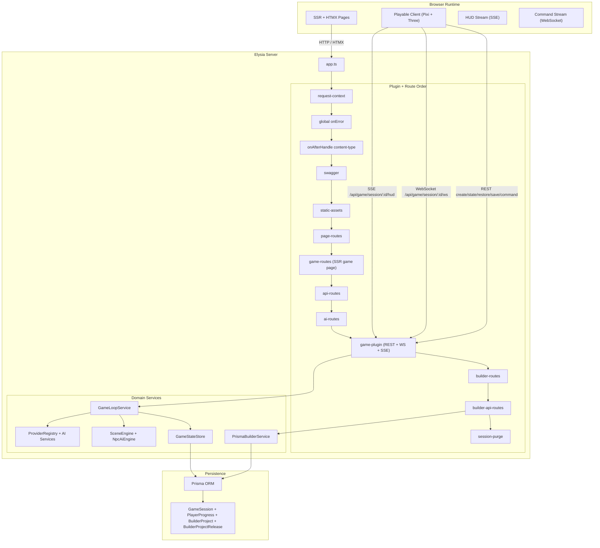
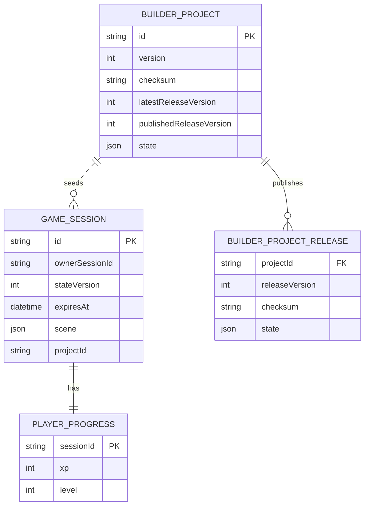
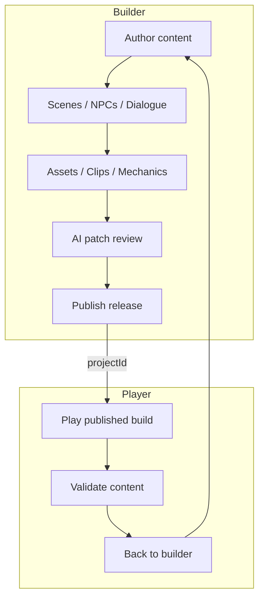
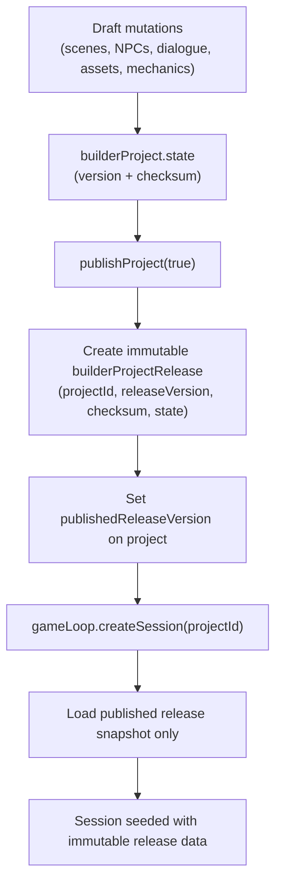
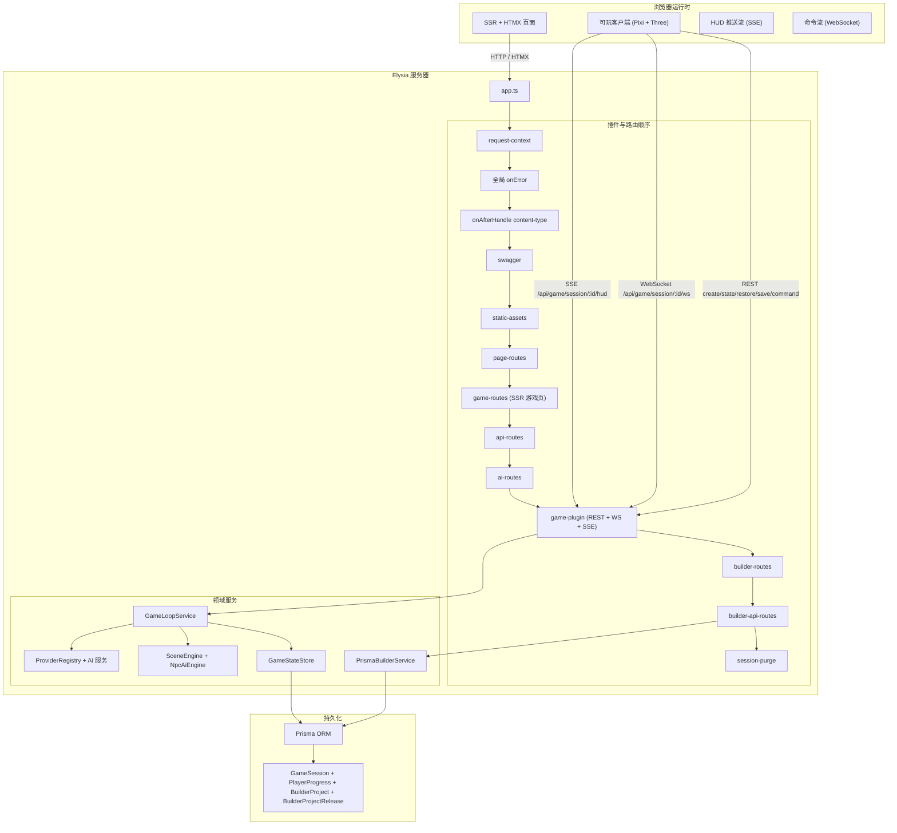
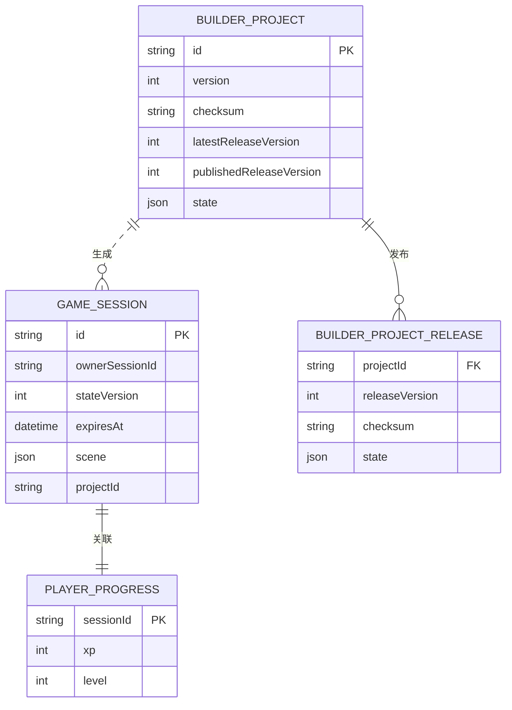
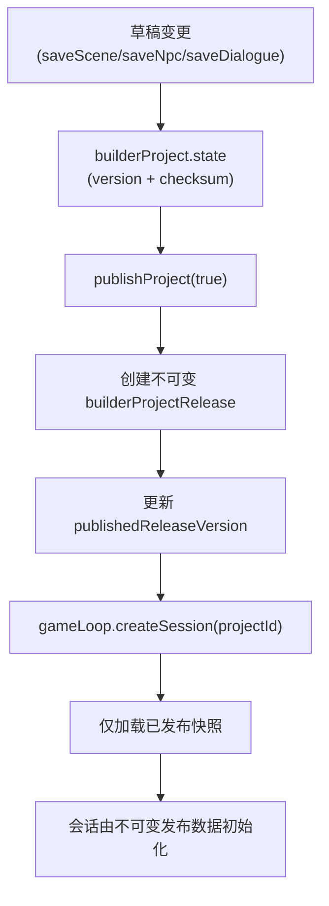

<div align="center">

```
        (  )   (   )  )
         ) (   )  (  (
         ( )  (    ) )
         _____________
        <_____________> ___
        |             |/ _ \
        |               | | |
        |               |_| |
   _____|             |\___/
  /    \___________/    \
  \_____________________/

   _____  _____     _
  |_   _|| ____|   / \
    | |  |  _|    / _ \
    | |  | |___  / ___ \
    |_|  |_____|/_/   \_\

  Templated  Event-driven  Agentic
```

# 🍵 TEA Game Engine

**T**emplated · **E**vent-driven · **A**gentic

A server-driven game engine and worldbuilding platform.<br/>
服务端驱动的游戏引擎与世界构建平台。

[](https://bun.sh)
[](https://www.typescriptlang.org)
[](https://elysiajs.com)
[](https://htmx.org)
[](https://pixijs.com)
[](https://www.prisma.io)

[English](#overview)&ensp;·&ensp;[中文说明](#中文说明)

</div>

---

## Table of Contents

- [Overview](#overview)
  - [Key Capabilities](#key-capabilities)
- [Tech Stack](#tech-stack)
- [Quick Start](#quick-start)
- [Architecture](#architecture)
  - [System Overview](#system-overview)
  - [Request Lifecycle](#request-lifecycle)
  - [Plugin Pipeline](#plugin-pipeline)
  - [Domain Model](#domain-model)
  - [Session Transport Contract](#session-transport-contract)
  - [Builder/Player Flow](#builderplayer-flow)
  - [Builder Publish Contract](#builder-publish-contract)
- [Project Structure](#project-structure)
- [Commands](#commands)
- [Environment](#environment)
- [API Reference](#api-reference)
- [Accessibility](#accessibility)
- [Acknowledgements](#acknowledgements)
- [中文说明](#%E4%B8%AD%E6%96%87%E8%AF%B4%E6%98%8E)

---

## Overview

TEA Game Engine is an SSR-first game development platform that unifies server-rendered pages, real-time AI narrative generation, and a browser-native playable game client into a single runtime. Built for **Leaves of the Fallen Kingdom (LOTFK)** — a strategy worldbuilding experience.

The product centers on a **builder/player loop**: author content in the builder, publish an immutable release, play the published build, and iterate. Legacy pitch/documentation pages are reachable via footer links; primary navigation routes to Home, Game, and Builder.

### Key Capabilities

- **Builder/Player Loop** — project-scoped authoring, publish/unpublish, immutable releases, and playable validation
- **Server-Side Rendering** — all pages render on the server via Elysia; HTMX provides progressive enhancement with `hx-indicator` and `hx-disabled-elt` for loading feedback
- **AI Narrative Engine** — on-device inference via 🤗 Transformers with ONNX/WebGPU acceleration; patch preview/apply for reviewable co-author flow
- **Playable Game Client** — PixiJS 8 canvas with Three.js 3D layer, bundled and hot-reloaded during development
- **Type-Safe Stack** — end-to-end types from Prisma schema through Elysia route contracts and SSR views
- **Internationalization** — `Accept-Language` q-weight parsing with deterministic locale persistence
- **Structured Observability** — correlation ID propagation, levelled JSON logging, typed error envelopes

### Platform Readiness

The builder exposes a capability matrix that reflects current implementation state:

| Capability | Status | Notes |
|---|---|---|
| Release flow | Implemented | Publish/unpublish, immutable releases |
| 2D runtime | Partial | PixiJS; scene from authored data |
| 3D runtime | Partial | Three.js atmosphere; no full scene graph from builder |
| Sprite pipeline | Partial | Manifest-based; asset upload implemented |
| Animation pipeline | Partial | Clip definitions; no frame editor |
| Mechanics | Partial | Quests, triggers, dialogue graphs; quest edit/delete implemented |
| AI authoring | Partial | Patch preview/apply; dialogue generate |
| Automation / RPA | Missing | Worker stub; approval-gated workflow in place |

---

## Tech Stack

| Layer | Technology | Version |
|---|---|---|
| Runtime | Bun | 1.3 |
| Language | TypeScript (strict) | 5.9 |
| Server Framework | Elysia | 1.4 |
| SSR Enhancement | HTMX | 2.0 |
| CSS Framework | Tailwind CSS | 4.x |
| UI Components | DaisyUI | 5.x |
| ORM | Prisma + libSQL | 7.x |
| 2D Render | PixiJS | 8.x |
| 3D Render | Three.js | 0.183 |
| AI Inference | 🤗 Transformers (ONNX) | 3.8 |
| Image Ops | Sharp | 0.34 |

---

## Quick Start

```bash
# Clone
git clone https://github.com/d4551/tea.git && cd tea

# Install dependencies
bun install

# Configure environment
cp .env.example .env

# Generate Prisma client
bun run prisma:generate

# Start development (launches all watchers)
bun run dev
```

---

## Architecture

### System Overview



### Request Lifecycle

Example flow for server-authoritative game session creation:

```mermaid
sequenceDiagram
  participant B as Browser
  participant APP as Elysia App
  participant AUTH as auth-session
  participant LOOP as GameLoop
  participant STORE as GameStateStore
  participant DB as Prisma

  B->>APP: POST /api/game/session
  APP->>AUTH: Resolve/issue cookie session id
  APP->>LOOP: createSession(locale, sceneId, projectId, ownerSessionId)
  LOOP->>STORE: createSession + initialize stateVersion
  STORE->>DB: INSERT gameSession
  DB-->>STORE: persisted row
  STORE-->>LOOP: GameSessionSnapshot
  LOOP-->>APP: lifecycle snapshot + resume token
  APP-->>B: 200 { sessionId, resumeToken, resumeTokenExpiresAtMs }
```

### Plugin Pipeline

Plugins are composed in strict order. Each plugin decorates the request context for downstream consumers:

```mermaid
flowchart LR
  A["request-context"] --> B["global onError"]
  B --> C["onAfterHandle content-type"]
  C --> D["swagger"]
  D --> E["static-assets"]
  E --> F["page-routes"]
  F --> G["game-routes"]
  G --> H["api-routes"]
  H --> I["ai-routes"]
  I --> J["game-plugin"]
  J --> K["builder-routes"]
  K --> L["builder-api-routes"]
  L --> M["session-purge"]

  style A fill:#4ade80,color:#000
  style B fill:#f87171,color:#000
  style C fill:#60a5fa,color:#000
  style D fill:#fbbf24,color:#000
  style E fill:#94a3b8,color:#000
  style F fill:#2dd4bf,color:#000
  style G fill:#2dd4bf,color:#000
  style H fill:#2dd4bf,color:#000
  style I fill:#2dd4bf,color:#000
  style J fill:#fb923c,color:#000
  style K fill:#c084fc,color:#000
  style L fill:#c084fc,color:#000
  style M fill:#a3e635,color:#000
```



### Domain Model



### Session Transport Contract

```mermaid
sequenceDiagram
  participant Client as Playable Client
  participant REST as /api/game/session
  participant WS as /api/game/session/:id/ws
  participant HUD as /api/game/session/:id/hud
  participant Loop as GameLoop

  Client->>REST: POST create
  REST-->>Client: sessionId + resumeToken + resumeTokenExpiresAtMs
  Client->>WS: connect with resumeToken query
  WS->>Loop: restoreSession(sessionId, resumeToken, ownerSessionId)
  Loop-->>WS: accepted
  Client->>REST: POST command
  REST->>Loop: queue validated command
  Loop-->>WS: publish state + rotated resume token
  Client->>HUD: SSE subscribe
  HUD-->>Client: scene-title/xp/dialogue events
  Note over Client,REST: On token expiry, client calls POST /api/game/session/:id with body { resumeToken }
```

### Builder/Player Flow



### Builder Publish Contract



---

## Project Structure

```text
tea/
├── packages/             # Bun workspaces
├── prisma/               # Schema and migrations
│   └── schema.prisma     # Single source of truth
├── assets/               # Canonical media assets mounted at runtime
├── public/               # Static web assets
├── scripts/              # Bun-native build/dev orchestration
│   └── asset-pipeline.ts # Canonical asset graph used by build + watch flows
├── src/                  # Server / Backend
│   ├── config/           # Envs and constants
│   ├── shared/services/  # Prisma client and shared infrastructure
│   ├── domain/           # Core game logic (Game, AI, Oracle)
│   ├── plugins/          # Elysia plugins (i18n, HTMX, Error)
│   └── app.ts            # Elysia entry point
├── tests/                # bun:test suites
└── README.md             # Developer-facing architecture and workflow guide
```

---

## Commands

| Command | Description |
|---|---|
| `bun run dev` | Start development server with all watchers |
| `bun run build:assets` | One-off asset compilation |
| `bun run start` | Production: build and start |
| `bun run lint` | Biome linting |
| `bun run typecheck` | Strict TypeScript checking |
| `bun test` | Run test suite |
| `bun run verify` | Full pipeline: lint → typecheck → test |

---

## Environment

Core `.env` variables (see `.env.example` for full defaults):

| Variable | Purpose |
|---|---|
| `DATABASE_URL` | libSQL connection string (e.g., `file:./prisma/dev.db`) |
| `NODE_ENV` | `development` or `production` |
| `PORT` | Server port (default: 3000) |
| `SESSION_COOKIE_NAME` | Cookie name for anonymous auth-session identity |
| `SESSION_MAX_AGE_SECONDS` | Anonymous session cookie lifetime in seconds |
| `AI_WARMUP_ON_BOOT` | Optional boolean to enable eager local model warmup at boot (default: `false`) |

Game runtime controls:

| Variable | Purpose |
|---|---|
| `GAME_SESSION_TTL_MS` | Session expiration TTL |
| `GAME_TICK_MS` | Server-authoritative tick cadence |
| `GAME_SESSION_PERSIST_INTERVAL_MS` | Minimum interval between automatic DB persists |
| `GAME_SAVE_COOLDOWN_MS` | Manual save cooldown for `/save` endpoint |
| `GAME_MAX_COMMANDS_PER_TICK` | Command queue upper bound per processing window |
| `GAME_MAX_INTERACTIONS_PER_TICK` | Per-tick interaction cap |
| `GAME_MAX_CHAT_COMMANDS_PER_WINDOW` | Chat anti-spam max actions per window |
| `GAME_CHAT_RATE_LIMIT_WINDOW_MS` | Chat anti-spam window length |
| `GAME_SESSION_RESUME_WINDOW_MS` | Max resume token validity horizon |
| `GAME_COMMAND_SEND_INTERVAL_MS` | Client movement command send cadence |
| `GAME_COMMAND_TTL_MS` | Client command TTL used in WS envelopes |
| `GAME_SOCKET_RECONNECT_DELAY_MS` | Client reconnect backoff delay |
| `GAME_RESTORE_REQUEST_TIMEOUT_MS` | Restore POST timeout budget |
| `GAME_RESTORE_MAX_ATTEMPTS` | Max restore retries before expired UX state |

---

## API Reference

Core game/session endpoints:

| Endpoint | Method | Purpose |
|---|---|---|
| `/game` | GET | SSR game page bootstrap (`sessionId`, owner-bound `resumeToken`) |
| `/api/game/session` | POST | Create a new server-authoritative session |
| `/api/game/session/:id/state` | GET | Read owner-scoped session state + queue metadata |
| `/api/game/session/:id` | POST | Restore session using resume token in JSON body |
| `/api/game/session/:id/command` | POST | Validate and enqueue command |
| `/api/game/session/:id/dialogue` | GET | Fetch current active dialogue |
| `/api/game/session/:id/save` | POST | Force persist subject to save cooldown |
| `/api/game/session/:id/close` | POST | Close + delete session |
| `/api/game/session/:id` | DELETE | Delete session directly |
| `/api/game/session/:id/hud` | GET (SSE) | Canonical HUD stream (`scene-title`, `xp`, `dialogue`, `close`) |
| `/api/game/session/:id/ws` | WS | Command/state realtime channel (requires valid resume token) |

Other primary endpoints:

| Endpoint | Method | Purpose |
|---|---|---|
| `/` | GET | SSR home page |
| `/api/health` | GET | System health envelope |
| `/api/oracle` | POST | Oracle interaction |
| `/builder/*` | GET | Builder SSR views |
| `/api/builder/*` | REST | Builder data + AI compose/test/assist |

Builder API highlights:

| Endpoint | Method | Purpose |
|---|---|---|
| `/api/builder/assets/upload` | POST | Multipart asset upload (file input) |
| `/api/builder/quests/:questId` | GET | Quest edit form |
| `/api/builder/quests/:questId/form` | POST | Save quest |
| `/api/builder/quests/:questId` | DELETE | Delete quest |

Deprecated/removed surface:

- `/api/game/session/:id/partials/dialogue` was removed. HUD rendering is now single-path via SSE.

---

## Accessibility

- WCAG AA minimum
- Skip-to-content link for keyboard navigation
- `aria-current="page"` on active nav items
- Focus management on all interactive elements
- All user-facing text via i18n message catalogs

---

## Acknowledgements

<div align="center">

```text
    ·  ˚ . ·  ✦  ˚
  ˚  · Thank you ·  ˚
  ✦  ·  谢谢你们  ·  ✦
    ˚  ·    🍵   ·  ˚
    ·  ˚ . ·  ✦  ˚
```

*Dedicated to **Estrella** and **Ioanin** — the heart and inspiration behind this engine.*

</div>

---

<details>
<summary><h2 id="中文说明">中文说明</h2></summary>

### 目录

- [概述](#概述)
  - [核心能力](#核心能力)
- [技术栈](#技术栈-1)
- [快速开始](#快速开始-1)
- [系统架构](#系统架构)
  - [系统概览](#系统概览)
  - [请求生命周期](#请求生命周期-1)
  - [插件流水线](#插件流水线-1)
  - [领域模型](#领域模型-1)
  - [会话传输契约](#会话传输契约)
  - [构建器发布契约](#构建器发布契约)
- [项目结构](#项目结构-1)
- [命令](#命令-1)
- [环境变量](#环境变量)
- [API 参考](#api-参考)
- [无障碍](#无障碍)
- [致谢](#致谢)

### 概述

TEA 游戏引擎是一个以服务端渲染 (SSR) 为核心的游戏开发平台，将服务端页面交付、实时 AI 叙事生成和浏览器原生可玩游戏客户端统一在单一运行时中。专为 **落叶王国 (LOTFK)** 策略世界构建体验而打造。

#### 核心能力

- **服务端渲染** — 所有页面由 Elysia 在服务端渲染，HTMX 提供渐进增强
- **AI 叙事引擎** — 通过 🤗 Transformers 进行设备端推理，支持 ONNX/WebGPU 加速
- **可玩游戏客户端** — PixiJS 8 画布 + Three.js 3D 层，开发期间支持热重载
- **全链路类型安全** — 从 Prisma 模式到 Elysia 路由契约与 SSR 视图的端到端类型
- **国际化** — `Accept-Language` q 权重解析与确定性区域设置持久化
- **结构化可观察性** — 关联 ID 传播、分级 JSON 日志、类型化错误信封

### 技术栈

| 层级 | 技术 | 版本 |
|---|---|---|
| 运行时 | Bun | 1.3 |
| 语言 | TypeScript (strict) | 5.9 |
| 服务端框架 | Elysia | 1.4 |
| SSR 增强 | HTMX | 2.0 |
| CSS 框架 | Tailwind CSS | 4.x |
| UI 组件库 | DaisyUI | 5.x |
| ORM | Prisma + libSQL | 7.x |
| 2D 渲染 | PixiJS | 8.x |
| 3D 渲染 | Three.js | 0.183 |
| AI 推理 | 🤗 Transformers (ONNX) | 3.8 |
| 图像处理 | Sharp | 0.34 |

### 快速开始

```bash
# 克隆仓库
git clone https://github.com/d4551/tea.git && cd tea

# 安装依赖
bun install

# 配置环境变量
cp .env.example .env

# 生成 Prisma 客户端
bun run prisma:generate

# 启动开发服务器
bun run dev
```

### 系统架构

#### 系统概览



#### 请求生命周期

```mermaid
sequenceDiagram
  participant B as 浏览器
  participant APP as Elysia App
  participant AUTH as auth-session
  participant LOOP as GameLoop
  participant STORE as GameStateStore
  participant DB as Prisma

  B->>APP: POST /api/game/session
  APP->>AUTH: 解析/签发 cookie 会话标识
  APP->>LOOP: createSession(locale, sceneId, projectId, ownerSessionId)
  LOOP->>STORE: createSession + 初始化 stateVersion
  STORE->>DB: INSERT gameSession
  DB-->>STORE: 持久化行
  STORE-->>LOOP: GameSessionSnapshot
  LOOP-->>APP: 生命周期快照 + 恢复令牌
  APP-->>B: 200 { sessionId, resumeToken, resumeTokenExpiresAtMs }
```

#### 插件流水线

```mermaid
flowchart LR
  A["request-context"] --> B["全局 onError"]
  B --> C["onAfterHandle content-type"]
  C --> D["swagger"]
  D --> E["static-assets"]
  E --> F["page-routes"]
  F --> G["game-routes"]
  G --> H["api-routes"]
  H --> I["ai-routes"]
  I --> J["game-plugin"]
  J --> K["builder-routes"]
  K --> L["builder-api-routes"]
  L --> M["session-purge"]

  style A fill:#4ade80,color:#000
  style B fill:#f87171,color:#000
  style C fill:#60a5fa,color:#000
  style D fill:#fbbf24,color:#000
  style E fill:#94a3b8,color:#000
  style F fill:#2dd4bf,color:#000
  style G fill:#2dd4bf,color:#000
  style H fill:#2dd4bf,color:#000
  style I fill:#2dd4bf,color:#000
  style J fill:#fb923c,color:#000
  style K fill:#c084fc,color:#000
  style L fill:#c084fc,color:#000
  style M fill:#a3e635,color:#000
```



#### 领域模型



#### 会话传输契约

```mermaid
sequenceDiagram
  participant Client as 可玩客户端
  participant REST as /api/game/session
  participant WS as /api/game/session/:id/ws
  participant HUD as /api/game/session/:id/hud
  participant Loop as GameLoop

  Client->>REST: POST create
  REST-->>Client: sessionId + resumeToken + resumeTokenExpiresAtMs
  Client->>WS: 带 resumeToken query 建立连接
  WS->>Loop: restoreSession(sessionId, resumeToken, ownerSessionId)
  Loop-->>WS: 通过/拒绝
  Client->>REST: POST command
  REST->>Loop: 命令入队并处理
  Loop-->>WS: 推送 state + 新 token
  Client->>HUD: 订阅 SSE
  HUD-->>Client: scene-title/xp/dialogue/close
```

#### 构建器发布契约



### 项目结构

```text
tea/
├── packages/             # Bun 工作区
├── prisma/               # 数据库模式与迁移
│   └── schema.prisma     # 唯一事实来源
├── assets/               # 运行时挂载的媒体资产
├── public/               # 静态 Web 资产
├── scripts/              # Bun 原生构建 / 开发编排
│   └── asset-pipeline.ts # build 与 watch 共用的规范资产图
├── src/                  # 服务器 / 后端
│   ├── config/           # 环境变量与常量
│   ├── shared/services/  # Prisma 客户端与共享基础设施
│   ├── domain/           # 核心游戏逻辑 (游戏, AI, 神谕)
│   ├── plugins/          # Elysia 插件 (国际化, HTMX, 错误处理)
│   └── app.ts            # Elysia 入口点
├── tests/                # bun:test 测试套件
└── README.md             # 面向开发者的架构与工作流文档
```

### 命令

| 命令 | 说明 |
|---|---|
| `bun run dev` | 启动开发服务器 |
| `bun run build:assets` | 一次性资产编译 |
| `bun run start` | 生产环境：构建并启动 |
| `bun run lint` | Biome 代码检查 |
| `bun run typecheck` | TypeScript 严格类型检查 |
| `bun test` | 运行测试套件 |
| `bun run verify` | 完整流水线：检查 → 类型检查 → 测试 |

### 环境变量

核心 `.env` 变量（完整默认值见 `.env.example`）：

| 变量 | 用途 |
|---|---|
| `DATABASE_URL` | libSQL 连接字符串 (例如: `file:./prisma/dev.db`) |
| `NODE_ENV` | `development` (开发) 或 `production` (生产) |
| `PORT` | 服务器端口 (默认: 3000) |
| `SESSION_COOKIE_NAME` | 匿名 auth-session 的 Cookie 名称 |
| `SESSION_MAX_AGE_SECONDS` | 匿名会话 Cookie 生命周期（秒） |

游戏运行时关键参数：

| 变量 | 用途 |
|---|---|
| `GAME_SESSION_TTL_MS` | 会话过期 TTL |
| `GAME_TICK_MS` | 服务端权威 tick 周期 |
| `GAME_SESSION_PERSIST_INTERVAL_MS` | 自动持久化最小间隔 |
| `GAME_SAVE_COOLDOWN_MS` | `/save` 接口手动保存冷却 |
| `GAME_MAX_COMMANDS_PER_TICK` | 每处理窗口命令队列上限 |
| `GAME_MAX_INTERACTIONS_PER_TICK` | 单 tick 交互上限 |
| `GAME_MAX_CHAT_COMMANDS_PER_WINDOW` | 聊天防刷窗口内最大命令数 |
| `GAME_CHAT_RATE_LIMIT_WINDOW_MS` | 聊天防刷窗口长度 |
| `GAME_SESSION_RESUME_WINDOW_MS` | 恢复令牌有效时间上限 |
| `GAME_COMMAND_SEND_INTERVAL_MS` | 客户端移动命令发送频率 |
| `GAME_COMMAND_TTL_MS` | 客户端命令 TTL |
| `GAME_SOCKET_RECONNECT_DELAY_MS` | 客户端重连退避延迟 |
| `GAME_RESTORE_REQUEST_TIMEOUT_MS` | 恢复请求超时预算 |
| `GAME_RESTORE_MAX_ATTEMPTS` | 恢复失败前最大重试次数 |

### API 参考

| 端点 | 方法 | 用途 |
|---|---|---|
| `/game` | GET | SSR 游戏页引导（`sessionId` + owner 绑定 `resumeToken`） |
| `/api/game/session` | POST | 创建新的服务端权威会话 |
| `/api/game/session/:id/state` | GET | 查询 owner 范围内会话状态与队列元数据 |
| `/api/game/session/:id` | POST | 使用 JSON body 中的恢复令牌恢复会话 |
| `/api/game/session/:id/command` | POST | 校验并入队命令 |
| `/api/game/session/:id/dialogue` | GET | 获取当前活动对话 |
| `/api/game/session/:id/save` | POST | 在冷却约束下强制持久化 |
| `/api/game/session/:id/close` | POST | 关闭并删除会话 |
| `/api/game/session/:id` | DELETE | 直接删除会话 |
| `/api/game/session/:id/hud` | GET (SSE) | 规范 HUD 推送流（`scene-title` / `xp` / `dialogue` / `close`） |
| `/api/game/session/:id/ws` | WS | 实时命令/状态通道（需要有效恢复令牌） |

已移除的旧接口：

- `/api/game/session/:id/partials/dialogue` 已删除。HUD 渲染统一经由 SSE 单路径输出。

### 无障碍

- 最低 WCAG AA 合规
- 键盘用户跳转至内容链接
- 活动导航项 `aria-current="page"`
- 交互元素焦点管理
- 所有面向用户文本通过国际化目录管理

### 致谢

*本引擎献给 **Estrella** 和 **Ioanin** — 你们是这一切背后的灵感与灵魂。* 🍵

</details>

---

## License

Private · All rights reserved.
