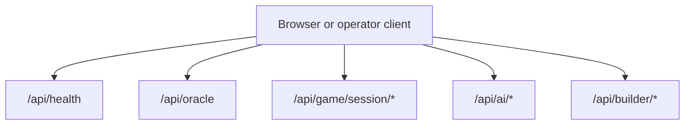
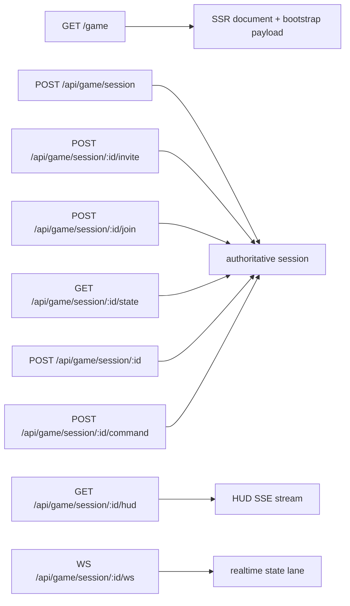

# API and transport contracts

This document summarizes the current public transport surfaces and envelope conventions for the TEA app.

## Envelope model

JSON APIs use one envelope family:

- success responses: `ok: true` with `data`
- failure responses: `ok: false` with `error`

Current failure fields:

```ts
{
  ok: false,
  error: {
    code: string,
    message: string,
    retryable: boolean,
    correlationId: string
  }
}
```

## Surface map



## Game transport surfaces



### Game route contract notes

- `GET /game` is the SSR entrypoint for the playable runtime.
- The playable runtime consumes one canonical bootstrap JSON payload.
- `POST /api/game/session/:id` is the restore surface.
- `GET /api/game/session/:id/hud` is the only HUD stream surface.
- `WS /api/game/session/:id/ws` is the realtime command/state transport.

## Core application APIs

| Endpoint | Purpose |
| --- | --- |
| `/api/health` | Typed health envelope for runtime readiness at the HTTP surface |
| `/api/oracle` | Oracle question/answer workflow with locale-aware behavior |

## AI APIs

| Endpoint | Purpose |
| --- | --- |
| `/api/ai/status` | Aggregate provider/runtime status |
| `/api/ai/health` | AI health snapshot |
| `/api/ai/capabilities` | Available AI model capabilities |
| `/api/ai/catalog` | Configurable AI targets |
| `/api/ai/knowledge/documents` | Knowledge document CRUD/indexing |
| `/api/ai/knowledge/search` | Knowledge retrieval search |
| `/api/ai/assist/retrieval` | Retrieval-assisted help surface |
| `/api/ai/plan/tools` | Structured tool planning |
| `/api/ai/generate/dialogue` | Dialogue generation |
| `/api/ai/generate/scene` | Scene generation |
| `/api/ai/audio/transcribe` | Audio transcription |
| `/api/ai/audio/synthesize` | Speech synthesis |

## Builder APIs

| Endpoint family | Purpose |
| --- | --- |
| `/api/builder/projects` | Builder project lifecycle |
| `/api/builder/scenes` | Authored scene CRUD |
| `/api/builder/scenes/:sceneId/nodes` | Scene-node editing |
| `/api/builder/npcs` | NPC authoring |
| `/api/builder/dialogue` | Dialogue authoring |
| `/api/builder/assets` | Asset CRUD |
| `/api/builder/assets/upload` | File upload / ingestion |
| `/api/builder/animation-clips` | Animation clip authoring |
| `/api/builder/dialogue-graphs` | Dialogue graph editing |
| `/api/builder/quests` | Quest editing |
| `/api/builder/triggers` | Trigger editing |
| `/api/builder/generation-jobs` | AI generation jobs |
| `/api/builder/automation-runs` | Automation runs |

## Contract ownership

| Concern | Owner |
| --- | --- |
| Route constants | `src/shared/constants/routes.ts` |
| UI state vocabulary | `src/shared/contracts/ui-state.ts` |
| Game transport contracts | `src/shared/contracts/game.ts` |
| Game bootstrap contract | `src/shared/contracts/game-client-bootstrap.ts` |
| External failure contract | `src/shared/contracts/external-boundary.ts` |
| HTTP envelope helpers | `src/lib/error-envelope.ts` |

## Error and retry semantics

- Validation failures should map to deterministic validation/error states.
- Unauthorized failures should map to explicit unauthorized states.
- Retryable upstream/provider failures should preserve `retryable: true`.
- Prisma/database failures should be translated once at the storage boundary, then surfaced through the shared error envelope.
