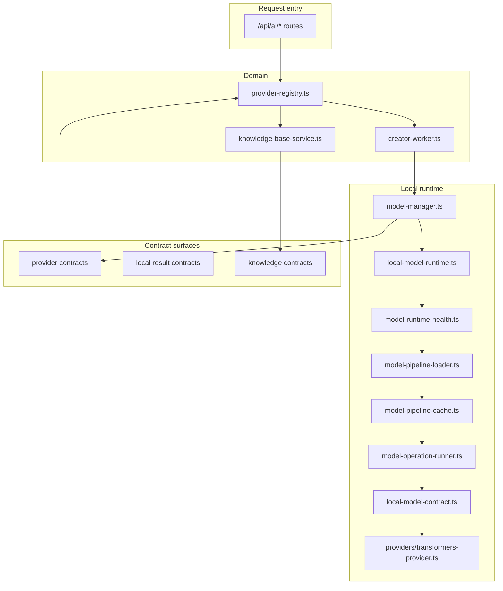
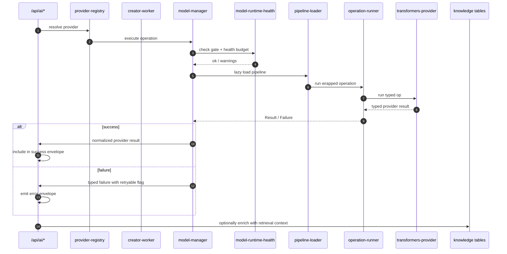
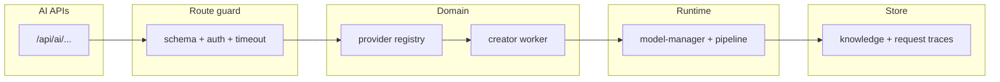

# Local AI runtime (providers, health, and failure contracts)

This document describes the local AI runtime path that isolates model operations from request routes.

## 1) Layer model

## 2) Execution sequence

## 3) Failure taxonomy

| Code | Meaning | Recovery |
| --- | --- | --- |
| `timeout` | operation exceeded budget | retry with backoff if transient |
| `circuit-open` | failure threshold reached | wait cooldown + reset |
| `cache-corruption-recovered` | pipeline cache repaired | one controlled retry |
| `unavailable` | provider disabled / config missing | operator reconfigure required |
| `invalid-output` | malformed provider output | retry once then fail with diagnostics |
| `unexpected` | unknown runtime failure | operator triage required |

## 4) Contract guarantees

- Routes receive only normalized typed contracts.
- Routes never consume raw provider responses.
- Health state and warmup are tracked separately from pipeline lifecycle.
- Pipeline cache is reused in process with explicit corruption recovery boundaries.

## 4.1) API-compatible vendor presets

- Local API-compatible routing defaults to `ramalama` and remains overrideable with `AI_LOCAL_API_COMPATIBLE_VENDOR`.
- Cloud API-compatible routing supports explicit presets for `openai`, `claude`, `deepseek`, `gemini`, `copilot`, and `custom` through `AI_CLOUD_API_COMPATIBLE_VENDOR`.
- Vendor presets own base URLs, endpoint paths, and required static headers so providers that do not expose plain OpenAI `/v1/models` surfaces can still route through the shared provider contract.
- Manual overrides still win for `AI_*_API_COMPATIBLE_BASE_URL`, `AI_*_API_COMPATIBLE_*_MODEL`, and provider labels when operators need a custom deployment.

## 5) Knowledge integration

- Documents/chunks are stored in AI tables and reused across retrieval flow.
- Retrieval-assisted generation includes deterministic truncation strategy and context windows.
- Search miss is not fatal unless business config marks it hard-required.

## 6) Latency, observability, and hardening

- Each operation emits timing and model/pipeline identifiers.
- Failures are mapped into one typed error envelope with `correlationId`.
- Health endpoint exposes warmup state, circuit state, and recent failure counters.
- Timeouts are bounded and logged for operator action.

## 7) Dataflow map

## 8) Recommended tests

- Failure-mode tests for each typed failure code.
- Circuit-open and recovery tests.
- Cache corruption recovery path smoke.
- Timeout and unknown provider fallback tests.
