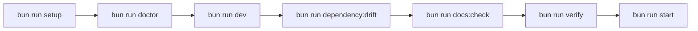

# Operator runbook

This runbook describes the standard operating flow for local development, verification, dependency governance, and basic incident handling.

## Primary commands

| Command | When to use it |
| --- | --- |
| `bun run audit:security` | On-demand vulnerability audit |
| `bun run docs:check` | Current-state documentation surface validation |
| `bun run setup` | First bootstrap on a machine with Bun installed |
| `bun run doctor` | Non-destructive readiness check |
| `bun run dev` | Daily development loop |
| `bun run build:assets` | Rebuild CSS, HTMX extensions, game client, and editor assets |
| `bun run dependency:drift` | Check pinned versions against current policy |
| `bun run verify` | Full pre-ship verification |
| `bun run start` | Production-like local boot |

## Standard workflow



## First bootstrap

1. Run `bun install` if dependencies are not present.
2. Run `bun run setup`.
3. Run `bun run doctor`.

Expected outcome:

- `.env` is created if missing.
- Prisma generation/migration is complete.
- Assets are built.
- Writable paths, required assets, database reachability, and runtime surfaces report healthy status.

## Daily development

Use:

```bash
bun run dev
```

This is the standard developer loop for:

- app server
- CSS and extension assets
- playable runtime bundle
- builder editor assets

## Verification gate

Before merging or shipping, run:

```bash
bun run verify
```

This executes:

1. `bun run build:assets`
2. `bun run dependency:drift`
3. `bun run docs:check`
4. `bun run lint`
5. `bun run typecheck`
6. `bun test`

`bun run audit:security` remains a separate operator command and is not a hard verify gate.

## Dependency governance

Use:

```bash
bun run dependency:drift
```

Policy:

- Stable versions are pinned deliberately.
- Drift should be resolved by updating the declared version and keeping docs/tests in sync.
- Do not silently relax version policy or move checks into lint suppression.

For security auditing:

```bash
bun run audit:security
```

## Readiness and diagnosis

Use:

```bash
bun run doctor
```

This is the fastest way to inspect:

- database connectivity
- writable directories
- expected built assets
- Bun/runtime policy
- AI routing readiness

## Local AI runtime operations

Key facts:

- The provider registry is the routing boundary.
- The local model manager is the local inference facade.
- Warmup and circuit state are runtime-owned, not route-owned.

If local AI behaves unexpectedly:

1. Run `bun run doctor`.
2. Check configured AI environment variables.
3. Confirm asset/build outputs are present if the issue appears browser-side.
4. Re-run `bun run verify` after any fix.

Reference:

- [Local AI runtime](/Users/brandondonnelly/Downloads/tea/docs/local-ai-runtime.md)

## Playable runtime operations

If the game page loads but the playable runtime does not recover:

1. Confirm the SSR page rendered a valid bootstrap payload.
2. Check restore retry budget and reconnect settings in environment config.
3. Confirm the authoritative game routes and websocket surface are available.
4. Reproduce through the standard game route, not an ad-hoc HTML fixture.

Reference:

- [Playable runtime](/Users/brandondonnelly/Downloads/tea/docs/playable-runtime.md)

## HTMX and shell incidents

If loading states, validation swaps, or focus restoration regress:

1. Check `src/htmx-extensions/layout-controls.ts`.
2. Confirm the target fragment still uses the shared focus-panel and shell conventions.
3. Confirm the route is not introducing page-local HTMX event listeners for shared concerns.

Reference:

- [HTMX extensions](/Users/brandondonnelly/Downloads/tea/docs/htmx-extensions.md)

## Documentation surface checks

Use:

```bash
bun run docs:check
```

This validates:

- required current-state docs exist
- retired planning/prompt artifacts are gone
- top-level docs link to the current docs set
- the RMMZ companion pack is represented in the docs surface

## Logging expectations

Operational boundaries should use structured logs with correlation ids where available.

That applies to:

- request handling
- provider failures
- Prisma failure mapping
- runtime readiness
- asset build surfaces

## Recovery rules

- Fix the source, not the lint rule.
- Fix the contract owner, not the downstream symptom.
- Prefer shared boundaries over route-local patches.
- Do not reintroduce compatibility shims for retired bootstrap or transport paths.
