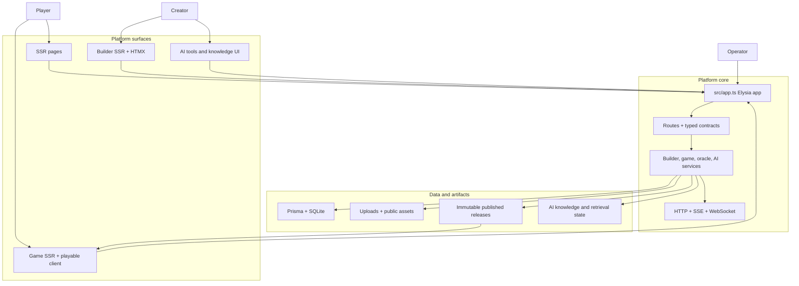
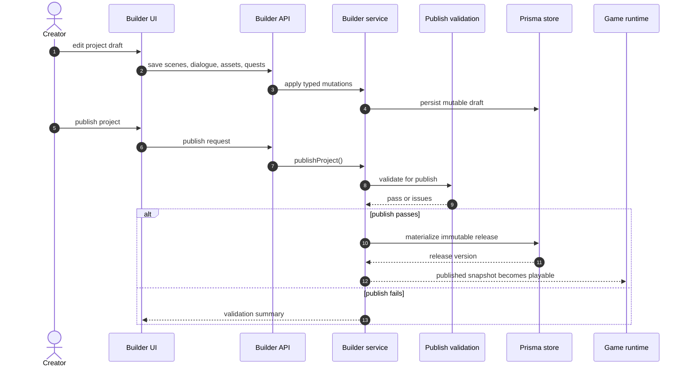
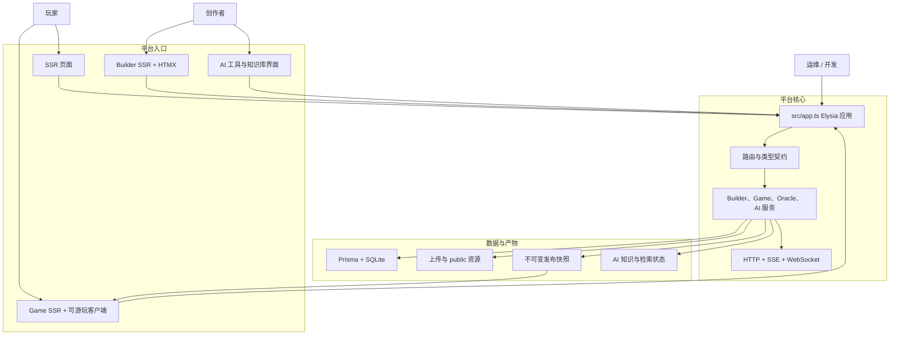
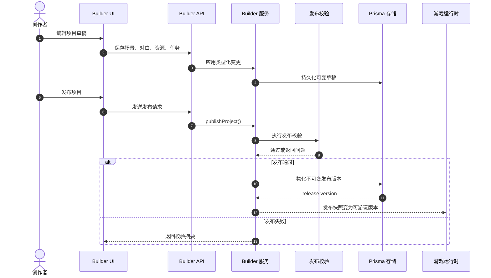
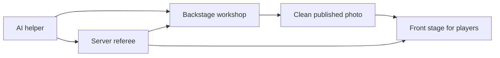
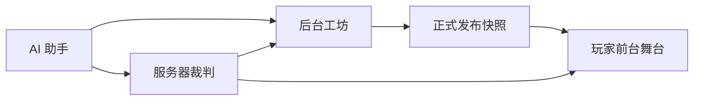

# TEA platform explainer / TEA 平台白话说明

Use this page when you want the platform explained quickly before reading the deeper architecture and contract docs.
This guide is bilingual and ends with an Explain Like I'm 5 version.

## Quick links / 快速入口

- [README](../README.md)
- [Architecture](../ARCHITECTURE.md)
- [Architecture (Chinese)](../ARCHITECTURE.zh-CN.md)
- [Docs index](./index.md)

## English

### What TEA is

TEA is one platform that combines a server-rendered website, a builder workspace, a playable game runtime, and AI-assisted content tools.
Creators use the builder to author worlds, scenes, NPCs, dialogue, quests, and assets.
Players use the runtime to join sessions, move through scenes, trigger events, and resume progress.
Operators and developers use the same platform contracts, logs, and docs to keep those flows deterministic.

### Platform map

### How the platform works

1. A creator opens the builder and edits a draft project.
2. The builder validates the draft and publishes an immutable release.
3. The game runtime boots from that published release, not from mutable draft data.
4. The game loop owns session state, command processing, and transport updates.
5. AI services support authoring and runtime features, but still return typed results that follow the same platform contracts.

### Builder to runtime handoff

### Core ownership model

| Concern | Owner |
| --- | --- |
| HTTP request setup, locale, error mapping | `src/app.ts` plugins and route composition |
| Builder draft authoring and publish lifecycle | builder routes and builder domain services |
| Playable session state and commands | `game-loop.ts` and game transport routes |
| AI provider routing and local model integration | AI provider registry and local runtime services |
| Persisted source of truth | Prisma + SQLite and published artifacts |

### Why the platform is structured this way

- SSR-first keeps the primary user flows fast, deterministic, and searchable.
- Draft state and runtime state are separated so creators can keep editing without mutating active player sessions.
- Typed contracts keep HTML fragments, JSON APIs, SSE, and WebSocket updates aligned.
- Immutable releases make publish behavior reproducible.
- AI features stay inside typed boundaries instead of bypassing the rest of the platform.

## 中文

### TEA 是什么

TEA 是一个把服务端渲染网站、构建器工作区、可游玩游戏运行时以及 AI 辅助创作工具放在一起的平台。
创作者在 Builder 中编写世界、场景、NPC、对白、任务和资源。
玩家在运行时中进入会话、移动、触发事件并恢复进度。
开发者和运维则依赖同一套契约、日志和文档，让这些流程保持可预测。

### 平台总览图

### 平台如何运作

1. 创作者在 Builder 中编辑草稿项目。
2. Builder 校验草稿并生成不可变的发布版本。
3. 游戏运行时只从已发布版本启动，不直接读取可变草稿。
4. `game-loop` 负责会话状态、命令处理和增量更新。
5. AI 服务可以辅助创作或运行时能力，但最终仍然要回到同一套类型化契约。

### Builder 到 Runtime 的交接

### 核心职责归属

| 关注点 | 单一所有者 |
| --- | --- |
| 请求上下文、语言环境、错误映射 | `src/app.ts` 插件和路由组合 |
| Builder 草稿编辑与发布生命周期 | Builder 路由和领域服务 |
| 可玩会话状态与命令处理 | `game-loop.ts` 与游戏传输路由 |
| AI Provider 路由与本地模型接入 | AI provider registry 与本地运行时服务 |
| 持久化真相源 | Prisma + SQLite 与发布产物 |

### 为什么这样设计

- SSR-first 让主流程更快、更稳定、更适合文档化。
- 草稿态和运行态分离，创作者编辑时不会直接污染在线玩家会话。
- 类型契约让 HTML 片段、JSON API、SSE 和 WebSocket 更新保持一致。
- 不可变发布让发布行为可重现。
- AI 功能被放在平台边界内，而不是绕开契约直接改状态。

## Explain Like I'm 5 / 五岁也能懂

### English

Think of TEA like a toy theater.
The builder is the backstage workshop where someone arranges the stage, characters, props, and story cards.
Publishing is when the workshop takes a clean photo of that setup and says, "this is the version people are allowed to play."
The game runtime is the front stage where players act inside that frozen setup.
The server is the referee who remembers the rules, keeps score, and tells every screen what changed.

### 中文

把 TEA 想成一个玩具戏台。
Builder 是后台工坊，负责摆舞台、角色、道具和剧情卡片。
发布就像给这个工坊拍一张“正式版本”的照片，并说“玩家只能玩这一版”。
游戏运行时就是前台舞台，玩家在这张已经定稿的照片里开始玩。
服务器像裁判，负责记规则、记分数，并告诉每个界面刚刚发生了什么。

