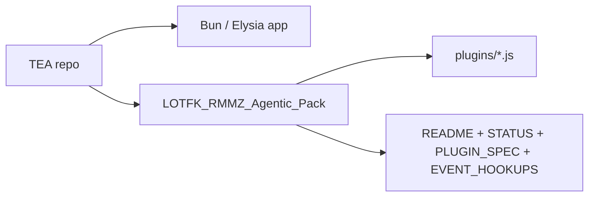

# RMMZ companion pack

The `LOTFK_RMMZ_Agentic_Pack` is an active companion artifact in this repository. It is not part of the TypeScript compile surface, but the main app still carries runtime configuration for serving or packaging the pack as a mounted artifact.

## Status

Current classification: distributable companion pack, maintained alongside the main app.

## Artifact shape

## What the pack contains

- eight RPG Maker MZ plugin files under `LOTFK_RMMZ_Agentic_Pack/plugins`
- pack-specific README
- current plugin contract documentation
- current event hookup guidance
- status/maintenance documentation

## Maintenance contract

- Treat the pack docs as current-state docs, not prompt or plan artifacts.
- Keep plugin inventory in sync with the shipped `plugins/*.js` files.
- Keep plugin order and compatibility assumptions explicit in pack docs.
- If the pack stops being actively distributed, reclassify it explicitly instead of leaving it as ambiguous collateral.

## Relationship to the main app

- The main app and the pack are separate runtime surfaces.
- The main app docs index should still reference the pack because it remains an active repo artifact.
- The pack is intentionally excluded from the TypeScript compile surface, so documentation consistency is the primary governance tool for that surface.

## Pack docs

| Document | Purpose |
| --- | --- |
| [/Users/brandondonnelly/Downloads/tea/LOTFK_RMMZ_Agentic_Pack/README.md](/Users/brandondonnelly/Downloads/tea/LOTFK_RMMZ_Agentic_Pack/README.md) | Pack overview, plugin inventory, install flow |
| [/Users/brandondonnelly/Downloads/tea/LOTFK_RMMZ_Agentic_Pack/STATUS.md](/Users/brandondonnelly/Downloads/tea/LOTFK_RMMZ_Agentic_Pack/STATUS.md) | Current implementation and maintenance status |
| [/Users/brandondonnelly/Downloads/tea/LOTFK_RMMZ_Agentic_Pack/PLUGIN_SPEC.md](/Users/brandondonnelly/Downloads/tea/LOTFK_RMMZ_Agentic_Pack/PLUGIN_SPEC.md) | Current plugin contract |
| [/Users/brandondonnelly/Downloads/tea/LOTFK_RMMZ_Agentic_Pack/EVENT_HOOKUPS.md](/Users/brandondonnelly/Downloads/tea/LOTFK_RMMZ_Agentic_Pack/EVENT_HOOKUPS.md) | Recommended MZ editor event wiring |
